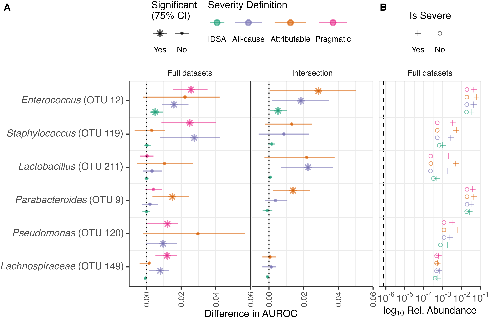

<link href="paper_files/libs/lightable-0.0.1/lightable.css" rel="stylesheet" />

# Predicting *C. difficile* Infection Severity from the Taxonomic Composition of the Gut Microbiome

Kelly L. Sovacool, Sarah E. Tomkovich, Megan L. Coden, Jenna Wiens,
Vincent B. Young, Krishna Rao, Patrick D. Schloss

# Abstract

*Clostridioides difficile* infection (CDI) can lead to adverse outcomes
including ICU admission, colectomy, and death. The composition of the
gut microbiome plays an important role in determining colonization
resistance and clearance upon exposure to *C. difficile*. We
investigated whether machine learning (ML) models trained on gut
microbiota isolated from stool samples on the day of CDI diagnosis could
predict which CDI cases led to severe outcomes. We collected 1,277 stool
samples from CDI patients and clustered 16S rRNA gene amplicon sequences
into *de novo* Operational Taxonomic Units (OTUs). We then trained ML
models to predict CDI severity on OTU relative abundances according to
four different severity definitions: the IDSA severity score on the day
of diagnosis, all-cause adverse outcomes within 30 days, adverse
outcomes confirmed as attributable to CDI via chart review, and a
pragmatic definition that uses the attributable definition when
available and falls back to the all-cause definition otherwise. The
models predicting pragmatic severity performed best, suggesting that
while chart review is valuable to verify the cause of complications,
including as many samples as possible is indispensable for training
performant models on imbalanced datasets. Permutation importance
identified *Enterococcus* as the most important OTU for model
performance. Finally, we evaluated the potential clinical value of the
OTU-based models and found similar performance compared to prior models
based on Electronic Health Records. The modest performance of the
OTU-based models represents a step toward the goal of deploying models
to inform clinical decisions and ultimately improve CDI outcomes.

# Introduction

*Clostridoides difficile* infection (CDI) is the most common nosocomial
infection in the United States, and community-acquired cases are on the
rise (Magill et al. 2014; Feuerstadt, Theriault, and Tillotson 2023).
The classic CDI case typically occurs soon after antibiotic use, which
perturbs the protective gut microbiota and allows *C. difficile* to
proliferate (Kelly 2012). Non-antibiotic medications including
proton-pump inhibitors and osmotic laxatives have also been shown to
increase CDI susceptibilty and inhibit clearance (Janarthanan et al.
2012; Tomkovich et al. 2021). Diarrhea is the primary symptom, with some
patients developing colitis, toxic megacolon, or requiring intensive
care with an in-hospital mortality rate of approximately 8-9% (Lucado
and Elixhauser 2012; Kassam et al. 2016). Furthermore, 5-20% of initial
cases reoccur within 2-8 weeks, and recurrent cases are associated with
increased morbidity and mortality risk (Napolitano and Edmiston 2017;
Kelly 2012). Patient risk factors for CDI-related morbidity and
mortality include age \> 65, history of recurrent CDI, and co-morbid
chronic illnesses (Ressler, Wang, and Rao 2021). CDI remains a
significant burden on the US health care system with approximately
500,000 cases annually (Guh et al. 2020; Kwon, Olsen, and Dubberke
2015).

There is a need for robust, accurate methods to identify patients at
risk of severe CDI outcomes. When paired with treatment options that may
reduce risk of severity, prediction models can guide clinician
decision-making to improve patient outcomes while minimizing harms from
unnecessary treatment. Numerous scoring systems for predicting severe
CDI outcomes based on patient clinical factors have been developed, but
none have validated well to external datasets nor are any in use in
routine clinical practice (Chakra, Pepin, and Valiquette 2012; Perry et
al. 2022). Machine learning (ML) is a promising approach that allows for
use of thousands of features to classify samples and predict outcomes,
rather than relying on limited sets of human-curated variables. Indeed,
ML models trained on entire Electronic Health Record (EHR) data have
demonstrated improved performance over curated models (Rao et al. 2015;
Li et al. 2019).

Aside from patient factors encoded in EHRs, the state of the patient gut
microbiome is a promising factor to predict severity, as the host
microbiota can play either a protective or harmful role in *C.
difficile* colonization, infection, and clearance. Mouse studies have
found that the initial taxonomic composition of the gut microbiome
predicts differences in clearance, moribundity, and cecal tissue damage
in mice infected with CDI (Tomkovich et al. 2020; Lesniak et al. 2022).
Identifying features of the human gut microbiota that promote or prevent
severe infections can guide further experiments to elucidate microbial
mechanisms of CDI severity, and incorporating these features into CDI
severity models may improve model performance to help guide clinical
treatment decisions.

We set out to investigate whether ML models trained on the taxonomic
composition of the gut microbiome can predict CDI severity in a human
cohort, whether the severity definition employed affects model
performance, and whether there is potential clinical value in deploying
OTU-based models. Stool samples from 1277 CDI patients were collected on
the day of diagnosis and 16S rRNA gene amplicon sequencing was
performed, followed by clustering sequences into Operational Taxonomic
Units (OTUs). We then trained ML models to classify or predict each of
four severity definitions from OTU relative abundances, identified which
microbial features contributed most to model performance, and conducted
a proof-of-concept analysis of the potential clinical value of these
OTU-based models and compared these to prior EHR-based models.

# Results

## CDI severity

There is not currently a consensus definition of CDI severity. Some
scoring systems leverage clinical data available during the course of
CDI, while others focus on adverse outcomes of CDI at 30 days after
diagnosis (Ressler, Wang, and Rao 2021; Dieterle et al. 2020). We
explored four different ways to define CDI cases as severe or not
([Figure 1](#fig-flowchart)). The “IDSA” definition of severe CDI is
based on laboratory values collected on the day of diagnosis, with a
case being severe if serum creatinine level is greater than or equal to
$1.5 mg/dL$ and the white blood cell count is greater than or equal to
$15 k/\mu L$ (L. Clifford McDonald et al. 2018). However, the IDSA score
is known to be a poor predictor of adverse outcomes (Stevens et al.
2020), although it is straightforward to collect. The remaining
definitions we employed focus on the occurrence of adverse outcomes,
which may be more clinically relevant. The “attributable” severity
definition is based on disease-related complications defined by the CDC,
where an adverse event of ICU admission, colectomy, or death occurs
within 30 days of CDI diagnosis, and the adverse event is determined to
be attributable to the CDI by physician chart review (L. Clifford
McDonald et al. 2007). However, physician chart review is time-consuming
and has not been completed for all cases, so we defined “all-cause”
severity where a case is severe if an adverse event occurs within 30
days of the diagnosis regardless of the cause of the adverse event.
Finally, we defined a “pragmatic” severity definition that makes use of
the attributable definition when available and falls back to the
all-cause definition when chart review has not been completed, allowing
us to use as many samples as we have available while taking physicians’
expert opinions into account where possible ([Figure 1](#fig-flowchart)
B). We trained ML models to classify (in the case of the IDSA
definition) or predict (in the case of the three other definitions)
severity and determined how well OTU-based models perform for each
definition.

Figure 1: **CDI severity definitions.** **A)** Decision flow chart to
define CDI cases as severe according to the Infectious Diseases Society
of America (IDSA) based on lab values, the occurrence of an adverse
outcome due to any cause (All-cause), and the occurrence of
disease-related complications confirmed as attributable to CDI with
chart review (Attributable). **B)** The proportion of severe CDI cases
labelled according to each definition. An additional ‘Pragmatic’
severity definition uses the Attributable definition when possible, and
falls back to the All-cause definition when chart review is not
available. See **?@tbl-counts** for sample counts and proportions of
severe cases across severity definitions.

|          |    IDSA | All-cause | Attributable | Pragmatic |
|:---------|--------:|----------:|-------------:|----------:|
| n        | 1,072.0 |   1,218.0 |      1,178.0 |   1,218.0 |
| % Severe |    34.2 |       7.1 |          2.2 |       5.4 |

Table 1: Full datasets

|          |  IDSA | All-cause | Attributable | Pragmatic |
|:---------|------:|----------:|-------------:|----------:|
| n        | 993.0 |     993.0 |        993.0 |     993.0 |
| % Severe |  32.7 |       4.6 |          2.6 |       2.6 |

Table 2: Intersection of samples with all labels available

**Sample counts and proportion of severe cases.** Each severity
definition has a different number of patient samples available, as well
as a different proportion of cases labelled as severe.

## Model performance

We first set out to train the best models possible for each severity
definition. Not all samples have labels available for all four severity
definitions due to missing data for some patient lab values and
incomplete chart review ([Figure 1](#fig-flowchart) B), thus each
severity definition has a different number of samples when using as many
samples as possible (**?@tbl-counts** A). We refer to these as the full
datasets. Random forest models were trained on 100 splits of the
datasets into training and test sets, and performance was evaluated on
the held-out test set using the area under the receiver-operator
characteristic curve (AUROC). Since the severity classes are highly
imbalanced with different proportions of severe samples between
definitions, we also calculated the balanced precision and the area
under the balanced precision-recall curve (AUBPRC) as first proposed by
Wu et al. (2021) to describe the precision that would be expected if the
outcome classes were balanced.

After training on the full datasets, the performance as measured by the
AUROCs of the training set cross-validation folds were similar to those
of the held-out test sets, indicating that the models are neither
overfit nor underfit ([Figure 2](#fig-performance) A). As measured by
AUROC on the held-out test sets, models predicting pragmatic severity
performed best with a median AUROC of 0.6864548, and this was
significantly different from that of the other definitions on the full
datasets (P \< 0.05). Models predicting IDSA, all-cause, and
attributable severity performed similarly with median test set AUROCs of
0.6083018, 0.6320927, and 0.6143478 respectively. The test set AUROCs
were not significantly different (P \> 0.05) for attributable and IDSA
nor for attributable and all-cause, but the IDSA and all-cause AUROCs
were significantly different from each other (P \< 0.05). We plotted the
receiver-operator characteristic curve and found that the pragmatic
severity models outperformed the others at all specificity values
([Figure 2](#fig-performance) B). For comparison, a prior study trained
a logistic regression model on whole Electronic Health Record data
extracted on the day of CDI diagnosis to predict attributable severity,
yielding an AUROC of 0.69 (Li et al. 2019). While our OTU-based
attributable severity model did not meet this performance, the OTU-based
pragmatic severity model performed just as well as the EHR-based model
in terms of AUROC.

Figure 2: **Performance of ML models.** In the left facets, models were
trained on the full datasets, with different numbers of samples
available for each severity definition. In the right facets, models were
trained on the same dataset consisting of the intersection of samples
with labels available for all definitions. Note that the intersection
dataset has exactly the same labels for attributable and pragmatic
severity, thus these have identical performance. **A)** Area under the
receiver-operator characteristic curve (AUROC) for the test sets and
cross-validation folds of the training sets, and the area under the
balanced precision-recall curve (AUBPRC) for the test sets. Each point
is annotated with the median performance across 100 train/test splits
with tails as the 95% CI. **B)** Receiver-operator characteristic curves
for the test sets. Mean specificity is reported at each sensitivity
value, with ribbons as the 95% CI. **C)** Balanced precision-recall
curves for the test sets. Mean balanced precision is reported at each
recall (sensitivity) value, with ribbons as the 95% CI. Original
unbalanced precision-recall curves are shown in Figure S1.

The test set median AUBPRCs from the full datasets followed a similar
pattern as the test set AUROCs with 0.595164 for IDSA severity,
0.6687631 for all-cause severity, 0.6584436 for attributable severity,
and 0.7466801 for pragmatic severity. The AUBPRCs were significantly
different from each other (P \< 0.05) for each pair of severity
definitions except for attributable vs all-cause. We plotted the
balanced precision-recall curve and found that the IDSA definition
outperformed all other models at very low recall values, but the others
outperform IDSA at all other points of the curve
([Figure 2](#fig-performance) C). The 95% confidence intervals
overlapped the baseline AUROC and AUBPRC for the attributable severity
models, while all others did not overlap the baseline.

While it is advantageous to use as much data as available to train the
best models possible, comparing performances of models trained on
different subsets of the data is not entirely fair. To enable fair
comparisons of the model performances across different severity
definitions, we also selected the intersection of samples (n=993) that
had labels for all four severity definitions and repeated the model
training and evaluation process on this intersection dataset. The
attributable definition is exactly the same as the pragmatic definition
for the intersection dataset, as we defined pragmatic severity to use
the attributable label when available. The performance results on the
intersection dataset are shown in the right facets of each panel of
[Figure 2](#fig-performance).

As with the full datasets, the AUROCs of the training sets and test sets
were similar within each severity definition. The median test set AUROCs
were 0.6026316 for IDSA severity, 0.5489418 for all-cause severity,
0.5865285 and for attributable severity. The AUROCs on the intersection
dataset were significantly different for all-cause vs attributable and
all-cause vs IDSA severity (P \< 0.05), but not for IDSA vs attributable
severity (P \> 0.05). The median test set AUBPRCs were 0.593301 for IDSA
severity, 0.5523027 for all-cause severity, 0.5820498 and for
attributable severity. Just as with the AUROCs, the AUBPRCs were
significantly different for all-cause vs attributable and all-cause vs
IDSA severity (P \< 0.05), but not for IDSA vs attributable severity (P
\> 0.05). For all severity definitions, performance dropped between the
full dataset and the intersection dataset since fewer samples are
available, but this effect is least dramatic for IDSA severity as the
full and intersection datasets are more similar for this definition
(**?@tbl-counts** B). The 95% confidence interval overlaps with the
baseline for both AUROC and AUBPRC for all definitions on the
intersection dataset except for IDSA severity.

## Feature importance

We performed permutation feature importance to determine which OTUs
contributed the most to model performance. An OTU was considered
important if performance decreased when it was permuted in at least 75%
of the train/test splits, with greater differences in AUROC meaning
greater importance. We plotted mean decrease in AUROC alongside
log10-transformed mean relative abundances for the top OTUs
([Figure 3](#fig-features)). *Enterococcus* was the most important OTU,
being significantly important for all models except for attributable
severity on the full dataset. *Staphylococcus* was important for the
pragmatic and all-cause definitions on the full datasets, but not for
models trained on the intersection dataset. *Lactobacillus* was
important only for the all-cause definition on the intersection dataset.
All remaining OTUs had differences in AUROC \< 0.02 and were only
significantly important in one or two of the models at most. There is
not always a clear pattern of increased or decreased relative abundance
for important OTUs in severe CDI cases, but all of the top 5 OTUs had an
increased mean relative abundance in severe cases relative to not severe
cases.

Figure 3: **Feature importance.** **A)** Feature importance via
permutation test. For each OTU, the order of samples was randomized in
the test set 100 times and the performance was re-calculated to estimate
the permutation performance. An OTU was considered important if the
performance decreased when the OTU was permuted in at least 75% of the
models. Mean difference in AUROC and the 75% confidence interval (CI) is
reported for each OTU, with starred OTUs being significant for the 75%
CI. OTUs with a greater difference in AUROC (actual performance minus
permutation performance) are more important. Left: models were trained
on the full datasets, with different numbers of samples available for
each severity definition. Right: models were trained on the intersection
of samples with all labels available for each definition. Note that
Attributable and Pragmatic severity are exactly the same for the
intersection dataset. *Pseudomonas* (OTU 120) is not shown for IDSA
severity in the full datasets nor in the intersection dataset because it
was removed during pre-processing due to having near-zero variance.
**B)** Log10-transformed mean relative abundances of the most
important OTUs on the full datasets, grouped by severity (shape). The
vertical dashed line is the limit of detection.

## Estimating clinical value

Even if a model performs well, it may not be useful in a clinical
setting unless it can guide clinicians to choose between treatment
options. At this time, we are not aware of any direct evidence that a
particular treatment reduces the risk of severe CDI outcomes. However,
with some assumptions we offer a proof-of-concept analysis of the
potential clinical value of OTU-based severity prediction models when
paired with treatments that may reduce severity. When considering the
suitability of a model for deployment in clinical settings, the number
needed to screen (NNS) is a highly relevant metric representing how many
patients must be predicted as severe by the model to identify one true
positive. Similarly, the number needed to treat (NNT) is the number of
true positive patients that must be treated by an intervention in order
for one patient to benefit from the treatment. Multiplying NNS by NNT
yields the number needed to benefit (NNB): the number of patients
predicted to have a severe outcome who then benefit from the treatment
(Liu et al. 2019). Thus the NNB pairs model performance with treatment
effectiveness to estimate the benefit of using predictive models in
clinical practice, and are useful for comparing models and performing
cost-benefit analyses.

Current clinical guidelines specify vancomycin and fidaxomicin as the
standard antibiotics to treat CDI, with a preference for fidaxomicin due
to its higher rate of sustained resolution of CDI and lower rate of
recurrence (Johnson et al. 2021). The NNTs of fidaxomicin for sustained
resolution and prevention of recurrence are each estimated to be 10
(Long and Gottlieb 2022; Tashiro et al. 2022). However, fidaxomicin is
considerably more expensive than vancomycin. If fidaxomicin were shown
to reduce the risk of severe CDI outcomes, it could be preferentially
prescribed to patients predicted to be at risk, while prescribing
vancomycin to low-risk patients. If we assume that the superior efficacy
of fidaxomicin for sustained resolution and reduced recurrence also
translates to reducing the risk of severe outcomes, we can pair the NNT
of fidaxomicin with the NNS of OTU-based prediction models to estimate
the NNB.

To calculate a clinically-relevant NNS for these models, we computed the
confusion matrix at the 95th percentile of risk for each prediction
model. We excluded the IDSA severity models as the IDSA severity scores
were calculated on the day of diagnosis, thus they are classification
rather than prediction problems. Furthermore, IDSA severity scores do
not correlate well with disease-related adverse events which are a more
salient outcome to prevent. Among the models predicting severe outcomes,
those trained on the full datasets performed best with an NNS of 4 for
the all-cause definition, 6 for the attributable definition, and 3 for
the pragmatic definition (**?@tbl-risk**). Multiplying the NNS of the
OTU-based models by the estimated NNT of 10 for fidaxomicin yields NNB
values of 40 for all-cause severity, 60 for attributable severity, and
30 for pragmatic severity. Thus, in a hypothetical scenario where these
assumptions about fidaxomicin hold true, between 30 and 60 patients
would need to be predicted to experience a severe outcome and be treated
with fidaxomicin in order for one patient to benefit. As the NNS values
were computed at the 95th percentile of risk (where 5% of patients
screened are predicted to experience severity), these NNB values mean
that 600 to 1200 total CDI patients would need to be screened by an
OTU-based prediction model in order for one patient to benefit. For
comparison, prior studies predicted CDI-attributable severity using
whole Electronic Health Record data extracted two days after diagnosis
and from a smaller set of manually curated variables, achieving
precision values of 0.417 (NNS = 2.3980815) for the EHR model and 0.167
(NNS = 5.988024) for the curated model at the 95th percentile of risk
(Li et al. 2019; Rao et al. 2015).
<!-- TODO possible to find NNS on day of diagnosis for EHR model-->
Pairing the prior EHR-based model with fidaxomicin would yield an NNB of
24 with 480 total CDI patients screened for one patient to benefit,
although the EHR was extracted two days after diagnosis while OTUs in
this study are from stool samples collected on the day of diagnosis.
These estimates represent a proof-of-concept demonstration of the
potential value and trade-offs of deploying severity prediction models
trained on microbial factors versus EHRs to guide clinicians’ treatment
decisions.

| Outcome      | Risk threshold |  TP |  FP |  TN |  FN | Precision | NNS | Recall | Specificity |
|:-------------|---------------:|----:|----:|----:|----:|----------:|----:|-------:|------------:|
| All-cause    |           0.20 |   3 |   9 | 217 |  14 |      0.25 |   4 |   0.18 |        0.96 |
| Attributable |           0.10 |   2 |  10 | 220 |   3 |      0.17 |   6 |   0.40 |        0.96 |
| Pragmatic    |           0.25 |   4 |   8 | 222 |   9 |      0.33 |   3 |   0.31 |        0.97 |

Table 3: Full datasets

| Outcome      | Risk threshold |  TP |  FP |  TN |  FN | Precision | NNS | Recall | Specificity |
|:-------------|---------------:|----:|----:|----:|----:|----------:|----:|-------:|------------:|
| All-cause    |            0.2 |   2 |   8 | 181 |   7 |       0.2 |   5 |   0.22 |        0.96 |
| Attributable |            0.1 |   1 |   9 | 184 |   4 |       0.1 |  10 |   0.20 |        0.95 |

Table 4: Intersection of samples with all labels available

**Predictive model performance at 95th percentile of risk.** The
confusion matrix was computed for the decision threshold at the 95th
percentile of risk for each severity prediction model, which corresponds
to 5% of cases predicted to have a severe outcome. The number needed to
screen (NNS) to identify one true positive is the reciprocal of
precision.

# Discussion

We trained ML models based on gut microbial communities on the day of
CDI diagnosis to predict CDI severity according to four different
severity definitions. The purpose of the full datasets was to train the
best models possible given the constraints, while using the intersection
dataset allows for comparing severity definitions. We found that models
predicting pragmatic severity with as much data as available performed
best, while models classifying IDSA severity outperformed the all-cause
and attributable definitions only with the inersection. Performance
dropped substantially when reducing to the intersection dataset for all
definitions, likely due to the particularly imbalanced nature of the
all-cause and attributable definitions. These results demonstrate the
importance of using as many samples as possible when data are sparse and
the outcome is low prevalence, as well as the need to incorporate
physician’s expertise when possible.

Permutation feature importance revealed patterns of important bacteria
that concord with the literature. Enrichment of *Enterococcus* and
*Lactobacillus* in *C. difficile* infection and severity has been
well-documented in prior studies, thus its importance and increase in
abundance for severe cases is not surprising (Schubert et al. 2014;
Antharam et al. 2013; Berkell et al. 2021; Lesniak et al. 2022). For
many of the top OTUs, there is a wide range in importance. Notably, the
OTU represented by *Pseudomonas* had wide variance in importance for the
full dataset in models predicting attributable severity, with the
maximum point more important than any other OTU yet a minimum below
zero. However, for the intersection dataset, this OTU was removed due to
having near-zero variance. The presence of *Pseudomonas* was thus
informative in a small number of patient samples, but not in others, and
these samples were lost in the intersection dataset. Overall the
abundance data are sparse, as these patients were likely on antibiotics
prior to CDI onset and may have begun antibiotic treatment prior to the
initial stool sample collection. A limitation of permutation importance
is that the contribution of each feature is considered in isolation, but
members of microbial communities interact and compete with each other,
thus these complicated relationships are not well captured by
permutation importance.

The full pragmatic severity model performed just as well as a prior
EHR-based model trained on the day of diagnosis, demonstrating the
potential utility of OTU-based models. In terms of the number needed to
screen, the OTU-based pragmatic severity model outperformed a prior
model of manually curated clinical variables, but not a model trained on
EHR data extracted two days after the diagnosis. While the attributable
definition had a worse NNS for the OTU-based models, it did not perform
worse than the prior curated model, and it may be the most clinically
relevant as physician chart review increases confidence that
positively-labelled severe outcomes are due to the CDI rather than other
causes.

However, it is not enough for models to perform well to justify
deploying them in a clinical setting; benefit over current practices
must be shown (Wiens et al. 2019). Although no known treatment options
are proven to reduce the risk of severe CDI outcomes, fidaxomicin is
promising due to its improved time to resolution and reduced recurrence.
Despite its increased cost, fidaxomicin is also attractive as a
preferential antibiotic option as vancomycin-resistant enterococcus is
on the rise and enterococci are known to worsen CDI (Poduval et al.
2000; Smith et al. 2022). We extended our analysis of clinical value to
incorporate the number needed to treat for fidaxomicin alongside the
predictive models in order to calculate the number needed to benefit.
The NNB contextualizes model performance within clinical reality, as it
combines both model performance and treatment effectiveness (Liu et al.
2019). A more robust analysis of clinical value would further consider
the cost of treatment options versus the savings of averting severe
outcomes, as economic disparities are a major barrier to treatment in
the US (Johnson et al. 2021). Cost-benefit analyses based on clinical
trial data have reported that fidaxomicin may be as cost-effective as
vancomycin as a treatment for initial CDI cases, largely due to the
reduced risk of recurrence (Jiang et al. 2022; Reveles et al. 2017).
While our analysis of clinical value is only a proof-of-concept, if
evidence emerges that new or existing treatments significantly reduce
the risk of severe CDI, our results can be incorporated into future
considerations of whether to build severity prediction models and what
features should be incorporated. In practice, EHR-based models are less
costly to deploy than OTU-based models and do not require additional
clinical sample collection. Amplicon sequencing is not typically
performed for CDI patients, however, routinely profiling the microbial
communities of CDI patients could be justified if models that
incorporate microbial features were shown to improve patient outcomes.

In all, we found that our models to predict severity from features of
the gut microbiome performed moderately well. Our approach enabled us to
identify bacteria that contributed to model performance and evaluate how
well the state of the gut microbiome can predict several different
definitions of CDI severity. Further work is needed to determine whether
the performance of OTU-based models is sufficient to justify their
deployment in clinical settings, especially as compared to EHR-based
models. If and when new evidence emerges of improved treatments to
prevent severe CDI outcomes, deploying performant and robust models for
clinicians to tailor treatment options may improve patient outcomes and
reduce the burden of severe CDI.

# Materials and Methods

## Sample collection

This study was approved by the University of Michigan Institutional
Review Board. All patient samples were collected by the University of
Michigan Health System from January 2016 through December 2017. Stool
samples that had unformed stool consistency were tested for *C.
difficile* by the clinical microbiology lab with a two-step algorithm
that included detection of *C. difficile* glutamate dehydrogenase and
toxins A and B by enzyme immunoassay with reflex to PCR for the *tcdB*
gene when results were discordant. 1,517 stool samples were collected
from patients diagnosed with a CDI. Leftover stool samples that were
sent to the clinical microbiology lab were collected and split into
different aliquots. For 16S sequencing, the aliquot of stool was
re-suspended in DNA genotek stabilization buffer and then stored in the
-80°C freezer.

## 16S rRNA gene amplicon sequencing

Samples stored in DNA genotek buffer were thawed from the -80°C,
vortexed, and then transferred to a 96-well bead beating plate for DNA
extractions. DNA was extracted using the DNeasy Powersoil HTP 96 kit
(Qiagen) and an EpMotion 5075 automated pipetting system (Eppendorf).
The V4 region of the 16S rRNA gene was amplified with the AccuPrime Pfx
DNA polymerase (Thermo Fisher Scientific) using custom barcoded primers,
as previously described (Kozich et al. 2013). Each library preparation
plate for sequencing contained a negative control (water) and mock
community control (ZymoBIOMICS microbial community DNA standards). The
PCR amplicons were normalized (SequalPrep normalization plate kit from
Thermo Fisher Scientific), pooled and quantified (KAPA library
quantification kit from KAPA Biosystems), and sequenced with the MiSeq
system (Illumina).

All sequences were processed with mothur (v1.46) using the MiSeq SOP
protocol (Schloss et al. 2009; Kozich et al. 2013). Paired sequencing
reads were combined and aligned with the SILVA (v132) reference database
(Quast et al. 2013) and taxonomy was assigned with a modified version of
the Ribosomal Database Project reference sequences (v16) (Cole et al.
2014). Sequences were clustered into *de novo* OTUs with the OptiClust
algorithm in mothur (Westcott and Schloss 2017), resulting in 9939 OTUs.
Only the first CDI sample per patient was used for subsequent ML
analyses such that no patient is represented more than once, resulting
in a dataset of 1277 samples.

## Defining CDI severity

We chose to explore four different ways to define CDI cases as severe or
not ([Figure 1](#fig-flowchart)).

- **IDSA**: A case is severe if serum creatinine level is greater than
  or equal to $1.5 mg/dL$ and the white blood cell count is greater than
  or equal to $15 k/\mu L$ on the day of diagnosis (L. Clifford McDonald
  et al. 2018).
- **All-cause**: A case is severe if ICU admission, colectomy, or death
  occurred within 30 days of CDI diagnosis, regardless of the cause of
  the adverse event.
- **Attributable**: A case is severe if an adverse event of ICU
  admission, colectomy, or death occurred within 30 days of CDI
  diagnosis, and the adverse event was determined to be attributable to
  the CDI by two physicians who reviewed the medical chart (L. Clifford
  McDonald et al. 2007).
- **Pragmatic**: A case’s severity is determined by the attributable
  definition if it is available, otherwise it is determiend by the
  all-cause definition.

## Model training

Random forest models were used to examine whether OTU data collected on
the day of diagnosis could classify CDI cases as severe according to
each severity definition. We used the mikropml R package v1.5.0
(Topçuoğlu et al. 2021) implemented in a custom version of the mikropml
Snakemake workflow (Sovacool et al. 2023) for all steps of the machine
learning analysis. We have full datasets which use all samples available
for each severity definition, and an intersection dataset which consists
of only the samples that have all four definitions labelled. The
intersection dataset is the most fair for comparing model performance
across definitions, while the full dataset allows us to use as much data
as possible for model training and evaluation. Datasets were
pre-processed with the default options in mikropml to remove features
with near-zero variance and scale continuous features from -1 to 1.
During pre-processing, 9757 to 9760 features were removed due to having
near-zero variance, resulting in datasets having 179 to 182 features
depending on the severity definition. No features had missing values and
no features were perfectly correlated. We randomly split the data into
an 80% training and 20% test set and repeated this 100 times, followed
by training models with 5-fold cross-validation.

## Model evaluation

Model performance was calculated on the held-out test sets using the
area under the receiver-operator characteristic curve (AUROC) and the
area under the balanced precision-recall curve (AUBPRC). Permutation
feature importance was then performed to determine which OTUs
contributed most to model performance. We reported OTUs with a
significant permutation test in at least 75 of the 100 models.

Since the severity labels are imbalanced with different frequencies of
severity for each definition, we calculated balanced precision, the
precision expected if the labels were balanced. The balanced precision
and the area under the balanced precision-recall curve (AUBPRC) were
calculated with Equations 1 and 7 from Wu et al. (2021).

## Number needed to benefit

For the severity prediction models (which excludes the IDSA definition),
we set out to estimate the potential benefit of deploying models in
clinical settings. We determined the decision threshold at the 95th
percentile of risk for each model, which corresponds to 5% of cases
being predicted by the model to experience a severe outcome. At this
threshold we computed the number needed to screen (NNS), which is the
reciprocal of precision and represents the number of cases that must be
predicted as severe to identify one true positive (Rembold 1998). The
number needed to treat (NNT) is the number of true positive patients
that must be treated by an intervention in order for one patient to
benefit, and is calculated from the reciprocal of absolute risk in
randomized controlled trials (Laupacis, Sackett, and Roberts 1988).
Multiplying the NNS of a model by the NNT of a treatment yields the
number needed to benefit (NNB) - the number of patients that must be
predicted to have a severe outcome and undergo a treatment to benefit
from it (Liu et al. 2019). NNB encapsulates the benefit of pairing a
predictive model with a treatment in a clinical setting, with lower NNB
numbers being better.

## Code availability

The complete workflow, code, and supporting files required to reproduce
this manuscript with accompanying figures is available at
<https://github.com/SchlossLab/severe-CDI>.
<!-- TODO update GitHub URL once accepted to journal -->

The workflow was defined with Snakemake (Köster and Rahmann 2012) and
dependencies were managed with conda environments. Scripts were written
in R (R Core Team 2020), Python (Van Rossum and Drake 2009), and GNU
bash. Additional software and packages used in the creation of this
manuscript include cowplot (Wilke 2020a), ggtext (Wilke 2020b), ggsankey
(Sjoberg 2022), schtools (Sovacool et al. 2022), the tidyverse
metapackage (Wickham et al. 2019), Quarto, and vegan (Oksanen et al.
2023).

## Data availability

The 16S rRNA sequencing data have been deposited in the National Center
for Biotechnology Information Sequence Read Archive (BioProject
Accession no. PRJNA729511).

# Acknowledgements

We thank the patients for donating stool samples and the research team
members who collected, stored, and processed the samples.

<!--
## Author contributions
&#10;KLS performed data processing, trained machine learning models, wrote the
analysis code, created the figures and tables, and wrote the original draft of
the manuscript.
SET processed samples, performed initial analysis of IDSA severity scores, and
contributed analysis code.
MLC contributed analysis code and assisted in training machine learning models.
JW, VBY, and KR directed the analysis of clinical value.
PDS conceived of the study and supervised the project.
All authors reviewed and edited the manuscript.
&#10;## Funding
&#10;TODO
&#10;-->



# References

Antharam, Vijay C., Eric C. Li, Arif Ishmael, Anuj Sharma, Volker Mai,
Kenneth H. Rand, and Gary P. Wang. 2013. “Intestinal Dysbiosis and
Depletion of Butyrogenic Bacteria in Clostridium Difficile Infection and
Nosocomial Diarrhea.” *J Clin Microbiol* 51 (9): 2884–92.
<https://doi.org/10.1128/JCM.00845-13>.

Berkell, Matilda, Mohamed Mysara, Basil Britto Xavier, Cornelis H. van
Werkhoven, Pieter Monsieurs, Christine Lammens, Annie Ducher, et al.
2021. “Microbiota-Based Markers Predictive of Development of
Clostridioides Difficile Infection.” *Nat Commun* 12 (1): 2241.
<https://doi.org/10.1038/s41467-021-22302-0>.

Chakra, Claire Nour Abou, Jacques Pepin, and Louis Valiquette. 2012.
“Prediction Tools for Unfavourable Outcomes in Clostridium Difficile
Infection: A Systematic Review.” *PLOS ONE* 7 (1): e30258.
<https://doi.org/10.1371/journal.pone.0030258>.

Cole, James R., Qiong Wang, Jordan A. Fish, Benli Chai, Donna M.
McGarrell, Yanni Sun, C. Titus Brown, Andrea Porras-Alfaro, Cheryl R.
Kuske, and James M. Tiedje. 2014. “Ribosomal Database Project: Data and
Tools for High Throughput rRNA Analysis.”
*Nucl. Acids Res.* 42 (D1): D633–42.
<https://doi.org/10.1093/nar/gkt1244>.

Dieterle, Michael G., Rosemary Putler, D. Alexander Perry, Anitha Menon,
Lisa Abernathy-Close, Naomi S. Perlman, Aline Penkevich, et al. 2020.
“Systemic Inflammatory Mediators Are Effective Biomarkers for Predicting
Adverse Outcomes in Clostridioides Difficile Infection.” *mBio* 11 (3):
e00180–20. <https://doi.org/10.1128/mBio.00180-20>.

Feuerstadt, Paul, Nicolette Theriault, and Glenn Tillotson. 2023. “The
Burden of CDI in the United States: A Multifactorial Challenge.” *BMC
Infectious Diseases* 23 (1): 132.
<https://doi.org/10.1186/s12879-023-08096-0>.

Guh, Alice Y., Yi Mu, Lisa G. Winston, Helen Johnston, Danyel Olson,
Monica M. Farley, Lucy E. Wilson, et al. 2020. “Trends in U.S. Burden of
Clostridioides Difficile Infection and Outcomes.” *N Engl J Med* 382
(14): 1320–30. <https://doi.org/10.1056/NEJMoa1910215>.

Janarthanan, Sailajah, Ivo Ditah, Douglas G. Adler, and Murray N.
Ehrinpreis. 2012. “Clostridium Difficile-Associated Diarrhea and Proton
Pump Inhibitor Therapy: A Meta-Analysis.” *Official Journal of the
American College of Gastroenterology \| ACG* 107 (7): 1001.
<https://doi.org/10.1038/ajg.2012.179>.

Jiang, Yiling, Eric M. Sarpong, Pamela Sears, and Engels N. Obi. 2022.
“Budget Impact Analysis of Fidaxomicin Versus Vancomycin for the
Treatment of Clostridioides Difficile Infection in the United States.”
*Infect Dis Ther* 11 (1): 111–26.
<https://doi.org/10.1007/s40121-021-00480-0>.

Johnson, Stuart, Valéry Lavergne, Andrew M Skinner, Anne J
Gonzales-Luna, Kevin W Garey, Ciaran P Kelly, and Mark H Wilcox. 2021.
“Clinical Practice Guideline by the Infectious Diseases Society of
America (IDSA) and Society for Healthcare Epidemiology of America
(SHEA): 2021 Focused Update Guidelines on Management of *Clostridioides*
*Difficile* Infection in Adults.” *Clinical Infectious Diseases* 73 (5):
e1029–44. <https://doi.org/10.1093/cid/ciab549>.

Kassam, Z., C. Cribb Fabersunne, M. B. Smith, E. J. Alm, G. G. Kaplan,
G. C. Nguyen, and A. N. Ananthakrishnan. 2016. “Clostridium Difficile
Associated Risk of Death Score (CARDS): A Novel Severity Score to
Predict Mortality Among Hospitalised Patients with C. Difficile
Infection.” *Aliment Pharmacol Ther* 43 (6): 725–33.
<https://doi.org/10.1111/apt.13546>.

Kelly, C. P. 2012. “Can We Identify Patients at High Risk of Recurrent
Clostridium Difficile Infection?” *Clinical Microbiology and Infection*
18 (January): 21–27. <https://doi.org/10.1111/1469-0691.12046>.

Köster, Johannes, and Sven Rahmann. 2012. “Snakemake a Scalable
Bioinformatics Workflow Engine.” *Bioinformatics* 28 (19): 2520–22.
<https://doi.org/10.1093/bioinformatics/bts480>.

Kozich, James J., Sarah L. Westcott, Nielson T. Baxter, Sarah K.
Highlander, and Patrick D. Schloss. 2013. “Development of a Dual-Index
Sequencing Strategy and Curation Pipeline for Analyzing Amplicon
Sequence Data on the MiSeq Illumina Sequencing Platform.” *Appl.
Environ. Microbiol.* 79 (17): 5112–20.
<https://doi.org/10.1128/AEM.01043-13>.

Kwon, Jennie H., Margaret A. Olsen, and Erik R. Dubberke. 2015. “The
Morbidity, Mortality, and Costs Associated with Clostridium Difficile
Infection.” *Infect Dis Clin North Am* 29 (1): 123–34.
<https://doi.org/10.1016/j.idc.2014.11.003>.

Laupacis, Andreas, David L. Sackett, and Robin S. Roberts. 1988. “An
Assessment of Clinically Useful Measures of the Consequences of
Treatment.” *New England Journal of Medicine* 318 (26): 1728–33.
<https://doi.org/10.1056/NEJM198806303182605>.

Lesniak, Nicholas A., Alyxandria M. Schubert, Kaitlin J. Flynn, Jhansi
L. Leslie, Hamide Sinani, Ingrid L. Bergin, Vincent B. Young, and
Patrick D. Schloss. 2022. “The Gut Bacterial Community Potentiates
Clostridioides Difficile Infection Severity.” *mBio* 13 (4): e01183–22.
<https://doi.org/10.1128/mbio.01183-22>.

Li, Benjamin Y., Jeeheh Oh, Vincent B. Young, Krishna Rao, and Jenna
Wiens. 2019. “Using Machine Learning and the Electronic Health Record to
Predict Complicated Clostridium Difficile Infection.” *Open Forum Infect
Dis* 6 (5): ofz186. <https://doi.org/10.1093/ofid/ofz186>.

Liu, Vincent X, David W Bates, Jenna Wiens, and Nigam H Shah. 2019. “The
Number Needed to Benefit: Estimating the Value of Predictive Analytics
in Healthcare.” *Journal of the American Medical Informatics
Association* 26 (12): 1655–59. <https://doi.org/10.1093/jamia/ocz088>.

Long, Brit, and Michael Gottlieb. 2022. “Oral Fidaxomicin Versus
Vancomycin for Clostridioides Difficile Infection.” *Academic Emergency
Medicine* 29 (12): 1506–7. <https://doi.org/10.1111/acem.14600>.

Lucado, Jennifer, and Anne Elixhauser. 2012. “Clostridium Difficile
Infections (CDI) in Hospital Stays, 2009. HCUP Statistical Brief \#124.”
*AHRQ*. <http://www.hcup-us.ahrq.gov/reports/statbriefs/sb124.pdf>.

Magill, Shelley S., Jonathan R. Edwards, Wendy Bamberg, Zintars G.
Beldavs, Ghinwa Dumyati, Marion A. Kainer, Ruth Lynfield, et al. 2014.
“Multistate Point-Prevalence Survey of Health Care.” *N Engl J Med* 370
(13): 1198–208. <https://doi.org/10.1056/NEJMoa1306801>.

McDonald, L Clifford, Dale N Gerding, Stuart Johnson, Johan S Bakken,
Karen C Carroll, Susan E Coffin, Erik R Dubberke, et al. 2018. “Clinical
Practice Guidelines for Clostridium Difficile Infection in Adults and
Children: 2017 Update by the Infectious Diseases Society of America
(IDSA) and Society for Healthcare Epidemiology of America (SHEA).”
*Clinical Infectious Diseases* 66 (7): e1–48.
<https://doi.org/10.1093/cid/cix1085>.

McDonald, L. Clifford, Bruno Coignard, Erik Dubberke, Xiaoyan Song,
Teresa Horan, and Preeta K. Kutty. 2007. “Recommendations for
Surveillance of Clostridium Difficile Disease.” *Infection Control &Amp;
Hospital Epidemiology* 28 (2): 140–45. <https://doi.org/10.1086/511798>.

Napolitano, Lena M., and Charles E. Edmiston. 2017. “Clostridium
Difficile Disease: Diagnosis, Pathogenesis, and Treatment Update.”
*Surgery* 162 (2): 325–48. <https://doi.org/10.1016/j.surg.2017.01.018>.

Oksanen, Jari, Gavin L. Simpson, F. Guillaume Blanchet, Roeland Kindt,
Pierre Legendre, Peter R. Minchin, R. B. O’Hara, et al. 2023. *Vegan:
Community Ecology Package*. <https://github.com/vegandevs/vegan>.

Perry, D Alexander, Daniel Shirley, Dejan Micic, Pratish C Patel,
Rosemary Putler, Anitha Menon, Vincent B Young, and Krishna Rao. 2022.
“External Validation and Comparison of Clostridioides Difficile Severity
Scoring Systems.” *Clinical Infectious Diseases* 74 (11): 2028–35.
<https://doi.org/10.1093/cid/ciab737>.

Poduval, Rajiv D., Ramdas P. Kamath, Marilou Corpuz, Edward P. Norkus,
and C. S. Pitchumoni. 2000. “Clostridium Difficileand
Vancomycin-Resistant Enterococcus: The New Nosocomial Alliance.”
*Official Journal of the American College of Gastroenterology \| ACG* 95
(12): 3513. <https://doi.org/10.1111/j.1572-0241.2000.03291.x>.

Quast, Christian, Elmar Pruesse, Pelin Yilmaz, Jan Gerken, Timmy
Schweer, Pablo Yarza, Jörg Peplies, and Frank Oliver Glöckner. 2013.
“The SILVA Ribosomal RNA Gene Database Project: Improved Data Processing
and Web-Based Tools.” *Nucleic Acids Research* 41 (D1): D590–96.
<https://doi.org/10.1093/nar/gks1219>.

R Core Team. 2020. *R: A Language and Environment for Statistical
Computing*. Manual. Vienna, Austria: R Foundation for Statistical
Computing.

Rao, Krishna, Dejan Micic, Mukil Natarajan, Spencer Winters, Mark J.
Kiel, Seth T. Walk, Kavitha Santhosh, et al. 2015. “Clostridium
Difficile Ribotype 027: Relationship to Age, Detectability of Toxins A
or B in Stool With Rapid Testing, Severe Infection, and Mortality.”
*Clinical Infectious Diseases* 61 (2): 233–41.
<https://doi.org/10.1093/cid/civ254>.

Rembold, Christopher M. 1998. “Number Needed to Screen: Development of a
Statistic for Disease Screening.” *BMJ* 317 (7154): 307–12.
<https://doi.org/10.1136/bmj.317.7154.307>.

Ressler, Adam, Joyce Wang, and Krishna Rao. 2021. “Defining the Black
Box: A Narrative Review of Factors Associated with Adverse Outcomes from
Severe Clostridioides Difficile Infection.” *Therap Adv Gastroenterol*
14 (January): 17562848211048127.
<https://doi.org/10.1177/17562848211048127>.

Reveles, Kelly R., Jennifer L. Backo, Frank A. Corvino, Marko Zivkovic,
and Kelly C. Broderick. 2017. “Fidaxomicin Versus Vancomycin as a
First-Line Treatment for Clostridium Difficile in Specific Patient
Populations: A Pharmacoeconomic Evaluation.” *Pharmacotherapy: The
Journal of Human Pharmacology and Drug Therapy* 37 (12): 1489–97.
<https://doi.org/10.1002/phar.2049>.

Schloss, Patrick D., Sarah L. Westcott, Thomas Ryabin, Justine R. Hall,
Martin Hartmann, Emily B. Hollister, Ryan A. Lesniewski, et al. 2009.
“Introducing Mothur: Open-Source, Platform-Independent,
Community-Supported Software for Describing and Comparing Microbial
Communities.” *Applied and Environmental Microbiology* 75 (23): 7537–41.
<https://doi.org/10.1128/AEM.01541-09>.

Schubert, Alyxandria M., Mary A. M. Rogers, Cathrin Ring, Jill Mogle,
Joseph P. Petrosino, Vincent B. Young, David M. Aronoff, and Patrick D.
Schloss. 2014. “Microbiome Data Distinguish Patients with Clostridium
Difficile Infection and Non-C. Difficile-Associated Diarrhea from
Healthy Controls.” *mBio* 5 (3).
<https://doi.org/10.1128/mBio.01021-14>.

Sjoberg, David. 2022. *Ggsankey: Sankey, Alluvial and Sankey Bump
Plots*.

Smith, Alexander B., Matthew L. Jenior, Orlaith Keenan, Jessica L. Hart,
Jonathan Specker, Arwa Abbas, Paula C. Rangel, et al. 2022. “Enterococci
Enhance Clostridioides Difficile Pathogenesis.” *Nature* 611 (7937):
780–86. <https://doi.org/10.1038/s41586-022-05438-x>.

Sovacool, Kelly, Zena Lapp, Courtney Armour, Sarah K. Lucas, and Patrick
Schloss. 2023. “Mikropml Snakemake Workflow.” Zenodo.
<https://doi.org/10.5281/zenodo.4759351>.

Sovacool, Kelly, Nick Lesniak, Sarah Lucas, Courtney Armour, and Patrick
Schloss. 2022. “Schtools: Schloss Lab Tools for Reproducible Microbiome
Research.” <https://doi.org/10.5281/zenodo.6540686>.

Stevens, Vanessa W., Holly E. Shoemaker, Makoto M. Jones, Barbara E.
Jones, Richard E. Nelson, Karim Khader, Matthew H. Samore, and Michael
A. Rubin. 2020. “Validation of the SHEA/IDSA Severity Criteria to
Predict Poor Outcomes Among Inpatients and Outpatients with
Clostridioides Difficile Infection.” *Infection Control & Hospital
Epidemiology* 41 (5): 510–16. <https://doi.org/10.1017/ice.2020.8>.

Tashiro, Sho, Takayuki Mihara, Moe Sasaki, Chiaki Shimamura, Rina
Shimamura, Shiho Suzuki, Maiko Yoshikawa, et al. 2022. “Oral Fidaxomicin
Versus Vancomycin for the Treatment of Clostridioides Difficile
Infection: A Systematic Review and Meta-Analysis of Randomized
Controlled Trials.” *Journal of Infection and Chemotherapy* 28 (11):
1536–45. <https://doi.org/10.1016/j.jiac.2022.08.008>.

Tomkovich, Sarah, Joshua M. A. Stough, Lucas Bishop, and Patrick D.
Schloss. 2020. “The Initial Gut Microbiota and Response to Antibiotic
Perturbation Influence Clostridioides Difficile Clearance in Mice.”
*mSphere* 5 (5). <https://doi.org/10.1128/mSphere.00869-20>.

Tomkovich, Sarah, Ana Taylor, Jacob King, Joanna Colovas, Lucas Bishop,
Kathryn McBride, Sonya Royzenblat, Nicholas A. Lesniak, Ingrid L.
Bergin, and Patrick D. Schloss. 2021. “An Osmotic Laxative Renders Mice
Susceptible to Prolonged Clostridioides Difficile Colonization and
Hinders Clearance.” *mSphere* 0 (0): e00629–21.
<https://doi.org/10.1128/mSphere.00629-21>.

Topçuoğlu, Begüm D., Zena Lapp, Kelly L. Sovacool, Evan Snitkin, Jenna
Wiens, and Patrick D. Schloss. 2021. “Mikropml: User-Friendly R Package
for Supervised Machine Learning Pipelines.” *JOSS* 6 (61): 3073.
<https://doi.org/10.21105/joss.03073>.

Van Rossum, Guido, and Fred L. Drake. 2009. “Python 3 Reference Manual
\| Guide Books.” <https://dl.acm.org/doi/book/10.5555/1593511>.

Westcott, Sarah L., and Patrick D. Schloss. 2017. “OptiClust, an
Improved Method for Assigning Amplicon-Based Sequence Data to
Operational Taxonomic Units.” Edited by Katherine McMahon. *mSphere* 2
(2): e00073–17. <https://doi.org/10.1128/mSphereDirect.00073-17>.

Wickham, Hadley, Mara Averick, Jennifer Bryan, Winston Chang, Lucy
D’Agostino McGowan, Romain François, Garrett Grolemund, et al. 2019.
“Welcome to the Tidyverse.” *Journal of Open Source Software* 4 (43):
1686. <https://doi.org/10.21105/joss.01686>.

Wiens, Jenna, Suchi Saria, Mark Sendak, Marzyeh Ghassemi, Vincent X.
Liu, Finale Doshi-Velez, Kenneth Jung, et al. 2019. “Do No Harm: A
Roadmap for Responsible Machine Learning for Health Care.” *Nat Med* 25
(9): 1337–40. <https://doi.org/10.1038/s41591-019-0548-6>.

Wilke, Claus O. 2020a. *Cowplot: Streamlined Plot Theme and Plot
Annotations for ’Ggplot2’*.
<https://CRAN.R-project.org/package=cowplot>.

———. 2020b. *Ggtext: Improved Text Rendering Support for ’Ggplot2’*.
Manual. <https://CRAN.R-project.org/package=ggtext>.

Wu, Yingzhou, Hanqing Liu, Roujia Li, Song Sun, Jochen Weile, and
Frederick P. Roth. 2021. “Improved Pathogenicity Prediction for Rare
Human Missense Variants.” *The American Journal of Human Genetics* 108
(10): 1891–1906. <https://doi.org/10.1016/j.ajhg.2021.08.012>.

