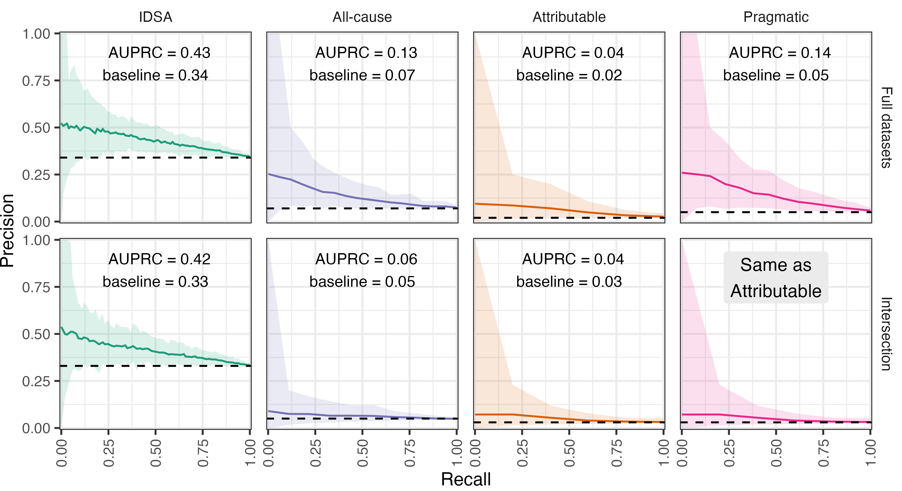

<link href="paper_files/libs/lightable-0.0.1/lightable.css" rel="stylesheet" />

# Predicting Severity of *C. difficile* Infections from the Taxonomic Composition of the Gut Microbiome

Kelly L. Sovacool, Sarah E. Tomkovich, Megan L. Coden, Jenna Wiens,
Vincent B. Young, Krishna Rao, Patrick D. Schloss

# Abstract

*Clostridioides difficile* infection (CDI) can lead to adverse outcomes
including ICU admission, colectomy, and death. The composition of the
gut microbiome plays an important role in determining colonization
resistance and clearance upon exposure to *C. difficile*. We
investigated whether machine learning (ML) models trained on 16S rRNA
gene amplicon sequences from gut microbiota extracted from 1,277 patient
stool samples on the day of CDI diagnosis could predict which CDI cases
led to severe outcomes. We then trained ML models to predict CDI
severity on OTU relative abundances according to four different severity
definitions: the IDSA severity score on the day of diagnosis, all-cause
adverse outcomes within 30 days, adverse outcomes confirmed as
attributable to CDI via chart review, and a pragmatic definition that
uses the attributable definition when available and otherwise uses the
all-cause definition. The models predicting pragmatic severity performed
best, suggesting that while chart review is valuable to verify the cause
of complications, including as many samples as possible is indispensable
for training performant models on imbalanced datasets. Permutation
importance identified *Enterococcus* as the most important OTU for model
performance, and increased relative abundance of *Enterococcus* was
associated with severe outcomes. Finally, we evaluated the potential
clinical value of the OTU-based models and found similar performance
compared to prior models based on Electronic Health Records. The modest
performance of the OTU-based models represents a step toward the goal of
deploying models to inform clinical decisions and ultimately improve CDI
outcomes.

# Introduction

*Clostridoides difficile* infection (CDI) is the most common nosocomial
infection in the United States, and community-acquired cases are on the
rise (1, 2). The classic CDI case typically occurs soon after antibiotic
use, which perturbs the protective gut microbiota and allows *C.
difficile* to proliferate (3). Non-antibiotic medications including
proton-pump inhibitors and osmotic laxatives have also been associated
with increased CDI susceptibilty and inhibited clearance (4, 5).
Diarrhea is the primary symptom, with some patients developing colitis,
toxic megacolon, or requiring intensive care with an in-hospital
mortality rate of approximately 8-9% (6, 7). Furthermore, 5-20% of
initial cases reoccur within 2-8 weeks, and recurrent cases are
associated with increased morbidity and mortality risk (3, 8). Patient
risk factors for CDI-related morbidity and mortality include age greater
than 65 years, history of recurrent CDI, and co-morbid chronic illnesses
(9). CDI remains a significant burden on the US health care system with
approximately 500,000 cases annually (10, 11).

There is a need for robust, accurate methods to identify patients at
risk of severe CDI outcomes. When paired with treatment options that may
reduce risk of severity, prediction models can guide clinician
decision-making to improve patient outcomes while minimizing harms from
unnecessary treatment. Numerous scoring systems for predicting severe
CDI outcomes based on patient clinical factors have been developed, but
none have validated well to external datasets nor are any in use in
routine clinical practice (12, 13). Rather than relying on limited sets
of human-curated variables, machine learning (ML) is a promising
approach that allows for use of thousands of features to classify
samples and predict outcomes. Indeed, ML models trained on entire
Electronic Health Record (EHR) data have demonstrated improved
performance over curated models (14, 15).

Aside from patient factors encoded in EHRs, the state of the patient gut
microbiome is a promising factor to predict severity, as the host
microbiota can play either a protective or harmful role in *C.
difficile* colonization, infection, and clearance. Mouse studies have
found that the initial taxonomic composition of the gut microbiome
predicts differences in clearance, moribundity, and cecal tissue damage
in mice infected with CDI (16, 17). Identifying features of the human
gut microbiota that promote or prevent severe infections can guide
further experiments to elucidate microbial mechanisms of CDI severity,
and incorporating these features into CDI severity models may improve
model performance to help guide clinical treatment decisions.

We set out to investigate whether ML models trained on the taxonomic
composition of the gut microbiome can predict CDI severity in a human
cohort, whether the severity definition employed affects model
performance, and whether there is potential clinical value in deploying
OTU-based models. Stool samples from 1,277 CDI patients were collected
on the day of diagnosis and 16S rRNA gene amplicon sequencing was
performed, followed by clustering sequences into Operational Taxonomic
Units (OTUs). We then trained ML models to classify or predict each of
four severity definitions from OTU relative abundances, identified which
microbial features contributed most to model performance, and conducted
a proof-of-concept analysis of the potential clinical value of these
OTU-based models and compared these to prior EHR-based models.

# Results

## CDI severity.

There is not currently a consensus definition of CDI severity. Some
scoring systems leverage clinical data available during the course of
CDI, while others focus on adverse outcomes of CDI at 30 days after
diagnosis (9, 18). We explored four different ways to define CDI cases
as severe or not ([Figure 1](#fig-flowchart)). The Infectious Diseases
Society of America (IDSA) definition of severe CDI is based on
laboratory values collected on the day of diagnosis, with a case being
severe if serum creatinine level is greater than or equal to $1.5 mg/dL$
and the white blood cell count is greater than or equal to $15 k/\mu L$
(19). Although data for the IDSA score is straightforward to collect, it
is known to be a poor predictor of adverse outcomes (20). The remaining
definitions we employed focus on the occurrence of adverse outcomes,
which may be more clinically relevant. The “attributable” severity
definition is based on disease-related complications defined by the
Centers for Disease Control and Prevention, where an adverse event of
ICU admission, colectomy, or death occurs within 30 days of CDI
diagnosis, and the adverse event is determined to be attributable to the
CDI by physician chart review (21). However, physician chart review is
time-consuming and has not been completed for all cases (n=46 out of 86
cases with an adverse outcome), so we defined “all-cause” severity where
a case is severe if an adverse event occurs within 30 days of the
diagnosis regardless of the cause of the adverse event. Finally, we
defined a “pragmatic” severity definition that makes use of the
attributable definition when available and uses the all-cause definition
when chart review has not been completed, allowing us to use as many
samples as we have available while taking physicians’ expert opinions
into account where possible ([Figure 1](#fig-flowchart) B). We trained
ML models to classify (in the case of the IDSA definition) or predict
(in the case of the three other definitions) severity and determined how
well OTU-based models perform for each definition.

Figure 1: **CDI severity definitions.** **A)** Decision flow chart to
define CDI cases as severe according to the Infectious Diseases Society
of America (IDSA) based on lab values, the occurrence of an adverse
outcome due to any cause (All-cause), and the occurrence of
disease-related complications confirmed as attributable to CDI with
chart review (Attributable). **B)** The proportion of severe CDI cases
labelled according to each definition. An additional ‘Pragmatic’
severity definition uses the Attributable definition when possible, and
falls back to the All-cause definition when chart review is not
available. See **?@tbl-counts** for sample counts and proportions of
severe cases across severity definitions.

| Severity     |     n | % severe |
|:-------------|------:|---------:|
| All-cause    | 1,218 |      7.1 |
| Attributable | 1,178 |      2.2 |
| IDSA         | 1,072 |     34.2 |
| Pragmatic    | 1,218 |      5.4 |

Table 1: Full datasets

| Severity     |   n | % severe |
|:-------------|----:|---------:|
| All-cause    | 993 |      4.6 |
| Attributable | 993 |      2.6 |
| IDSA         | 993 |     32.7 |
| Pragmatic    | 993 |      2.6 |

Table 2: Intersection of samples with all labels available

**Sample counts and proportion of severe cases.** Each severity
definition has a different number of patient samples available, as well
as a different proportion of cases labelled as severe.

## Model performance.

We first set out to train the best models possible for each severity
definition. Not all samples have outcomes available for all four
severity definitions due to missing data for some patient lab values and
incomplete chart review ([Figure 1](#fig-flowchart) B), thus each
severity definition had a different number of samples when using as many
samples as possible (**?@tbl-counts** A). We referred to these as the
full datasets. Random forest models were trained on 100 splits of the
datasets into training and test sets, and performance was evaluated on
the held-out test set using the area under the receiver-operator
characteristic curve (AUROC). Since the severity outcomes were highly
imbalanced with different proportions of severe samples between
definitions, we also calculated the balanced precision and the area
under the balanced precision-recall curve (AUBPRC) as first proposed by
(22) to describe the precision that would be expected if the outcomes
were balanced.

After training on the full datasets, the performance as measured by the
AUROCs of the training set cross-validation folds were similar to those
of the held-out test sets, indicating that the models are neither
overfit nor underfit ([Figure 2](#fig-performance) A). As measured by
AUROC on the held-out test sets, models predicting pragmatic severity
performed best with a median AUROC of 0.69, and this was significantly
different from that of the other definitions on the full datasets (P \<
0.05). Models predicting IDSA, all-cause, and attributable severity
performed similarly with median test set AUROCs of 0.61, 0.63, and 0.61
respectively. The test set AUROCs were not significantly different (P \>
0.05) for attributable and IDSA nor for attributable and all-cause, but
the IDSA and all-cause AUROCs were significantly different from each
other (P \< 0.05). We plotted the receiver-operator characteristic curve
and found that the pragmatic severity models outperformed the others at
all specificity values ([Figure 2](#fig-performance) B). For comparison,
a prior study with a different dataset trained a logistic regression
model on whole Electronic Health Record data extracted on the day of CDI
diagnosis to predict attributable severity, yielding an AUROC of 0.69
(15). While our attributable severity model did not meet this
performance, the pragmatic severity model performed just as well as the
EHR-based model in terms of AUROC.

Figure 2: **Performance of ML models.** In the left facets, models were
trained on the full datasets, with different numbers of samples
available for each severity definition. In the right facets, models were
trained on the same dataset consisting of the intersection of samples
with labels available for all definitions. Note that the intersection
dataset has exactly the same labels for attributable and pragmatic
severity, thus these have identical performance. **A)** Area under the
receiver-operator characteristic curve (AUROC) for the test sets and
cross-validation folds of the training sets, and the area under the
balanced precision-recall curve (AUBPRC) for the test sets. Each point
is annotated with the median performance across 100 train/test splits
with tails as the 95% CI. **B)** Receiver-operator characteristic curves
for the test sets. Mean specificity is reported at each sensitivity
value, with ribbons as the 95% CI. **C)** Balanced precision-recall
curves for the test sets. Mean balanced precision is reported at each
recall (sensitivity) value, with ribbons as the 95% CI. Original
unbalanced precision-recall curves are shown in Supplementary
[Figure 4](#fig-prc).

Since the data are highly imbalanced with only a small proportion of CDI
cases having a severe outcome, evaluating the trade-off between
precision and recall is more informative than the receiver-operator
characteristic because precision and recall do not consider true
negatives, which may overinflate the AUROC. However, unlike for AUROC,
the baseline for the area under the precision-recall curve depends on
the proportion of positive outcomes (i.e. severe cases) in the data,
which vary across these severity definitions. To allow comparison of
precision across datasets with different proportions of positives, (22)
introduced the concept of balanced precision, a transformation of
precision based on Bayes’ theorem that represents the precision that
would have been expected if the proportion of positives were balanced at
0.5. Reporting the area under the balanced precision-recall curve
(AUBPRC) allows us to compare the trade-off between precision and recall
for our different severity defintions. The test set median AUBPRCs from
the full datasets followed a similar pattern as the test set AUROCs with
0.60 for IDSA severity, 0.67 for all-cause severity, 0.66 for
attributable severity, and 0.75 for pragmatic severity. The AUBPRCs were
significantly different from each other (P \< 0.05) for each pair of
severity definitions except for attributable versus all-cause. We
plotted the balanced precision-recall curve and found that the IDSA
definition outperformed all other models at very low recall values, but
the others outperform IDSA at all other points of the curve
([Figure 2](#fig-performance) C). The 95% confidence intervals
overlapped the baseline AUROC and AUBPRC for the attributable severity
models, while all others did not overlap the baseline.

While it is advantageous to use as much data as available to train the
best models possible, comparing performances of models trained on
different subsets of the data is not entirely fair. To enable fair
comparisons of the model performances across different severity
definitions, we also selected the intersection of samples (n=993) that
had labels for all four severity definitions and repeated the model
training and evaluation process on this intersection dataset. The
attributable definition is exactly the same as the pragmatic definition
for the intersection dataset, as we defined pragmatic severity to use
the attributable definition when available. The performance results on
the intersection dataset are shown in the right facets of each panel of
[Figure 2](#fig-performance).

As with the full datasets, the AUROCs of the training sets and test sets
were similar within each severity definition. The median test set AUROCs
were 0.60 for IDSA severity, 0.55 for all-cause severity, 0.59 and for
attributable severity. The AUROCs on the intersection dataset were
significantly different for all-cause versus attributable and all-cause
versus IDSA severity (P \< 0.05), but not for IDSA versus attributable
severity (P \> 0.05). The median test set AUBPRCs were 0.59 for IDSA
severity, 0.55 for all-cause severity, 0.58 and for attributable
severity. Just as with the AUROCs, the AUBPRCs were significantly
different for all-cause versus attributable and all-cause versus IDSA
severity (P \< 0.05), but not for IDSA versus attributable severity (P
\> 0.05). For all severity definitions, performance dropped between the
full dataset and the intersection dataset since fewer samples are
available, but this effect is least dramatic for IDSA severity as the
full and intersection datasets are more similar for this definition
(**?@tbl-counts** B). The 95% confidence interval overlaps with the
baseline for both AUROC and AUBPRC for all definitions on the
intersection dataset except for IDSA severity.

## Feature importance.

We performed permutation feature importance to determine which OTUs
contributed the most to model performance. An OTU was considered
important if performance decreased when it was permuted in at least 75%
of the train/test splits, with greater differences in AUROC meaning
greater importance. We plotted mean decrease in AUROC alongside
log10-transformed mean relative abundances for the top OTUs
([Figure 3](#fig-features)). *Enterococcus* was the most important OTU,
being significantly important for all models except for attributable
severity on the full dataset. *Staphylococcus* was important for the
pragmatic and all-cause definitions on the full datasets, but not for
models trained on the intersection dataset. *Lactobacillus* was
important only for the all-cause definition on the intersection dataset.
All remaining OTUs had differences in AUROC \< 0.02 and were only
significantly important in one or two of the models at most. There is
not always a clear pattern of increased or decreased relative abundance
for important OTUs in severe CDI cases, but all of the top 5 OTUs had an
increased mean relative abundance in severe cases relative to not severe
cases.

Figure 3: **Feature importance.** **A)** Feature importance via
permutation test. For each OTU, the order of samples was randomized in
the test set 100 times and the performance was re-calculated to estimate
the permutation performance. An OTU was considered important if the
performance decreased when the OTU was permuted in at least 75% of the
models. Mean difference in AUROC and the 75% confidence interval (CI) is
reported for each OTU, with starred OTUs being significant for the 75%
CI. OTUs with a greater difference in AUROC (actual performance minus
permutation performance) are more important. Left: models were trained
on the full datasets, with different numbers of samples available for
each severity definition. Right: models were trained on the intersection
of samples with all labels available for each definition. Note that
Attributable and Pragmatic severity are exactly the same for the
intersection dataset. *Pseudomonas* (OTU 120) is not shown for IDSA
severity in the full datasets nor in the intersection dataset because it
was removed during pre-processing due to having near-zero variance.
**B)** Log10-transformed mean relative abundances of the most
important OTUs on the full datasets, grouped by severity (shape). The
vertical dashed line is the limit of detection.

## Estimating clinical value.

Even if a model performs well, it may not be useful in a clinical
setting unless it can guide clinicians to choose between treatment
options. At this time, we are not aware of any direct evidence that a
particular treatment reduces the risk of severe CDI outcomes. However,
with some assumptions we offer a proof-of-concept analysis of the
potential clinical value of OTU-based severity prediction models when
paired with treatments that may reduce severity. When considering the
suitability of a model for deployment in clinical settings, the number
needed to screen (NNS) is a highly relevant metric representing how many
patients must be predicted as severe by the model to identify one true
positive. Similarly, the number needed to treat (NNT) is the number of
true positive patients that must be treated by an intervention in order
for one patient to benefit from the treatment. Multiplying NNS by NNT
yields the number needed to benefit (NNB): the number of patients
predicted to have a severe outcome who then benefit from the treatment
(23). Thus the NNB pairs model performance with treatment effectiveness
to estimate the benefit of using predictive models in clinical practice,
and are useful for comparing models and performing cost-benefit
analyses. Lower values of NNS, NNT, and NNB are better, with the minimum
value being 1, as fewer patients must be screened and treated in order
to benefit a single patient.

Current clinical guidelines specify vancomycin and fidaxomicin as the
standard antibiotics to treat CDI, with a preference for fidaxomicin due
to its higher rate of sustained resolution of CDI and lower rate of
recurrence (24). The NNTs of fidaxomicin for sustained resolution and
prevention of recurrence are each estimated to be 10 (25, 26). However,
fidaxomicin is considerably more expensive than vancomycin. If
fidaxomicin were shown to reduce the risk of severe CDI outcomes, it
could be preferentially prescribed to patients predicted to be at risk,
while prescribing vancomycin to low-risk patients. If we assume that the
superior efficacy of fidaxomicin for sustained resolution and reduced
recurrence also translates to reducing the risk of severe outcomes, we
can pair the NNT of fidaxomicin with the NNS of OTU-based prediction
models to estimate the NNB.

To calculate a clinically-relevant NNS for these models, we computed the
confusion matrix at the 95th percentile of risk for each prediction
model. We excluded the IDSA severity models as the IDSA severity scores
were calculated on the day of diagnosis, thus they are classification
rather than prediction problems. Furthermore, IDSA severity scores do
not correlate well with disease-related adverse events which are a more
salient outcome to prevent. Among the models predicting severe outcomes,
those trained on the full datasets performed best with an NNS of 4 for
the all-cause definition, 6 for the attributable definition, and 3 for
the pragmatic definition (**?@tbl-risk**). Multiplying the NNS of the
OTU-based models by the estimated NNT of 10 for fidaxomicin yields NNB
values of 40 for all-cause severity, 60 for attributable severity, and
30 for pragmatic severity. Thus, in a hypothetical scenario where these
assumptions about fidaxomicin hold true, between 30 and 60 patients
would need to be predicted to experience a severe outcome and be treated
with fidaxomicin in order for one patient to benefit, with the pragmatic
severity models having the best NNB when paired with fidaxomicin. As the
NNS values were computed at the 95th percentile of risk (where 5% of
patients screened are predicted to experience severity), these NNB
values mean that 600 to 1,200 total CDI patients would need to be
screened by an OTU-based prediction model and treated with fidaxomicin
in order for one patient to benefit. For comparison, prior studies
predicted CDI-attributable severity using whole Electronic Health Record
data extracted two days after diagnosis and from a smaller set of
manually curated variables, achieving precision values of 0.417 (NNS =
2.4) for the EHR model and 0.167 (NNS = 6.0) for the curated model at
the 95th percentile of risk (14, 15). Pairing the prior EHR-based model
with fidaxomicin would yield an NNB of 24 with 480 total CDI patients
screened and treated for one patient to benefit. Thus the pragmatic
severity model did not outperform the EHR-based model, although the EHR
data were extracted two days after diagnosis while OTUs in this study
are from stool samples collected on the day of diagnosis. These
estimates represent a proof-of-concept demonstration of the potential
value and trade-offs of deploying severity prediction models trained on
microbial factors versus EHRs to guide clinicians’ treatment decisions.
<!-- 
TODO possible to find NNS on day of diagnosis for EHR model?
-->

| Outcome      | Risk threshold |  TP |  FP |  TN |  FN | Precision | NNS | Recall | Specificity |
|:-------------|---------------:|----:|----:|----:|----:|----------:|----:|-------:|------------:|
| All-cause    |           0.20 |   3 |   9 | 217 |  14 |      0.25 |   4 |   0.18 |        0.96 |
| Attributable |           0.10 |   2 |  10 | 220 |   3 |      0.17 |   6 |   0.40 |        0.96 |
| Pragmatic    |           0.25 |   4 |   8 | 222 |   9 |      0.33 |   3 |   0.31 |        0.97 |

Table 3: Full datasets

| Outcome      | Risk threshold |  TP |  FP |  TN |  FN | Precision | NNS | Recall | Specificity |
|:-------------|---------------:|----:|----:|----:|----:|----------:|----:|-------:|------------:|
| All-cause    |            0.2 |   2 |   8 | 181 |   7 |       0.2 |   5 |   0.22 |        0.96 |
| Attributable |            0.1 |   1 |   9 | 184 |   4 |       0.1 |  10 |   0.20 |        0.95 |

Table 4: Intersection of samples with all labels available

**Predictive model performance at 95th percentile of risk.** The
confusion matrix was computed for the decision threshold at the 95th
percentile of risk for each severity prediction model, which corresponds
to 5% of cases predicted to have a severe outcome. The number needed to
screen (NNS) to identify one true positive is the reciprocal of
precision.

# Discussion

We trained ML models based on gut microbial communities on the day of
CDI diagnosis to predict CDI severity according to four different
severity definitions. The purpose of the full datasets was to train the
best models possible given the constraints, while using the intersection
dataset allows for comparing severity definitions. We found that models
predicting pragmatic severity with as much data as available performed
best, while models classifying IDSA severity outperformed the all-cause
and attributable definitions only with the intersection. Performance
dropped substantially when reducing to the intersection dataset for all
definitions, likely due to the particularly imbalanced nature of the
all-cause and attributable definitions. These results demonstrate the
importance of using as many samples as possible when data are sparse and
the outcome is low prevalence, as well as the need to incorporate
physician’s expertise when possible.

Permutation feature importance revealed patterns of important bacteria
that concord with the literature. Enrichment of *Enterococcus* and
*Lactobacillus* in *C. difficile* infection and severity have been
well-documented in prior studies, thus their importance and increase in
abundance for severe cases is not surprising (17, 27–29). For many of
the top OTUs, there is a wide range in importance. Notably, the OTU
represented by *Pseudomonas* had wide variance in importance for the
full dataset in models predicting attributable severity, with the
maximum point more important than any other OTU yet a minimum below
zero. However, for the intersection dataset, this OTU was removed due to
having near-zero variance. The presence of *Pseudomonas* was thus
informative in a small number of patient samples, but not in others, and
these samples were lost in the intersection dataset. Overall the
abundance data are patchy, as these patients were likely all taking
antibiotics for unrelated infections prior to CDI onset. A limitation of
permutation importance is that the contribution of each feature is
considered in isolation, but members of microbial communities interact
and compete with each other, thus these complicated relationships are
not well captured by permutation importance.

The full pragmatic severity model performed just as well as a prior
EHR-based model trained on the day of diagnosis, demonstrating the
potential utility of OTU-based models. In terms of the number needed to
screen, the OTU-based pragmatic severity model outperformed a prior
model of manually curated clinical variables, but not a model trained on
EHR data extracted two days after diagnosis. While the attributable
definition had a worse NNS for the OTU-based models, it did not perform
worse than the prior curated model, and it may be the most clinically
relevant as physician chart review increases confidence that
positively-labelled severe outcomes are due to the CDI rather than other
causes. Obtaining EHR data for the dataset in this study would allow a
more direct comparison of the performance of models trained on OTUs,
EHRs, or both, as well as extracting EHR data on the day of diagnosis
rather than two days after.

However, it is not enough for models to perform well to justify
deploying them in a clinical setting; benefit over current practices
must be shown (30). Although no known treatment options have been shown
to reduce the risk of severe CDI outcomes, fidaxomicin is promising due
to its improved time to resolution and reduced recurrence. Despite its
increased cost, fidaxomicin is also attractive as a preferential
antibiotic option as vancomycin-resistant *Enterococcus* is on the rise
and enterococci are known to worsen CDI (31, 32). We extended our
analysis of clinical value to incorporate the number needed to treat for
fidaxomicin alongside the predictive models in order to calculate the
number needed to benefit. The NNB contextualizes model performance
within clinical reality, as it combines both model performance and
treatment effectiveness (23). A more robust analysis of clinical value
would further consider the cost of treatment options versus the savings
of averting severe outcomes across a range of decision thresholds, as
economic disparities are a major barrier to treatment in the US (24).
Cost-benefit analyses based on clinical trial data have reported that
fidaxomicin may be as cost-effective as vancomycin as a treatment for
initial CDI cases, largely due to the reduced risk of recurrence (33,
34). While our analysis of clinical value is only a proof-of-concept, if
evidence emerges that new or existing treatments significantly reduce
the risk of severe CDI, our results can be incorporated into future
considerations of whether to build severity prediction models and what
features should be incorporated. In practice, EHR-based models are less
costly to deploy than OTU-based models and do not require additional
clinical sample collection. Amplicon sequencing is not typically
performed for CDI patients, however, routinely profiling the microbial
communities of CDI patients could be justified if models that
incorporate microbial features were shown to improve patient outcomes.

In all, we found that our models to predict severity from features of
the gut microbiome performed moderately well. Our approach enabled us to
identify bacteria that contributed to model performance and evaluate how
well the state of the gut microbiome can predict several different
definitions of CDI severity. Further work is needed to determine whether
the performance of OTU-based models is sufficient to justify their
deployment in clinical settings, especially as compared to EHR-based
models. If and when new evidence emerges of improved treatments to
prevent severe CDI outcomes, deploying performant and robust models for
clinicians to tailor treatment options may improve patient outcomes and
reduce the burden of severe CDI.

# Materials and Methods

## Sample collection.

This study was approved by the University of Michigan Institutional
Review Board. All patient samples were collected by the University of
Michigan Health System from January 2016 through December 2017. Stool
samples that had unformed stool consistency were tested for *C.
difficile* by the clinical microbiology lab with a two-step algorithm
that included detection of *C. difficile* glutamate dehydrogenase and
toxins A and B by enzyme immunoassay with reflex to PCR for the *tcdB*
gene when results were discordant. 1,517 stool samples were collected
from patients diagnosed with a CDI. Leftover stool samples that were
sent to the clinical microbiology lab were collected and split into
different aliquots. For 16S sequencing, the aliquot of stool was
re-suspended in DNA genotek stabilization buffer and then stored in the
-80°C freezer.

## 16S rRNA gene amplicon sequencing.

Samples stored in DNA genotek buffer were thawed from the -80°C,
vortexed, and then transferred to a 96-well bead beating plate for DNA
extractions. DNA was extracted using the DNeasy Powersoil HTP 96 kit
(Qiagen) and an EpMotion 5075 automated pipetting system (Eppendorf).
The V4 region of the 16S rRNA gene was amplified with the AccuPrime Pfx
DNA polymerase (Thermo Fisher Scientific) using custom barcoded primers,
as previously described (35). Each library preparation plate for
sequencing contained a negative control (water) and mock community
control (ZymoBIOMICS microbial community DNA standards). The PCR
amplicons were normalized (SequalPrep normalization plate kit from
Thermo Fisher Scientific), pooled and quantified (KAPA library
quantification kit from KAPA Biosystems), and sequenced with the MiSeq
system (Illumina).

All sequences were processed with mothur (v1.46) using the MiSeq SOP
protocol (35, 36). Paired sequencing reads were combined and aligned
with the SILVA (v132) reference database (37) and taxonomy was assigned
with a modified version of the Ribosomal Database Project reference
sequences (v16) (38). Sequences were clustered into *de novo* OTUs with
the OptiClust algorithm in mothur (39), resulting in 9,939 OTUs. Samples
were then subsampled to 5,000 sequences per sample. Only the first CDI
sample per patient was used for subsequent ML analyses such that no
patient is represented more than once, resulting in a dataset of 1,277
samples.

## Defining CDI severity.

We chose to explore four different ways to define CDI cases as severe or
not ([Figure 1](#fig-flowchart)).

- **IDSA**: A case is severe if serum creatinine level is greater than
  or equal to $1.5 mg/dL$ and the white blood cell count is greater than
  or equal to $15 k/\mu L$ on the day of diagnosis (19).
- **All-cause**: A case is severe if ICU admission, colectomy, or death
  occurred within 30 days of CDI diagnosis, regardless of the cause of
  the adverse event.
- **Attributable**: A case is severe if an adverse event of ICU
  admission, colectomy, or death occurred within 30 days of CDI
  diagnosis, and the adverse event was determined to be attributable to
  the CDI by two physicians who reviewed the medical chart (21).
- **Pragmatic**: A case’s severity is determined by the attributable
  definition if it is available, otherwise it is determiend by the
  all-cause definition.

## Model training.

Random forest models were used to examine whether OTU data collected on
the day of diagnosis could classify CDI cases as severe according to
each severity definition. We used the mikropml R package v1.5.0 (40)
implemented in a custom version of the mikropml Snakemake workflow (41)
for all steps of the machine learning analysis. We have full datasets
which use all samples available for each severity definition, and an
intersection dataset which consists of only the samples that have all
four definitions labelled. The intersection dataset is the most fair for
comparing model performance across definitions, while the full dataset
allows us to use as much data as possible for model training and
evaluation. Datasets were pre-processed with the default options in
mikropml to remove features with near-zero variance and scale continuous
features from -1 to 1. During pre-processing, 9,757 to 9,760 features
were removed due to having near-zero variance, resulting in datasets
having 179 to 182 features depending on the severity definition. No
features had missing values and no features were perfectly correlated.
We randomly split the data into an 80% training and 20% test set and
repeated this 100 times, followed by training models with 5-fold
cross-validation.

## Model evaluation.

Model performance was calculated on the held-out test sets using the
area under the receiver-operator characteristic curve (AUROC) and the
area under the balanced precision-recall curve (AUBPRC). Permutation
feature importance was then performed to determine which OTUs
contributed most to model performance. We reported OTUs with a
significant permutation test in at least 75 of the 100 models.

Since the severity labels are imbalanced with different frequencies of
severity for each definition, we calculated balanced precision, the
precision expected if the labels were balanced. The balanced precision
and the area under the balanced precision-recall curve (AUBPRC) were
calculated with Equations 1 and 7 from (22).

## Number needed to benefit.

For the severity prediction models (which excludes the IDSA definition),
we set out to estimate the potential benefit of deploying models in
clinical settings. We determined the decision threshold at the 95th
percentile of risk for each model, which corresponds to 5% of cases
being predicted by the model to experience a severe outcome. At this
threshold we computed the number needed to screen (NNS), which is the
reciprocal of precision and represents the number of cases that must be
predicted as severe to identify one true positive (42). The number
needed to treat (NNT) is the number of true positive patients that must
be treated by an intervention in order for one patient to benefit, and
is calculated from the reciprocal of absolute risk in randomized
controlled trials (43). Multiplying the NNS of a model by the NNT of a
treatment yields the number needed to benefit (NNB) - the number of
patients that must be predicted to have a severe outcome and undergo a
treatment to benefit from it (23). NNB encapsulates the benefit of
pairing a predictive model with a treatment in a clinical setting, with
lower NNB numbers being better.

## Code availability.

The complete workflow, code, and supporting files required to reproduce
this manuscript with accompanying figures is available at
<https://github.com/SchlossLab/severe-CDI>. <!-- 
TODO update GitHub URL once accepted to journal
-->

The workflow was defined with Snakemake (44) and dependencies were
managed with conda environments. Scripts were written in R (45), Python
(46), and GNU bash. Additional software and packages used in the
creation of this manuscript include cowplot (47), ggtext (48), ggsankey
(49), schtools (50), the tidyverse metapackage (51), Quarto, and vegan
(52).

## Data availability.

The 16S rRNA sequencing data have been deposited in the National Center
for Biotechnology Information Sequence Read Archive (BioProject
Accession no. PRJNA729511).

# Acknowledgements

We thank the patients for donating stool samples and the research team
members who collected, stored, and processed the samples.

<!--
## Author contributions
&#10;KLS performed data processing, trained machine learning models, wrote the
analysis code, created the figures and tables, and wrote the original draft of
the manuscript.
SET processed samples, performed initial analysis of IDSA severity scores, and
contributed analysis code.
MLC contributed analysis code and assisted in training machine learning models.
JW, VBY, and KR directed the analysis of clinical value.
PDS conceived of the study and supervised the project.
All authors reviewed and edited the manuscript.
&#10;## Funding
&#10;TODO
&#10;-->



# References

1.
**Magill SS**, **Edwards JR**,
**Bamberg W**, **Beldavs ZG**, **Dumyati G**, **Kainer MA**, **Lynfield
R**, **Maloney M**, **McAllister-Hollod L**, **Nadle J**, **Ray SM**,
**Thompson DL**, **Wilson LE**, **Fridkin SK**. 2014. Multistate
Point-Prevalence Survey of Health Care. N Engl J Med **370**:1198–1208.
doi:
[10.1056/NEJMoa1306801](https://doi.org/10.1056/NEJMoa1306801).

2.
**Feuerstadt P**, **Theriault N**,
**Tillotson G**. 2023. The burden of CDI in the United States: A
multifactorial challenge. BMC Infectious Diseases **23**:132. doi:
[10.1186/s12879-023-08096-0](https://doi.org/10.1186/s12879-023-08096-0).

3.
**Kelly CP**. 2012. Can we
identify patients at high risk of recurrent *Clostridium* *Difficile*
infection? Clinical Microbiology and Infection **18**:21–27. doi:
[10.1111/1469-0691.12046](https://doi.org/10.1111/1469-0691.12046).

4.
**Janarthanan S**, **Ditah I**,
**Adler DG**, **Ehrinpreis MN**. 2012. *Clostridium
Difficile*-Associated Diarrhea and Proton Pump Inhibitor Therapy: A
Meta-Analysis. Official journal of the American College of
Gastroenterology \| ACG **107**:1001. doi:
[10.1038/ajg.2012.179](https://doi.org/10.1038/ajg.2012.179).

5.
**Tomkovich S**, **Taylor A**,
**King J**, **Colovas J**, **Bishop L**, **McBride K**, **Royzenblat
S**, **Lesniak NA**, **Bergin IL**, **Schloss PD**. 2021. An Osmotic
Laxative Renders Mice Susceptible to Prolonged *Clostridioides*
*Difficile* Colonization and Hinders Clearance. mSphere
**6**:10.1128/msphere.00629–21. doi:
[10.1128/msphere.00629-21](https://doi.org/10.1128/msphere.00629-21).

6.
**Lucado J**, **Elixhauser A**.
2012. [*Clostridium Difficile* Infections (CDI) in Hospital Stays, 2009.
HCUP Statistical Brief
\#124](http://www.hcup-us.ahrq.gov/reports/statbriefs/sb124.pdf).
AHRQ.

7.
**Kassam Z**, **Cribb Fabersunne
C**, **Smith MB**, **Alm EJ**, **Kaplan GG**, **Nguyen GC**,
**Ananthakrishnan AN**. 2016. *Clostridium Difficile* associated risk of
death score (CARDS): A novel severity score to predict mortality among
hospitalised patients with *C**. Difficile$<$i/$>$ Infection*. Aliment
Pharmacol Ther **43**:725–733. doi:
[10.1111/apt.13546](https://doi.org/10.1111/apt.13546).

8.
**Napolitano LM**, **Edmiston
CE**. 2017. *Clostridium Difficile* disease: Diagnosis, pathogenesis,
and treatment update. Surgery **162**:325–348. doi:
[10.1016/j.surg.2017.01.018](https://doi.org/10.1016/j.surg.2017.01.018).

9.
**Ressler A**, **Wang J**, **Rao
K**. 2021. Defining the black box: A narrative review of factors
associated with adverse outcomes from severe *Clostridioides*
*Difficile* infection. Therap Adv Gastroenterol
**14**:17562848211048127. doi:
[10.1177/17562848211048127](https://doi.org/10.1177/17562848211048127).

10.
**Guh AY**, **Mu Y**, **Winston
LG**, **Johnston H**, **Olson D**, **Farley MM**, **Wilson LE**,
**Holzbauer SM**, **Phipps EC**, **Dumyati GK**, **Beldavs ZG**,
**Kainer MA**, **Karlsson M**, **Gerding DN**, **McDonald LC**. 2020.
Trends in U.S. Burden of *Clostridioides* *Difficile* Infection and
Outcomes. N Engl J Med **382**:1320–1330. doi:
[10.1056/NEJMoa1910215](https://doi.org/10.1056/NEJMoa1910215).

11.
**Kwon JH**, **Olsen MA**,
**Dubberke ER**. 2015. The morbidity, mortality, and costs associated
with *Clostridium* *Difficile* infection. Infect Dis Clin North Am
**29**:123–134. doi:
[10.1016/j.idc.2014.11.003](https://doi.org/10.1016/j.idc.2014.11.003).

12.
**Chakra CNA**, **Pepin J**,
**Valiquette L**. 2012. Prediction Tools for Unfavourable Outcomes in
*Clostridium* *Difficile* Infection: A Systematic Review. PLOS ONE
**7**:e30258. doi:
[10.1371/journal.pone.0030258](https://doi.org/10.1371/journal.pone.0030258).

13.
**Perry DA**, **Shirley D**,
**Micic D**, **Patel PC**, **Putler R**, **Menon A**, **Young VB**,
**Rao K**. 2022. External Validation and Comparison of *Clostridioides*
*Difficile* Severity Scoring Systems. Clinical Infectious Diseases
**74**:2028–2035. doi:
[10.1093/cid/ciab737](https://doi.org/10.1093/cid/ciab737).

14.
**Rao K**, **Micic D**,
**Natarajan M**, **Winters S**, **Kiel MJ**, **Walk ST**, **Santhosh
K**, **Mogle JA**, **Galecki AT**, **LeBar W**, **Higgins PDR**, **Young
VB**, **Aronoff DM**. 2015. *Clostridium Difficile* Ribotype 027:
Relationship to Age, Detectability of Toxins A or B in Stool With Rapid
Testing, Severe Infection, and Mortality. Clinical Infectious Diseases
**61**:233–241. doi:
[10.1093/cid/civ254](https://doi.org/10.1093/cid/civ254).

15.
**Li BY**, **Oh J**, **Young VB**,
**Rao K**, **Wiens J**. 2019. Using Machine Learning and the Electronic
Health Record to Predict Complicated *Clostridium* *Difficile*
Infection. Open Forum Infect Dis **6**:ofz186. doi:
[10.1093/ofid/ofz186](https://doi.org/10.1093/ofid/ofz186).

16.
**Tomkovich S**, **Stough JMA**,
**Bishop L**, **Schloss PD**. 2020. The Initial Gut Microbiota and
Response to Antibiotic Perturbation Influence *Clostridioides*
*Difficile* Clearance in Mice. mSphere **5**. doi:
[10.1128/mSphere.00869-20](https://doi.org/10.1128/mSphere.00869-20).

17.
**Lesniak NA**, **Schubert AM**,
**Flynn KJ**, **Leslie JL**, **Sinani H**, **Bergin IL**, **Young VB**,
**Schloss PD**. 2022. The Gut Bacterial Community Potentiates
*Clostridioides* *Difficile* Infection Severity. mBio **13**:e01183–22.
doi:
[10.1128/mbio.01183-22](https://doi.org/10.1128/mbio.01183-22).

18.
**Dieterle MG**, **Putler R**,
**Perry DA**, **Menon A**, **Abernathy-Close L**, **Perlman NS**,
**Penkevich A**, **Standke A**, **Keidan M**, **Vendrov KC**, **Bergin
IL**, **Young VB**, **Rao K**. 2020. Systemic Inflammatory Mediators Are
Effective Biomarkers for Predicting Adverse Outcomes in *Clostridioides*
*Difficile* Infection. mBio **11**:e00180–20. doi:
[10.1128/mBio.00180-20](https://doi.org/10.1128/mBio.00180-20).

19.
**McDonald LC**, **Gerding DN**,
**Johnson S**, **Bakken JS**, **Carroll KC**, **Coffin SE**, **Dubberke
ER**, **Garey KW**, **Gould CV**, **Kelly C**, **Loo V**, **Shaklee
Sammons J**, **Sandora TJ**, **Wilcox MH**. 2018. Clinical Practice
Guidelines for *Clostridium* *Difficile* Infection in Adults and
Children: 2017 Update by the Infectious Diseases Society of America
(IDSA) and Society for Healthcare Epidemiology of America (SHEA).
Clinical Infectious Diseases **66**:e1–e48. doi:
[10.1093/cid/cix1085](https://doi.org/10.1093/cid/cix1085).

20.
**Stevens VW**, **Shoemaker HE**,
**Jones MM**, **Jones BE**, **Nelson RE**, **Khader K**, **Samore MH**,
**Rubin MA**. 2020. Validation of the SHEA/IDSA severity criteria to
predict poor outcomes among inpatients and outpatients with
*Clostridioides* *Difficile* infection. Infection Control & Hospital
Epidemiology **41**:510–516. doi:
[10.1017/ice.2020.8](https://doi.org/10.1017/ice.2020.8).

21.
**McDonald LC**, **Coignard B**,
**Dubberke E**, **Song X**, **Horan T**, **Kutty PK**. 2007.
Recommendations for surveillance of *Clostridium* *Difficile* disease.
Infection Control &amp; Hospital Epidemiology **28**:140–145. doi:
[10.1086/511798](https://doi.org/10.1086/511798).

22.
**Wu Y**, **Liu H**, **Li R**,
**Sun S**, **Weile J**, **Roth FP**. 2021. Improved pathogenicity
prediction for rare human missense variants. The American Journal of
Human Genetics **108**:1891–1906. doi:
[10.1016/j.ajhg.2021.08.012](https://doi.org/10.1016/j.ajhg.2021.08.012).

23.
**Liu VX**, **Bates DW**, **Wiens
J**, **Shah NH**. 2019. The number needed to benefit: Estimating the
value of predictive analytics in healthcare. Journal of the American
Medical Informatics Association **26**:1655–1659. doi:
[10.1093/jamia/ocz088](https://doi.org/10.1093/jamia/ocz088).

24.
**Johnson S**, **Lavergne V**,
**Skinner AM**, **Gonzales-Luna AJ**, **Garey KW**, **Kelly CP**,
**Wilcox MH**. 2021. Clinical Practice Guideline by the Infectious
Diseases Society of America (IDSA) and Society for Healthcare
Epidemiology of America (SHEA): 2021 Focused Update Guidelines on
Management of *Clostridioides* *Difficile* Infection in Adults. Clinical
Infectious Diseases **73**:e1029–e1044. doi:
[10.1093/cid/ciab549](https://doi.org/10.1093/cid/ciab549).

25.
**Long B**, **Gottlieb M**. 2022.
Oral fidaxomicin versus vancomycin for *Clostridioides* *Difficile*
infection. Academic Emergency Medicine **29**:1506–1507. doi:
[10.1111/acem.14600](https://doi.org/10.1111/acem.14600).

26.
**Tashiro S**, **Mihara T**,
**Sasaki M**, **Shimamura C**, **Shimamura R**, **Suzuki S**,
**Yoshikawa M**, **Hasegawa T**, **Enoki Y**, **Taguchi K**, **Matsumoto
K**, **Ohge H**, **Suzuki H**, **Nakamura A**, **Mori N**, **Morinaga
Y**, **Yamagishi Y**, **Yoshizawa S**, **Yanagihara K**, **Mikamo H**,
**Kunishima H**. 2022. Oral fidaxomicin versus vancomycin for the
treatment of *Clostridioides* *Difficile* infection: A systematic review
and meta-analysis of randomized controlled trials. Journal of Infection
and Chemotherapy **28**:1536–1545. doi:
[10.1016/j.jiac.2022.08.008](https://doi.org/10.1016/j.jiac.2022.08.008).

27.
**Schubert AM**, **Rogers MAM**,
**Ring C**, **Mogle J**, **Petrosino JP**, **Young VB**, **Aronoff DM**,
**Schloss PD**. 2014. Microbiome Data Distinguish Patients with
*Clostridium* *Difficile* Infection and Non-*C**. Difficile*-Associated
Diarrhea from Healthy Controls. mBio **5**. doi:
[10.1128/mBio.01021-14](https://doi.org/10.1128/mBio.01021-14).

28.
**Antharam VC**, **Li EC**,
**Ishmael A**, **Sharma A**, **Mai V**, **Rand KH**, **Wang GP**. 2013.
Intestinal Dysbiosis and Depletion of Butyrogenic Bacteria in
*Clostridium* *Difficile* Infection and Nosocomial Diarrhea. J Clin
Microbiol **51**:2884–2892. doi:
[10.1128/JCM.00845-13](https://doi.org/10.1128/JCM.00845-13).

29.
**Berkell M**, **Mysara M**,
**Xavier BB**, **van Werkhoven CH**, **Monsieurs P**, **Lammens C**,
**Ducher A**, **Vehreschild MJGT**, **Goossens H**, **de Gunzburg J**,
**Bonten MJM**, **Malhotra-Kumar S**. 2021. Microbiota-based markers
predictive of development of *Clostridioides* *Difficile* infection. Nat
Commun **12**:2241. doi:
[10.1038/s41467-021-22302-0](https://doi.org/10.1038/s41467-021-22302-0).

30.
**Wiens J**, **Saria S**, **Sendak
M**, **Ghassemi M**, **Liu VX**, **Doshi-Velez F**, **Jung K**, **Heller
K**, **Kale D**, **Saeed M**, **Ossorio PN**, **Thadaney-Israni S**,
**Goldenberg A**. 2019. Do no harm: A roadmap for responsible machine
learning for health care. Nat Med **25**:1337–1340. doi:
[10.1038/s41591-019-0548-6](https://doi.org/10.1038/s41591-019-0548-6).

31.
**Poduval RD**, **Kamath RP**,
**Corpuz M**, **Norkus EP**, **Pitchumoni CS**. 2000. *Clostridium*
*Difficile* and Vancomycin-Resistant Enterococcus: The New Nosocomial
Alliance. Official journal of the American College of Gastroenterology
\| ACG **95**:3513. doi:
[10.1111/j.1572-0241.2000.03291.x](https://doi.org/10.1111/j.1572-0241.2000.03291.x).

32.
**Smith AB**, **Jenior ML**,
**Keenan O**, **Hart JL**, **Specker J**, **Abbas A**, **Rangel PC**,
**Di C**, **Green J**, **Bustin KA**, **Gaddy JA**, **Nicholson MR**,
**Laut C**, **Kelly BJ**, **Matthews ML**, **Evans DR**, **Van Tyne D**,
**Furth EE**, **Papin JA**, **Bushman FD**, **Erlichman J**,
**Baldassano RN**, **Silverman MA**, **Dunny GM**, **Prentice BM**,
**Skaar EP**, **Zackular JP**. 2022. Enterococci enhance
*Clostridioides* *Difficile* pathogenesis. Nature **611**:780–786. doi:
[10.1038/s41586-022-05438-x](https://doi.org/10.1038/s41586-022-05438-x).

33.
**Jiang Y**, **Sarpong EM**,
**Sears P**, **Obi EN**. 2022. Budget Impact Analysis of Fidaxomicin
Versus Vancomycin for the Treatment of *Clostridioides* *Difficile*
Infection in the United States. Infect Dis Ther **11**:111–126. doi:
[10.1007/s40121-021-00480-0](https://doi.org/10.1007/s40121-021-00480-0).

34.
**Reveles KR**, **Backo JL**,
**Corvino FA**, **Zivkovic M**, **Broderick KC**. 2017. Fidaxomicin
versus Vancomycin as a First-Line Treatment for *Clostridium*
*Difficile* in Specific Patient Populations: A Pharmacoeconomic
Evaluation. Pharmacotherapy: The Journal of Human Pharmacology and Drug
Therapy **37**:1489–1497. doi:
[10.1002/phar.2049](https://doi.org/10.1002/phar.2049).

35.
**Kozich JJ**, **Westcott SL**,
**Baxter NT**, **Highlander SK**, **Schloss PD**. 2013. Development of a
Dual-Index Sequencing Strategy and Curation Pipeline for Analyzing
Amplicon Sequence Data on the MiSeq Illumina Sequencing Platform. Appl
Environ Microbiol **79**:5112–5120. doi:
[10.1128/AEM.01043-13](https://doi.org/10.1128/AEM.01043-13).

36.
**Schloss PD**, **Westcott SL**,
**Ryabin T**, **Hall JR**, **Hartmann M**, **Hollister EB**,
**Lesniewski RA**, **Oakley BB**, **Parks DH**, **Robinson CJ**, **Sahl
JW**, **Stres B**, **Thallinger GG**, **Van Horn DJ**, **Weber CF**.
2009. Introducing mothur: Open-Source, platform-independent,
community-supported software for describing and comparing microbial
communities. Applied and Environmental Microbiology **75**:7537–7541.
doi:
[10.1128/AEM.01541-09](https://doi.org/10.1128/AEM.01541-09).

37.
**Quast C**, **Pruesse E**,
**Yilmaz P**, **Gerken J**, **Schweer T**, **Yarza P**, **Peplies J**,
**Glöckner FO**. 2013. The SILVA ribosomal RNA gene database project:
Improved data processing and web-based tools. Nucleic Acids Research
**41**:D590–D596. doi:
[10.1093/nar/gks1219](https://doi.org/10.1093/nar/gks1219).

38.
**Cole JR**, **Wang Q**, **Fish
JA**, **Chai B**, **McGarrell DM**, **Sun Y**, **Brown CT**,
**Porras-Alfaro A**, **Kuske CR**, **Tiedje JM**. 2014. Ribosomal
Database Project: Data and tools for high throughput
rRNA analysis. Nucl Acids Res
**42**:D633–D642. doi:
[10.1093/nar/gkt1244](https://doi.org/10.1093/nar/gkt1244).

39.
**Westcott SL**, **Schloss PD**.
2017. OptiClust, an Improved Method for Assigning Amplicon-Based
Sequence Data to Operational Taxonomic Units. mSphere **2**:e00073–17.
doi:
[10.1128/mSphereDirect.00073-17](https://doi.org/10.1128/mSphereDirect.00073-17).

40.
**Topçuoğlu BD**, **Lapp Z**,
**Sovacool KL**, **Snitkin E**, **Wiens J**, **Schloss PD**. 2021.
Mikropml: User-Friendly R Package for Supervised Machine Learning
Pipelines. JOSS **6**:3073. doi:
[10.21105/joss.03073](https://doi.org/10.21105/joss.03073).

41.
**Sovacool K**, **Lapp Z**,
**Armour C**, **Lucas SK**, **Schloss P**. 2023. Mikropml Snakemake
workflow. Zenodo. doi:
[10.5281/zenodo.4759351](https://doi.org/10.5281/zenodo.4759351).

42.
**Rembold CM**. 1998. Number
needed to screen: Development of a statistic for disease screening. BMJ
**317**:307–312. doi:
[10.1136/bmj.317.7154.307](https://doi.org/10.1136/bmj.317.7154.307).

43.
**Laupacis A**, **Sackett DL**,
**Roberts RS**. 1988. An assessment of clinically useful measures of the
consequences of treatment. New England Journal of Medicine
**318**:1728–1733. doi:
[10.1056/NEJM198806303182605](https://doi.org/10.1056/NEJM198806303182605).

44.
**Köster J**, **Rahmann S**. 2012.
Snakemake a scalable bioinformatics workflow engine. Bioinformatics
**28**:2520–2522. doi:
[10.1093/bioinformatics/bts480](https://doi.org/10.1093/bioinformatics/bts480).

45.
**R Core Team**. 2023. [R: A
language and environment for statistical
computing](https://www.R-project.org/). Manual, R Foundation for
Statistical Computing, Vienna, Austria.

46.
**Van Rossum G**, **Drake FL**.
2009. [Python 3 Reference Manual \| Guide
books](https://dl.acm.org/doi/book/10.5555/1593511).

47.
**Wilke CO**. 2020. [Cowplot:
Streamlined Plot Theme and Plot Annotations for
’Ggplot2’](https://CRAN.R-project.org/package=cowplot).

48.
**Wilke CO**. 2020. [Ggtext:
Improved text rendering support for
’Ggplot2’](https://CRAN.R-project.org/package=ggtext).

49.
**Sjoberg D**. 2022. [Ggsankey:
Sankey, Alluvial and Sankey Bump
Plots](https://github.com/davidsjoberg/ggsankey).

50.
**Sovacool K**, **Lesniak N**,
**Lucas S**, **Armour C**, **Schloss P**. 2022. Schtools: Schloss lab
tools for reproducible microbiome research. doi:
[10.5281/zenodo.6540686](https://doi.org/10.5281/zenodo.6540686).

51.
**Wickham H**, **Averick M**,
**Bryan J**, **Chang W**, **McGowan LD**, **François R**, **Grolemund
G**, **Hayes A**, **Henry L**, **Hester J**, **Kuhn M**, **Pedersen
TL**, **Miller E**, **Bache SM**, **Müller K**, **Ooms J**, **Robinson
D**, **Seidel DP**, **Spinu V**, **Takahashi K**, **Vaughan D**, **Wilke
C**, **Woo K**, **Yutani H**. 2019. Welcome to the Tidyverse. Journal of
Open Source Software **4**:1686. doi:
[10.21105/joss.01686](https://doi.org/10.21105/joss.01686).

52.
**Oksanen J**, **Simpson GL**,
**Blanchet FG**, **Kindt R**, **Legendre P**, **Minchin PR**, **O’Hara
RB**, **Solymos P**, **Stevens MHH**, **Szoecs E**, **Wagner H**,
**Barbour M**, **Bedward M**, **Bolker B**, **Borcard D**, **Carvalho
G**, **Chirico M**, **Caceres MD**, **Durand S**, **Evangelista HBA**,
**FitzJohn R**, **Friendly M**, **Furneaux B**, **Hannigan G**, **Hill
MO**, **Lahti L**, **McGlinn D**, **Ouellette M-H**, **Cunha ER**,
**Smith T**, **Stier A**, **Braak CJFT**, **Weedon J**. 2023. [Vegan:
Community Ecology Package](https://github.com/vegandevs/vegan).



# Supplement

<!--
TODO move aubprc to supplement?
-->
<!-- TODO how get supplement figures labelled with S prefix
-->

Figure 4: **Precision-recall curves.** The original precision-recall
curves for each model. The horizontal line is the baseline precision,
i.e. the proportion of severe cases in the dataset for each severity
definition. Since each definition has a different baseline precision,
the PRCs cannot be compared directly without balancing the precision
(see Figure 2).

Figure 5: ***C. difficile* relative abundance and feature importance.**
Of the 45 OTUs belonging to the *Peptostreptococcaceae* family, only one
(OTU 25) had abundance values above the limit of detection. **Left**:
log10-transformed relative abundance of OTU 25 in the full
datasets. The dashed line is the limit of detection. **Right**:
Permutation feature importance as measured by AUROC for OTU 25. The
point is the mean difference in AUROC and the tails are the 75%
confidence interval. The dotted line is a feature importance of zero,
meaning the feature is not important.

<!-- TODO supplementary figure with alpha and beta diversity & significance.
Samples were rarefied to 5,000 sequences per sample, repeated 1,000
times for alpha and beta diversity analysis.
 -->
