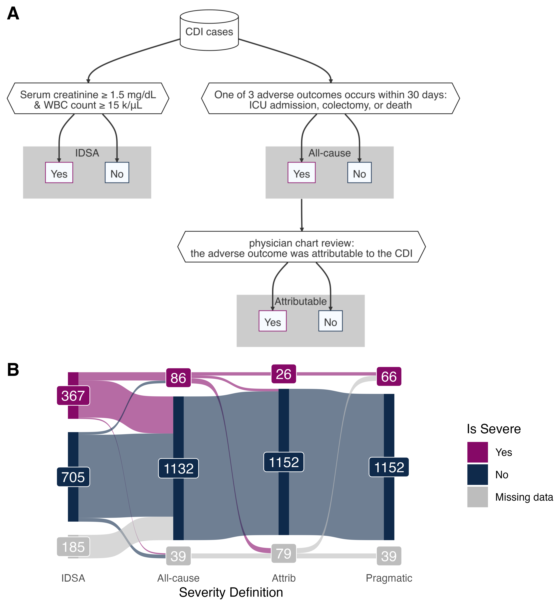
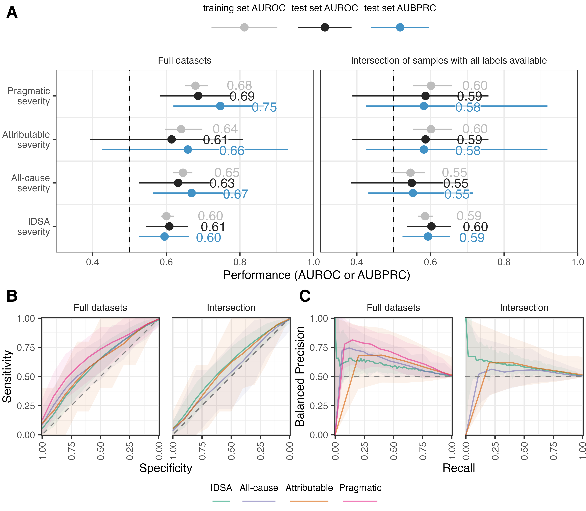
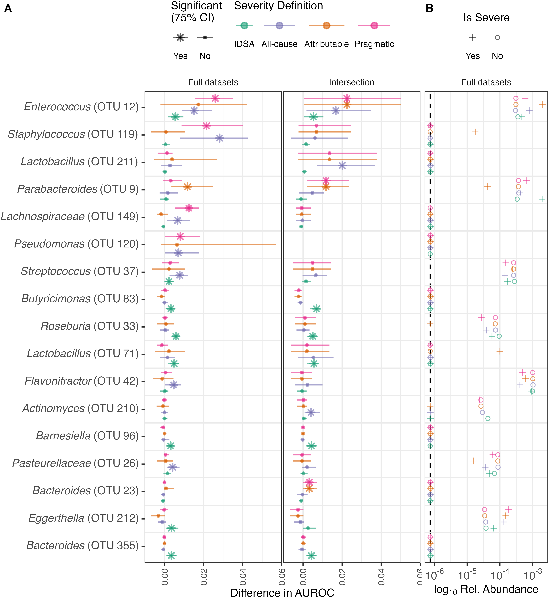

# Predicting *C. difficile* Infection Severity from the Taxonomic
Composition of the Gut Microbiome
Kelly L. SovacoolSarah E. TomkovichMegan L. CodenVincent B. YoungKrishna
RaoPatrick D. Schloss
Jun 2, 2023

<link href="paper_files/libs/lightable-0.0.1/lightable.css" rel="stylesheet" />

# Introduction

prevalence of cdi. prevalence of severe cdi outcomes. antibiotics
typical risk factor for cdi, but nonantibiotic medications can increase
susceptibilty too (Tomkovich et al. 2021) and non-nosomial CDI on the
rise

Numerous studies indicate that the gut microbiome may play a role in *C.
diff* colonization, infection, and clearance. Contribution of the gut
microbiome.

prediction models based on EHR for whether infection occurs in the first
place already in use. so how about predicting severity of infections to
guide treatment? also models on EHR to predict adverse outcomes (Li,
Rao). OTUs vs EHRs to predict severity. CDI severity prediction models
could be deployed to screen patients at risk and guide clinicians to
consider prescribing a different course of treatment. When paired with
treatment options that may reduce risk of severity, deploying prediction
models can guide clinician decision-making to improve patient outcomes
while minimizing unnecessary harms.

A few ways to define CDI severity ([Figure 1](#fig-flowchart)).

The IDSA definition is known to be a poor predictor of adverse outcomes
(Stevens et al. 2020), however, it is easy to collect.

new dataset.

Two goals: investigate whether we can predict CDI severity based on OTU
data to inform how the gut microbiome may modulate severity (ML-based
science: good performance implies something about underlying biology),
and determine whether there is potential clinical value in OTU-based
models.

# Results

## Model performance

We first set out to train the best models possible for each severity
definition. Not all samples have labels available for all four severity
definitions due to missing data for some patient lab values and
incomplete chart review ([Figure 1](#fig-flowchart) B), thus each
severity definition has a different number of samples when using as many
samples as possible (**?@tbl-counts**). We refer to these as the full
datasets. Random forest models were trained on 100 splits of the
datasets into training and test sets, and performance was evaluated on
the held-out test set using the area under the receiver-operator
characteristic curve (AUROC). Since the severity classes are highly
imbalanced with different proportions of severe samples between
definitions, we also calculated the balanced precision and the area
under the balanced precision-recall curve (AUBPRC) as first proposed by
Wu et al. (2021) to describe the precision that would be expected if the
outcome classes were balanced.

After training on the full datasets, the performance as measured by the
AUROCs of the training set cross-validation folds were similar to those
of the held-out test sets, indicating that the models are neither
overfit nor underfit ([Figure 2](#fig-performance) A). As measured by
AUROC on the held-out test sets, models predicting pragmatic severity
performed best with a median AUROC of 0.69, and this was significantly
different from that of the other definitions on the full datasets (P \<
0.05). Models predicting IDSA, all-cause, and attributable severity
performed similarly with median test set AUROCs of 0.61, 0.63, and 0.61
respectively. The test set AUROCs were not significantly different (P \>
0.05) for attributable and IDSA nor for attributable and all-cause, but
the IDSA and all-cause AUROCs were significantly different from each
other (P \< 0.05). We plotted the receiver-operator characteristic curve
and found that the pragmatic severity models outperformed the others at
all specificity values ([Figure 2](#fig-performance) B). A prior study
trained a logistic regression model on whole Electronic Health Record
data extracted on the day of CDI diagnosis to predict attributable
severity, yielding an AUROC of 0.69 (Li et al. 2019). While our
OTU-based attributable severity model did not meet this performance, the
OTU-based pragmatic severity model performed just as well as the
EHR-based model in terms of AUROC.

The test set median AUBPRCs from the full datasets followed a similar
pattern as the test set AUROCs with 0.60 for IDSA severity, 0.67 for
all-cause severity, 0.66 for attributable severity, and 0.75 for
pragmatic severity. The AUBPRCs were significantly different from each
other (P \< 0.05) for each pair of severity definitions except for
attributable vs all-cause. We plotted the balanced precision-recall
curve and found that the IDSA definition outperformed all other models
at very low recall values, but the others outperform IDSA at all other
points of the curve ([Figure 2](#fig-performance) C). The 95% confidence
intervals overlapped the baseline AUROC and AUBPRC for the attributable
severity models, while all others did not overlap the baseline.

While it is advantageous to use as much data as available to train the
best models possible, comparing performances of models trained on
different subsets of the data is not entirely fair. To enable fair
comparisons of the model performances across different severity
definitions, we also selected the intersection of samples (n=993) that
had labels for all four severity definitions and repeated the model
training and evaluation process on this intersection dataset. The
attributable definition is exactly the same as the pragmatic definition
for the intersection dataset, as we defined pragmatic severity to use
the attributable label when available. The performance results on the
intersection dataset are shown in the right facets of each panel of
[Figure 2](#fig-performance).

As with the full datasets, the AUROCs of the training sets and test sets
were similar within each severity definition. The median test set AUROCs
were 0.60 for IDSA severity, 0.55 for all-cause severity, 0.59 and for
attributable severity. The AUROCs on the intersection dataset were
significantly different for all-cause vs attributable and all-cause vs
IDSA severity (P \< 0.05), but not for IDSA vs attributable severity (P
\> 0.05). The median test set AUBPRCs were 0.59 for IDSA severity, 0.55
for all-cause severity, 0.58 and for attributable severity. Just as with
the AUROCs, the AUBPRCs were significantly different for all-cause vs
attributable and all-cause vs IDSA severity (P \< 0.05), but not for
IDSA vs attributable severity (P \> 0.05). For all severity definitions,
performance dropped between the full dataset and the intersection
dataset since fewer samples are available, but this effect is least
dramatic for IDSA severity as the full and intersection datasets are
more similar for this definition. The 95% confidence interval overlaps
with the baseline for both AUROC and AUBPRC for all definitions on the
intersection dataset except for IDSA severity.

## Feature importance

We performed permutation feature importance to determine which OTUs
contributed the most to model performance. An OTU was considered
important if performance decreased when it was permuted in at least 75%
of the train/test splits, with greater differences in AUROC meaning
greater importance. We plotted mean decrease in AUROC alongside
log10-transformed mean relative abundances for the top OTUs
([Figure 3](#fig-features)). There is not always a clear pattern of
increased or decreased relative abundance for important OTUs in severe
CDI cases, but all of the top 5 OTUs had an increased mean relative
abundance in severe cases relative to not severe cases. *Enterococcus*
was the most important OTU, being significantly important for all models
except for attributable severity on the full dataset. Enrichment of
*Enterococcus* in *C. difficile* infection and severity has been
well-documented in prior studies, thus its importance and increase in
abundance for severe cases is not suprising (Schubert et al. 2014;
**antharam_intestinal_2013?**; **berkell_microbiota-based_2021?**;
Lesniak et al. 2022). *Staphylococcus* was important for the pragmatic
and all-cause definitions on the full datasets, but not for models
trained on the intersection dataset. *Lactobacillus* was important only
for the all-cause definition on the intersection dataset, and its
enrichment during *C. difficile* infection has also been shown in prior
studies (**antharam_intestinal_2013?**;
**berkell_microbiota-based_2021?**). All remaining OTUs had differences
in AUROC \< 0.02 and were only significantly important in one or two of
the models at most. For many of the top OTUs, there is wide variance in
importance, perhaps due to the imbalanced nature of the severity
outcomes.

## Estimating clinical value

Even if a model performs well, it may not be useful in a clinical
setting unless it can guide clinicians to choose between treatment
options. At this time, we are not aware of any direct evidence that a
particular treatment reduces the risk of severe CDI outcomes. However,
with some assumptions we offer a proof-of-concept analysis of the
potential clinical value of OTU-based severity prediction models when
paired with treatments that may reduce severity. When considering the
suitability of a model for deployment in clinical settings, the number
needed to screen (NNS) is a highly relevant metric representing how many
patients must be predicted as severe by the model to identify one true
positive. Similarly, the number needed to treat (NNT) is the number of
true positive patients that must be treated by an intervention in order
for one patient to benefit from the treatment. Multiplying NNS by NNT
yields the number needed to benefit (NNB): the number of patients
predicted to have a severe outcome who then benefit from the treatment
(Liu et al. 2019). Thus the NNB pairs model performance with treatment
effectiveness to estimate the benefit of using predictive models in
clinical practice.

Current clinical guidelines specify vancomycin and fidaxomicin as the
standard antibiotics to treat CDI, with a preference for fidaxomicin due
to its higher rate of sustained resolution of CDI and lower rate of
recurrence (Johnson et al. 2021). The NNTs of fidaxomicin for sustained
resolution and prevention of recurrence are each estimated to be 10
(Long and Gottlieb 2022; Tashiro et al. 2022). However, fidaxomicin is
considerably more expensive than vancomycin. If fidaxomicin were shown
to reduce the risk of severe CDI outcomes, it could be preferentially
prescribed to patients predicted to be at risk, while prescribing
vancomycin to low-risk patients. If we assume that the superior efficacy
of fidaxomicin for sustained resolution and reduced recurrence also
translates to reducing the risk of severe outcomes, we can pair the NNT
of fidaxomicin with the NNS of OTU-based prediction models to estimate
the NNB.

To calculate a clinically-relevant NNS for these models, we computed the
confusion matrix at the 95th percentile of risk for each prediction
model (**?@tbl-risk**). We excluded the IDSA severity models as the IDSA
severity scores were calculated on the day of diagnosis, thus they are
classification rather than prediction problems. Furthermore, IDSA
severity scores do not correlate well with disease-related adverse
events which are a more salient outcome to prevent. Among the models
predicting severe outcomes, those trained on the full datasets performed
best with an NNS of 4 for the all-cause definition, 6 for the
attributable definition, and 3 for the pragmatic definition. For
context, prior studies predicted CDI-attributable severity using whole
Electronic Health Record data extracted two days after diagnosis and
from a smaller set of manually curated variables, achieving precision
values of 0.417 (NNS = 2.4) for the EHR model and 0.167 (NNS = 6.0) for
the curated model at the 95th percentile of risk (Li et al. 2019; Rao et
al. 2015). <!-- TODO what about NNS on day of diagnosis? --> Multiplying
the NNS of the OTU-based models by the estimated NNT of 10 for
fidaxomicin yields NNB values of 40 for all-cause severity, 60 for
attributable severity, and 30 for pragmatic severity. Thus, in a
hypothetical scenario where these assumptions about fidaxomicin hold
true, between 30 and 60 patients would need to be predicted to
experience a severe outcome and be treated with fidaxomicin in order for
one patient to benefit. As the NNS values were computed at the 95th
percentile of risk (where 5% of patients screened are predicted to
experience severity), these NNB values mean that 600 to 1,200 total CDI
patients would need to be screened by an OTU-based prediction model in
order for one patient to benefit. For comparison, pairing the prior
EHR-based model with fidaxomicin would yield an NNB of 24 with 480 total
CDI patients screened for one patient to benefit. These estimates
represent a proof-of-concept demonstration of the potential value of
deploying severity prediction models to guide clinicians’ treatment
decisions.

<!--
rough estimate of costs.
current: everyone gets vancomycin.
potential: patients flagged as severe get fidaxomicin. based on NNB, estimate
how much money saved in averting severe outcomes.
-->

# Discussion

Performance

Discuss important OTUs. which ones concord with literature, which ones
may be new. Abundance data are sparse, likely due to these patients
being on antibiotics. Really showcases importance of having as many
samples as possible when data are sparse and the outcome is low
prevalence. we do not know which antibiotics were prescribed to treat
these CDI cases, nor which antibiotics patients may have taken prior to
the CDI. differences in microbiota between patients may be due to
different abx… different antibiotics have been shown to create different
forms of dysbiotic microbiota (**berkell_microbiota-based_2021?**) and
differential cdi clearance (**tomkovick_initial_2020?**). vanc-resistant
enterococcus new nosocomial alliance (**poduval_clostridium_2000?**).

Compare to EHR-based models.

Models to guide treatment options. In the case of low-risk and
non-invasive treatments such as choosing between oral antibiotics, a
higher number of false positives may be tolerable as long as treatment
cost is not unbearably high. However, for highly invasive and
irreversibly treatments such as colectomy, false positives must be
minimized. Cite studies saying fidaxomicin is cost-effective relative to
vancomycin - mentioned by Johnson et al. (2021), e.g. Jiang et al.
(2022).

It’s not enough for models to perform well to justify deploying them in
a clinical setting; benefit over current practices must be shown. do no
harm (Wiens et al. 2019). Estimating the NNB contextualizes model
performance within clinical reality. Amplicon sequencing is not
typically performed for CDI patients, but if there is clinical value to
be gained by implementing OTU-based models, routinely sequencing and
profiling the microbial communities of CDI patients could be justified.
resistance to vancomycin is increasing in staph, cdi, and enterococci –
even more important to find alternate treatments.

Models predicting the pragmatic definition yielded the best NNS. While
the attributable definition had a worse NNS for our OTU-based models, it
did not perform worse than the prior curated model, and it is the most
clinically relevant as physician chart review increases confidence that
positively-labelled severe outcomes are due to the CDI rather than other
causes.

# Materials and Methods

## Sample collection

This study was approved by the University of Michigan Institutional
Review Board. All patient samples were collected by the University of
Michigan Health System from January 2016 through December 2017. Stool
samples that had unformed stool consistency were tested for *C.
difficile* by the clinical microbiology lab with a two-step algorithm
that included detection of *C. difficile* glutamate dehydrogenase and
toxins A and B by enzyme immunoassay with reflex to PCR for the *tcdB*
gene when results were discordant. 1,517 stool samples were collected
from patients diagnosed with a CDI. Leftover stool samples that were
sent to the clinical microbiology lab were collected and split into
different aliquots. For 16S sequencing, the aliquot of stool was
re-suspended in DNA genotek stabilization buffer and then stored in the
-80°C freezer. Only the first CDI sample per patient was used for
subsequent ML analyses such that no patient is represented more than
once, resulting in a dataset of 1,277 samples.

## 16S rRNA gene amplicon sequencing

Samples stored in DNA genotek buffer were thawed from the -80°C,
vortexed, and then transferred to a 96-well bead beating plate for DNA
extractions. DNA was extracted using the DNeasy Powersoil HTP 96 kit
(Qiagen) and an EpMotion 5075 automated pipetting system (Eppendorf).
The V4 region of the 16S rRNA gene was amplified with the AccuPrime Pfx
DNA polymerase (Thermo Fisher Scientific) using custom barcoded primers,
as previously described (Kozich et al. 2013). Each library preparation
plate for sequencing contained a negative control (water) and mock
community control (ZymoBIOMICS microbial community DNA standards). The
PCR amplicons were normalized (SequalPrep normalization plate kit from
Thermo Fisher Scientific), pooled and quantified (KAPA library
quantification kit from KAPA Biosystems), and sequenced with the MiSeq
system (Illumina).

All sequences were processed with mothur (v1.46) using the MiSeq SOP
protocol (Schloss et al. 2009; Kozich et al. 2013). Paired sequencing
reads were combined and aligned with the SILVA (v132) reference database
(Quast et al. 2013) and taxonomy was assigned with a modified version of
the Ribosomal Database Project reference sequences (v16) (Cole et al.
2014). Sequences were clustered into *de novo* OTUs with the OptiClust
algorithm in mothur (Westcott and Schloss 2017), resulting in 9,939
OTUs.
<!-- TODO supplementary figure with alpha and beta diversity & significance.
Samples were rarefied to 5,000 sequences per sample, repeated 1,000
times for alpha and beta diversity analysis.
 -->

## Defining CDI severity

We explore four different ways to define CDI cases as severe or not. The
IDSA definition of severe CDI is based on lab values collected on the
day of diagnosis, with a case being severe if serum creatinine level is
greater than or equal to $1.5 mg/dL$ and the white blood cell count is
greater than or equal to $15 k/\mu L$ (L. Clifford McDonald et al.
2018). The remaining definitions focus on the occurrence of adverse
outcomes, which may be more clinically relevant. The all-cause severity
definition defines a case as severe if ICU admission, colectomy, or
death occurs within 30 days of CDI diagnosis, regardless of the cause of
the adverse event. The attributable severity definition is based on
disease-related complications defined by the CDC, where an adverse event
of ICU admission, colectomy, or death occurs within 30 days of CDI
diagnosis, and the adverse event is determined to be attributable to the
CDI by physician chart review (L. Clifford McDonald et al. 2007).
Finally, we defined a pragmatic severity definition that makes use of
the attributable definition when available and falls back to the
all-cause definition when chart review has not been completed, allowing
us to use as many samples as we have available while taking physicians’
expert opinions into account where possible.

## Model training

Random forest models were used to examine whether OTU data collected on
the day of diagnosis could classify CDI cases as severe according to
four different definitions of severity. We used the mikropml R package
v1.5.0 (Topçuoğlu et al. 2021) implemented in a custom version of the
mikropml Snakemake workflow (Sovacool et al. 2023) for all steps of the
machine learning analysis. We have full datasets which use all samples
available for each severity definition, and an intersection dataset
which consists of only the samples that have all four definitions
labelled. The intersection dataset is the most fair for comparing model
performance across definitions, while the full dataset allows us to use
as much data as possible for model training and evaluation. Datasets
were pre-processed with the default options in mikropml to remove
features with near-zero variance and scale continuous features from -1
to 1. During pre-processing, 9,757 to 9,760 features were removed due to
having near-zero variance, resulting in datasets having 179 to 182
features depending on the severity definition. No features had missing
values and no features were perfectly correlated. We randomly split the
data into an 80% training and 20% test set and repeated this 100 times,
followed by training models with 5-fold cross-validation.

## Model evaluation

Model performance was calculated on the held-out test sets using the
area under the receiver-operator characteristic curve (AUROC) and the
area under the balanced precision-recall curve (AUBPRC). Permutation
feature importance was then performed to determine which OTUs
contributed most to model performance. We reported OTUs with a
significant permutation test in at least 75 of the 100 models.

Since the severity labels are imbalanced with different frequencies of
severity for each definition, we calculated balanced precision, the
precision expected if the labels were balanced. The balanced precision
and the area under the balanced precision-recall curve (AUBPRC) were
calculated with Equations 1 and 7 from Wu et al. (2021).

## Number needed to benefit

For the severity prediction models (which excludes the IDSA definition),
we set out to estimate the potential benefit of deploying models in
clincal settings. We determined the decision threshold at the 95th
percentile of risk for each model, which corresponds to 5% of cases
being predicted by the model to experience a severe outcome. At this
threshold we computed the number needed to screen (NNS), which is the
reciprocal of precision and represents the number of cases that must be
predicted as severe to identify one true positive (Rembold 1998). The
number needed to treat (NNT) is the number of true positive patients
that must be treated by an intervention in order for one patient to
benefit, and is calculated from the reciprocal of absolute risk in
randomized controlled trials (Laupacis, Sackett, and Roberts 1988).
Multiplying the NNS of a model by the NNT of a treatment yields the
number needed to benefit (NNB) - the number of patients that must be
predicted to have a severe outcome and undergo a treatment to benefit
from it (Liu et al. 2019). NNB encapsulates the benefit of pairing a
predictive model with a treatment in a clinical setting, with lower NNB
numbers being better.

## Code availability

The complete workflow, code, and supporting files required to reproduce
this manuscript with accompanying figures is available at
<https://github.com/SchlossLab/severe-CDI>.
<!-- TODO update GitHub URL once accepted to journal -->

The workflow was defined with Snakemake (Köster and Rahmann 2012) and
dependencies were managed with conda environments. Scripts were written
in R (R Core Team 2020), Python (Van Rossum and Drake 2009), and GNU
bash. Additional software and packages used in the creation of this
manuscript include cowplot (Wilke 2020a), ggtext (Wilke 2020b), ggsankey
(Sjoberg 2022), schtools (Sovacool et al. 2022), the tidyverse
metapackage (Wickham et al. 2019), Quarto, and vegan (Oksanen et al.
2023).

## Data availability

The 16S rRNA sequencing data have been deposited in the National Center
for Biotechnology Information Sequence Read Archive (BioProject
Accession no. PRJNA729511).

<!--
# Acknowledgements
&#10;TODO funding & author contributions
-->



# References

Cole, James R., Qiong Wang, Jordan A. Fish, Benli Chai, Donna M.
McGarrell, Yanni Sun, C. Titus Brown, Andrea Porras-Alfaro, Cheryl R.
Kuske, and James M. Tiedje. 2014. “Ribosomal Database Project: Data and
Tools for High Throughput rRNA Analysis.”
*Nucl. Acids Res.* 42 (D1): D633–42.
<https://doi.org/10.1093/nar/gkt1244>.

Jiang, Yiling, Eric M. Sarpong, Pamela Sears, and Engels N. Obi. 2022.
“Budget Impact Analysis of Fidaxomicin Versus Vancomycin for the
Treatment of Clostridioides Difficile Infection in the United States.”
*Infect Dis Ther* 11 (1): 111–26.
<https://doi.org/10.1007/s40121-021-00480-0>.

Johnson, Stuart, Valéry Lavergne, Andrew M Skinner, Anne J
Gonzales-Luna, Kevin W Garey, Ciaran P Kelly, and Mark H Wilcox. 2021.
“Clinical Practice Guideline by the Infectious Diseases Society of
America (IDSA) and Society for Healthcare Epidemiology of America
(SHEA): 2021 Focused Update Guidelines on Management of *Clostridioides*
*Difficile* Infection in Adults.” *Clinical Infectious Diseases* 73 (5):
e1029–44. <https://doi.org/10.1093/cid/ciab549>.

Köster, Johannes, and Sven Rahmann. 2012. “Snakemake a Scalable
Bioinformatics Workflow Engine.” *Bioinformatics* 28 (19): 2520–22.
<https://doi.org/10.1093/bioinformatics/bts480>.

Kozich, James J., Sarah L. Westcott, Nielson T. Baxter, Sarah K.
Highlander, and Patrick D. Schloss. 2013. “Development of a Dual-Index
Sequencing Strategy and Curation Pipeline for Analyzing Amplicon
Sequence Data on the MiSeq Illumina Sequencing Platform.” *Appl.
Environ. Microbiol.* 79 (17): 5112–20.
<https://doi.org/10.1128/AEM.01043-13>.

Laupacis, Andreas, David L. Sackett, and Robin S. Roberts. 1988. “An
Assessment of Clinically Useful Measures of the Consequences of
Treatment.” *New England Journal of Medicine* 318 (26): 1728–33.
<https://doi.org/10.1056/NEJM198806303182605>.

Lesniak, Nicholas A., Alyxandria M. Schubert, Kaitlin J. Flynn, Jhansi
L. Leslie, Hamide Sinani, Ingrid L. Bergin, Vincent B. Young, and
Patrick D. Schloss. 2022. “The Gut Bacterial Community Potentiates
Clostridioides Difficile Infection Severity.” *mBio* 13 (4): e01183–22.
<https://doi.org/10.1128/mbio.01183-22>.

Li, Benjamin Y., Jeeheh Oh, Vincent B. Young, Krishna Rao, and Jenna
Wiens. 2019. “Using Machine Learning and the Electronic Health Record to
Predict Complicated Clostridium Difficile Infection.” *Open Forum Infect
Dis* 6 (5): ofz186. <https://doi.org/10.1093/ofid/ofz186>.

Liu, Vincent X, David W Bates, Jenna Wiens, and Nigam H Shah. 2019. “The
Number Needed to Benefit: Estimating the Value of Predictive Analytics
in Healthcare.” *Journal of the American Medical Informatics
Association* 26 (12): 1655–59. <https://doi.org/10.1093/jamia/ocz088>.

Long, Brit, and Michael Gottlieb. 2022. “Oral Fidaxomicin Versus
Vancomycin for Clostridioides Difficile Infection.” *Academic Emergency
Medicine* 29 (12): 1506–7. <https://doi.org/10.1111/acem.14600>.

McDonald, L Clifford, Dale N Gerding, Stuart Johnson, Johan S Bakken,
Karen C Carroll, Susan E Coffin, Erik R Dubberke, et al. 2018. “Clinical
Practice Guidelines for Clostridium Difficile Infection in Adults and
Children: 2017 Update by the Infectious Diseases Society of America
(IDSA) and Society for Healthcare Epidemiology of America (SHEA).”
*Clinical Infectious Diseases* 66 (7): e1–48.
<https://doi.org/10.1093/cid/cix1085>.

McDonald, L. Clifford, Bruno Coignard, Erik Dubberke, Xiaoyan Song,
Teresa Horan, and Preeta K. Kutty. 2007. “Recommendations for
Surveillance of Clostridium Difficile Disease.” *Infection Control &Amp;
Hospital Epidemiology* 28 (2): 140–45. <https://doi.org/10.1086/511798>.

Oksanen, Jari, Gavin L. Simpson, F. Guillaume Blanchet, Roeland Kindt,
Pierre Legendre, Peter R. Minchin, R. B. O’Hara, et al. 2023. *Vegan:
Community Ecology Package*.

Quast, Christian, Elmar Pruesse, Pelin Yilmaz, Jan Gerken, Timmy
Schweer, Pablo Yarza, Jörg Peplies, and Frank Oliver Glöckner. 2013.
“The SILVA Ribosomal RNA Gene Database Project: Improved Data Processing
and Web-Based Tools.” *Nucleic Acids Research* 41 (D1): D590–96.
<https://doi.org/10.1093/nar/gks1219>.

R Core Team. 2020. *R: A Language and Environment for Statistical
Computing*. Manual. Vienna, Austria: R Foundation for Statistical
Computing.

Rao, Krishna, Dejan Micic, Mukil Natarajan, Spencer Winters, Mark J.
Kiel, Seth T. Walk, Kavitha Santhosh, et al. 2015. “Clostridium
Difficile Ribotype 027: Relationship to Age, Detectability of Toxins A
or B in Stool With Rapid Testing, Severe Infection, and Mortality.”
*Clinical Infectious Diseases* 61 (2): 233–41.
<https://doi.org/10.1093/cid/civ254>.

Rembold, Christopher M. 1998. “Number Needed to Screen: Development of a
Statistic for Disease Screening.” *BMJ* 317 (7154): 307–12.
<https://doi.org/10.1136/bmj.317.7154.307>.

Schloss, Patrick D., Sarah L. Westcott, Thomas Ryabin, Justine R. Hall,
Martin Hartmann, Emily B. Hollister, Ryan A. Lesniewski, et al. 2009.
“Introducing Mothur: Open-Source, Platform-Independent,
Community-Supported Software for Describing and Comparing Microbial
Communities.” *Applied and Environmental Microbiology* 75 (23): 7537–41.
<https://doi.org/10.1128/AEM.01541-09>.

Schubert, Alyxandria M., Mary A. M. Rogers, Cathrin Ring, Jill Mogle,
Joseph P. Petrosino, Vincent B. Young, David M. Aronoff, and Patrick D.
Schloss. 2014. “Microbiome Data Distinguish Patients with Clostridium
Difficile Infection and Non-C. Difficile-Associated Diarrhea from
Healthy Controls.” *mBio* 5 (3).
<https://doi.org/10.1128/mBio.01021-14>.

Sjoberg, David. 2022. *Ggsankey: Sankey, Alluvial and Sankey Bump
Plots*.

Sovacool, Kelly, Zena Lapp, Courtney Armour, Sarah K. Lucas, and Patrick
Schloss. 2023. “Mikropml Snakemake Workflow.” Zenodo.
<https://doi.org/10.5281/zenodo.4759351>.

Sovacool, Kelly, Nick Lesniak, Sarah Lucas, Courtney Armour, and Patrick
Schloss. 2022. “Schtools: Schloss Lab Tools for Reproducible Microbiome
Research.” <https://doi.org/10.5281/zenodo.6540686>.

Stevens, Vanessa W., Holly E. Shoemaker, Makoto M. Jones, Barbara E.
Jones, Richard E. Nelson, Karim Khader, Matthew H. Samore, and Michael
A. Rubin. 2020. “Validation of the SHEA/IDSA Severity Criteria to
Predict Poor Outcomes Among Inpatients and Outpatients with
Clostridioides Difficile Infection.” *Infection Control & Hospital
Epidemiology* 41 (5): 510–16. <https://doi.org/10.1017/ice.2020.8>.

Tashiro, Sho, Takayuki Mihara, Moe Sasaki, Chiaki Shimamura, Rina
Shimamura, Shiho Suzuki, Maiko Yoshikawa, et al. 2022. “Oral Fidaxomicin
Versus Vancomycin for the Treatment of Clostridioides Difficile
Infection: A Systematic Review and Meta-Analysis of Randomized
Controlled Trials.” *Journal of Infection and Chemotherapy* 28 (11):
1536–45. <https://doi.org/10.1016/j.jiac.2022.08.008>.

Tomkovich, Sarah, Ana Taylor, Jacob King, Joanna Colovas, Lucas Bishop,
Kathryn McBride, Sonya Royzenblat, Nicholas A. Lesniak, Ingrid L.
Bergin, and Patrick D. Schloss. 2021. “An Osmotic Laxative Renders Mice
Susceptible to Prolonged Clostridioides Difficile Colonization and
Hinders Clearance.” *mSphere* 0 (0): e00629–21.
<https://doi.org/10.1128/mSphere.00629-21>.

Topçuoğlu, Begüm D., Zena Lapp, Kelly L. Sovacool, Evan Snitkin, Jenna
Wiens, and Patrick D. Schloss. 2021. “Mikropml: User-Friendly R Package
for Supervised Machine Learning Pipelines.” *JOSS* 6 (61): 3073.
<https://doi.org/10.21105/joss.03073>.

Van Rossum, Guido, and Fred L. Drake. 2009. “Python 3 Reference Manual
\| Guide Books.”

Westcott, Sarah L., and Patrick D. Schloss. 2017. “OptiClust, an
Improved Method for Assigning Amplicon-Based Sequence Data to
Operational Taxonomic Units.” Edited by Katherine McMahon. *mSphere* 2
(2): e00073–17. <https://doi.org/10.1128/mSphereDirect.00073-17>.

Wickham, Hadley, Mara Averick, Jennifer Bryan, Winston Chang, Lucy
D’Agostino McGowan, Romain François, Garrett Grolemund, et al. 2019.
“Welcome to the Tidyverse.” *Journal of Open Source Software* 4 (43):
1686. <https://doi.org/10.21105/joss.01686>.

Wiens, Jenna, Suchi Saria, Mark Sendak, Marzyeh Ghassemi, Vincent X.
Liu, Finale Doshi-Velez, Kenneth Jung, et al. 2019. “Do No Harm: A
Roadmap for Responsible Machine Learning for Health Care.” *Nat Med* 25
(9): 1337–40. <https://doi.org/10.1038/s41591-019-0548-6>.

Wilke, Claus O. 2020a. *Cowplot: Streamlined Plot Theme and Plot
Annotations for ’Ggplot2’*.

———. 2020b. *Ggtext: Improved Text Rendering Support for ’Ggplot2’*.
Manual.

Wu, Yingzhou, Hanqing Liu, Roujia Li, Song Sun, Jochen Weile, and
Frederick P. Roth. 2021. “Improved Pathogenicity Prediction for Rare
Human Missense Variants.” *The American Journal of Human Genetics* 108
(10): 1891–1906. <https://doi.org/10.1016/j.ajhg.2021.08.012>.

# Tables



|          |    IDSA | All-cause | Attributable | Pragmatic |
|:---------|--------:|----------:|-------------:|----------:|
| n        | 1,072.0 |   1,218.0 |      1,178.0 |   1,218.0 |
| % Severe |    34.2 |       7.1 |          2.2 |       5.4 |

Table 1: Full datasets

|          |  IDSA | All-cause | Attributable | Pragmatic |
|:---------|------:|----------:|-------------:|----------:|
| n        | 993.0 |     993.0 |        993.0 |     993.0 |
| % Severe |  32.7 |       4.6 |          2.6 |       2.6 |

Table 2: Intersection of samples with all labels available

**Sample counts and proportion of severe cases.** Each severity
definition has a different number of patient samples available, as well
as a different proportion of cases labelled as severe.

| Outcome      | Risk threshold |  TP |  FP |  TN |  FN | Precision | NNS | Recall | Specificity |
|:-------------|---------------:|----:|----:|----:|----:|----------:|----:|-------:|------------:|
| All-cause    |           0.20 |   3 |   9 | 217 |  14 |      0.25 |   4 |   0.18 |        0.96 |
| Attributable |           0.10 |   2 |  10 | 220 |   3 |      0.17 |   6 |   0.40 |        0.96 |
| Pragmatic    |           0.25 |   4 |   8 | 222 |   9 |      0.33 |   3 |   0.31 |        0.97 |

Table 3: Full datasets

| Outcome      | Risk threshold |  TP |  FP |  TN |  FN | Precision | NNS | Recall | Specificity |
|:-------------|---------------:|----:|----:|----:|----:|----------:|----:|-------:|------------:|
| All-cause    |            0.2 |   2 |   8 | 181 |   7 |       0.2 |   5 |   0.22 |        0.96 |
| Attributable |            0.1 |   1 |   9 | 184 |   4 |       0.1 |  10 |   0.20 |        0.95 |

Table 4: Intersection of samples with all labels available

**Predictive model performance at 95th percentile of risk.** The
confusion matrix was computed for the decision threshold at the 95th
percentile of risk for each severity prediction model, which corresponds
to 5% of cases predicted to have a severe outcome. The number needed to
screen (NNS) to identify one true positive is the reciprocal of
precision.

# Figures

Figure 1: **CDI severity definitions.** **A)** Decision flow chart to
define CDI cases as severe according to the Infectious Diseases Society
of America (IDSA) based on lab values, the occurrence of an adverse
outcome due to any cause (All-cause), and the occurrence of
disease-related complications confirmed as attributable to CDI with
chart review (Attributable). **B)** The proportion of severe CDI cases
labelled according to each definition. An additional ‘Pragmatic’
severity definition uses the Attributable definition when possible, and
falls back to the All-cause definition when chart review is not
available.
<!-- TODO table (supplementary?) showing counts & frequency of positives-->

Figure 2: **Performance of ML models.** In the left facets, models were
trained on the full datasets, with different numbers of samples
available for each severity definition. In the right facets, models were
trained on the same dataset consisting of the intersection of samples
with labels available for all definitions. Note that the intersection
dataset has exactly the same labels for attributable and pragmatic
severity, thus these have identical performance. **A)** Area under the
receiver-operator characteristic curve (AUROC) for the test sets and
cross-validation folds of the training sets, and the area under the
balanced precision-recall curve (AUBPRC) for the test sets. Each point
is annotated with the median performance across 100 train/test splits
with tails as the 95% CI. **B)** Receiver-operator characteristic curves
for the test sets. Mean specificity is reported at each sensitivity
value, with ribbons as the 95% CI. **C)** Balanced precision-recall
curves for the test sets. Mean balanced precision is reported at each
recall value, with ribbons as the 95% CI. Original unbalanced
precision-recall curves are shown in Figure S1.

Figure 3: **Feature importance.** **A)** Feature importance via
permutation test. For each OTU, the order of samples was randomized in
the test set 100 times and the performance was re-calculated to estimate
the permutation performance. An OTU was considered important if the
performance decreased when the OTU was permuted in at least 75% of the
models. Mean difference in AUROC and the 75% confidence interval (CI) is
reported for each OTU, with starred OTUs being significant for the 75%
CI. OTUs with a greater difference in AUROC (actual performance minus
permutation performance) are more important. Left: models were trained
on the full datasets, with different numbers of samples available for
each severity definition. Right: models were trained on the intersection
of samples with all labels available for each definition. Note that
Attributable and Pragmatic severity are exactly the same for the
intersection dataset. *Pseudomonas* (OTU 120) is not shown for IDSA
severity in the full datasets nor in the intersection dataset because it
was removed during pre-processing due to having near-zero variance.
**B)** Log10-transformed mean relative abundances of the most
important OTUs on the full datasets, grouped by severity (shape). The
vertical dashed line is the limit of detection.

