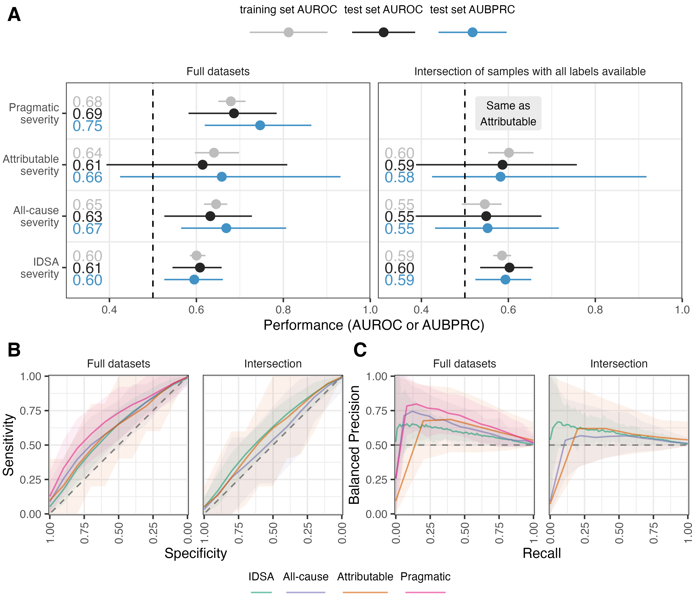

# Predicting *C. difficile* Infection Severity from the Taxonomic
Composition of the Gut Microbiome
Kelly L. SovacoolSarah E. TomkovichMegan L. CodenVincent B. YoungKrishna
RaoPatrick D. Schloss
May 31, 2023

<link href="paper_files/libs/lightable-0.0.1/lightable.css" rel="stylesheet" />

# Introduction

prevalance of cdi. prevalance of severe cdi outcomes.

Numerous studies indicate that the gut microbiome may play a role in *C.
diff* colonization, infection, and clearance.

prediction models based on EHR for whether infection occurs in the first
place already in use. so how about predicting severity of infections to
guide treatment? OTUs vs EHRs to predict severity.

A few ways to define CDI severity ([Figure 1](#fig-flowchart)).

The IDSA definition is known to be a poor predictor of adverse outcomes
(Stevens et al. 2020), however, it is easy to collect.

new dataset.

Two goals: investigate whether we can predict CDI severity based on OTU
data to inform how the gut microbiome may modulate severity (ML-based
science: good performance implies something about underlying biology),
and determine whether there is potential clinical value in OTU-based
models.

# Results

## Model performance

We first set out to train the best models possible for each severity
definition. Not all samples have labels available for all four severity
definitions due to missing data for some patient lab values and
incomplete chart review (**?@tbl-counts**).

However, comparisons across these definitions is not fair when using
different subsets of the data for each definition. To better compare the
model performances across different severity definitions, we selected
the intersection of samples (993) that had labels for all four severity
definitions and repeated the model training and evaluation process.

|        |    IDSA |  Attrib | All-cause | Pragmatic |
|:-------|--------:|--------:|----------:|----------:|
| n      | 1,072.0 | 1,178.0 |   1,218.0 |   1,218.0 |
| % pos. |    34.2 |     2.2 |       7.1 |       5.4 |

Table 1: Full datasets

|        |  IDSA | Attrib | All-cause | Pragmatic |
|:-------|------:|-------:|----------:|----------:|
| n      | 993.0 |  993.0 |     993.0 |     993.0 |
| % pos. |  32.7 |    2.6 |       4.6 |       2.6 |

Table 2: Intersection of samples with all labels available

Dataset sample counts

Report median AUROC for training set and test set, and median AUBPRC for
test set ([Figure 2](#fig-performance)). Nearly all pairs of definitions
have significantly different performances on the test set (P \< 0.05)
except for AUROC and AUBPRC of Attributable vs. Pragmatic on the
intersection dataset (as they are identical), AUROC of Attributable vs.
All-cause on the full dataset, and AUROC of Attributable vs. IDSA on the
full dataset.

## Feature importance

We performed permutation feature importance to determine which OTUs
contributed the most to model performance ([Figure 3](#fig-features)).

## Estimating clinical benefit

it’s not enough for models to perform well to deploy it in a clinical
setting; benefit over current practices must be shown. table of NNS at
95th pct of risk for each outcome x dataset (**?@tbl-risk**).

NNT x NNS = NNB

NNT for Fidaxomicin, FMT, and/or Bezlotoxumab. Current standard is
Vancomycin because it’s cheaper than Fidaxomicin, even though IDSA
recommends Fidaxomicin.

pragmatic vs attributable severity. table?

rough estimate of costs. current: everyone gets vancomycin. potential:
patients flagged as severe get fidaxomicin. based on NNB, estimate how
much money saved in averting severe outcomes.

| Severity     | Precision | NNS | Balanced Precision | Recall | Specificity |  TP |  FP |  TN |  FN |
|:-------------|----------:|----:|-------------------:|-------:|------------:|----:|----:|----:|----:|
| All-cause    |      0.29 | 3.5 |               0.84 |   0.12 |        0.98 |   2 |   5 | 221 |  15 |
| Attributable |      0.20 | 5.0 |               0.92 |   0.20 |        0.98 |   1 |   4 | 226 |   4 |
| Pragmatic    |      0.29 | 3.5 |               0.87 |   0.15 |        0.98 |   2 |   5 | 225 |  11 |

Table 3: Full datasets

| Severity     | Precision | NNS | Balanced Precision | Recall | Specificity |  TP |  FP |  TN |  FN |
|:-------------|----------:|----:|-------------------:|-------:|------------:|----:|----:|----:|----:|
| All-cause    |      0.12 |   8 |               0.75 |   0.11 |        0.96 |   1 |   7 | 182 |   8 |
| Attributable |      0.14 |   7 |               0.86 |   0.20 |        0.97 |   1 |   6 | 187 |   4 |

Table 4: Intersection of samples with all labels available

**Predictive model performance at 95th percentile of risk.** The
confusion matrix was computed at the 95th percentile of risk for each
severity prediction model, which corresponds to 5% of cases predicted to
be severe. The number needed to screen (NNS) to identify one true
positive is the reciprocal of precision.

# Discussion

Compare to EHR-based models.

Discuss important OTUs. which ones concord with literature, which ones
may be new.

Amplicon sequencing is not typically performed for CDI patients, but if
there is clinical value to be gained by implementing OTU-based models,
we could make a case to routinely sequence and profile the microbial
communities of CDI patients.

# Materials and Methods

## Sample collection

This study was approved by the University of Michigan Institutional
Review Board. All patient samples were collected by the University of
Michigan Health System from January 2016 through December 2017. Stool
samples that had unformed stool consistency were tested for *C.
difficile* by the clinical microbiology lab with a two-step algorithm
that included detection of *C. difficile* glutamate dehydrogenase and
toxins A and B by enzyme immunoassay with reflex to PCR for the *tcdB*
gene when results were discordant. 1,517 stool samples were collected
from patients diagnosed with a CDI. Leftover stool samples that were
sent to the clinical microbiology lab were collected and split into
different aliquots. For 16S sequencing, the aliquot of stool was
resuspended in DNA genotek stabilization buffer and then stored in the
-80°C freezer. Only the first CDI sample per patient was used for
subsequent ML analyses such that no patient is represented more than
once, resulting in a dataset of 1,277 samples.

## 16S rRNA gene amplicon sequencing

Samples stored in DNA genotek buffer were thawed from the -80°C,
vortexed, and then transferred to a 96-well bead beating plate for DNA
extractions. DNA was extracted using the DNeasy Powersoil HTP 96 kit
(Qiagen) and an EpMotion 5075 automated pipetting system (Eppendorf).
The V4 region of the 16S rRNA gene was amplified with the AccuPrime Pfx
DNA polymerase (Thermo Fisher Scientific) using custom barcoded primers,
as previously described (Kozich et al. 2013). Each library preparation
plate for sequencing contained a negative control (water) and mock
community control (ZymoBIOMICS microbial community DNA standards). The
PCR amplicons were normalized (SequalPrep normalizatin plate kit from
Thermo Fisher Scientific), pooled and quantified (KAPA library
quantification kit from KAPA Biosystems), and sequenced with the MiSeq
system (Illumina).

All sequences were processed with mothur (v1.46) using the MiSeq SOP
protocol (Schloss et al. 2009; Kozich et al. 2013). Paired sequencing
reads were combined and aligned with the SILVA (v132) reference database
(Quast et al. 2013) and taxonomy was assigned with a modified version of
the Ribosomal Database Project reference sequences (v16) (Cole et al.
2014). Sequences were clustered into *de novo* OTUs with the OptiClust
algorithm in mothur (Westcott and Schloss 2017), resulting in Samples
were rarefied to 5,000 sequences per sample, repeated 1,000 times for
alpha and beta diversity analysis.
<!-- TODO supplementary figure with alpha and beta diversity & significance -->

## Defining CDI severity

We explore four different ways to define CDI cases as severe or not. The
IDSA definition of severe CDI is based on lab values collected on the
day of diagnosis, with a case being severe if serum creatinine level is
greater than or equal to $1.5 mg/dL$ and the white blood cell count is
greater than or equal to $15 k/\mu L$ (**mcdonald_clinical_2018?**). The
remaining definitions focus on the occurrence of adverse outcomes, which
may be more clinically relevant. The all-cause severity definition
defines a case as severe if ICU admission, colectomy, or death occurs
within 30 days of CDI diagnosis, regardless of the cause of the adverse
event. The attributable severity definition is based on disease-related
complications defined by the CDC, where an adverse event of ICU
admission, colectomy, or death occurs within 30 days of CDI diagnosis,
and the adverse event is determined to be attributable to the CDI by
physician chart review (McDonald et al. 2007). Finally, we defined a
pragmatic severity definition that makes use of the attributable
definition when available and falls back to the all-cause definition
when chart review has not been completed, allowing us to use as many
samples as we have available while taking physicians’ expert opinions
into account where possible.

## Model training and evaluation

Random forest models were used to examine whether OTU data collected on
the day of diagnosis could classify CDI cases as severe according to
four different definitions of severity. We used the mikropml R package
v1.5.0 (Topçuoğlu et al. 2021) implemented in a custom version of the
mikropml Snakemake workflow (Sovacool et al. 2023) for all steps of the
machine learning analysis. We have a full dataset which uses all samples
available for each severity definition, and an intersection dataset
which consists of only the samples that have all four definitions
labelled. The intersection dataset is the most fair for comparing model
performance across definitions, while the full dataset allows us to use
as much data as possible for model training and evaluation. Datasets
were preprocessed with the default options in mikropml to remove
features with near-zero variance and scale continuous features from -1
to 1.
<!-- No features had missing values and no features were perfectly correlated -->
During preprocessing, 9,757 to 9,760 features were removed due to having
near-zero variance, resulting in datasets ranging from 179 to 182
depending on the severity definition. We randomly split the data into an
80% training and 20% test set and repeated this 100 times, followed by
training models with 5-fold cross-validation. Model performance was
calculated on the test set using the area under the receiver-operator
characteristic curve (AUROC) and the area under the balanced
precision-recall curve (AUBPRC). Permutation importance was then
performed to determine which OTUs contributed most to model performance.
We reported OTUs with a significant permutation test in at least 75 of
the 100 models.

Since the severity labels are imbalanced with different frequencies of
severity for each definition, we calculated balanced precision, the
precision expected if the labels were balanced. The balanced precision
and the area under the balanced precision-recall curve (AUBPRC) were
calculated with Equations 1 and 7 from Wu et al. (2021).

## Code availability

The complete workflow, code, and supporting files required to reproduce
this manuscript with accompanying figures is available at
<https://github.com/SchlossLab/severe-CDI>.
<!-- TODO update GitHub URL once accepted to journal -->

The workflow was defined with Snakemake (Köster and Rahmann 2012) and
dependencies were managed with conda environments. Scripts were written
in R (R Core Team 2020), Python (Van Rossum and Drake 2009), and GNU
bash. Additional software and packages used in the creation of this
manuscript include cowplot (Wilke 2020a), ggtext (Wilke 2020b), ggsankey
(Sjoberg 2022), schtools (Sovacool, Lesniak, and Schloss 2022), the
tidyverse metapackage (Wickham et al. 2019), Quarto, and vegan (Oksanen
et al. 2023).

## Data availability

The 16S rRNA sequencing data have been deposited in the National Center
for Biotechnology Information Sequence Read Archive (BioProject
Accession no. PRJNA729511).

# Acknowledgements

TODO



# References

Cole, James R., Qiong Wang, Jordan A. Fish, Benli Chai, Donna M.
McGarrell, Yanni Sun, C. Titus Brown, Andrea Porras-Alfaro, Cheryl R.
Kuske, and James M. Tiedje. 2014. “Ribosomal Database Project: Data and
Tools for High Throughput rRNA Analysis.”
*Nucl. Acids Res.* 42 (D1): D633–42.
<https://doi.org/10.1093/nar/gkt1244>.

Köster, Johannes, and Sven Rahmann. 2012. “Snakemake a Scalable
Bioinformatics Workflow Engine.” *Bioinformatics* 28 (19): 2520–22.
<https://doi.org/10.1093/bioinformatics/bts480>.

Kozich, James J., Sarah L. Westcott, Nielson T. Baxter, Sarah K.
Highlander, and Patrick D. Schloss. 2013. “Development of a Dual-Index
Sequencing Strategy and Curation Pipeline for Analyzing Amplicon
Sequence Data on the MiSeq Illumina Sequencing Platform.” *Appl.
Environ. Microbiol.* 79 (17): 5112–20.
<https://doi.org/10.1128/AEM.01043-13>.

McDonald, L. Clifford, Bruno Coignard, Erik Dubberke, Xiaoyan Song,
Teresa Horan, and Preeta K. Kutty. 2007. “Recommendations for
Surveillance of Clostridium Difficile Disease.” *Infection Control &Amp;
Hospital Epidemiology* 28 (2): 140–45. <https://doi.org/10.1086/511798>.

Oksanen, Jari, Gavin L. Simpson, F. Guillaume Blanchet, Roeland Kindt,
Pierre Legendre, Peter R. Minchin, R. B. O’Hara, et al. 2023. *Vegan:
Community Ecology Package*.

Quast, Christian, Elmar Pruesse, Pelin Yilmaz, Jan Gerken, Timmy
Schweer, Pablo Yarza, Jörg Peplies, and Frank Oliver Glöckner. 2013.
“The SILVA Ribosomal RNA Gene Database Project: Improved Data Processing
and Web-Based Tools.” *Nucleic Acids Research* 41 (D1): D590–96.
<https://doi.org/10.1093/nar/gks1219>.

R Core Team. 2020. *R: A Language and Environment for Statistical
Computing*. Manual. Vienna, Austria: R Foundation for Statistical
Computing.

Schloss, Patrick D., Sarah L. Westcott, Thomas Ryabin, Justine R. Hall,
Martin Hartmann, Emily B. Hollister, Ryan A. Lesniewski, et al. 2009.
“Introducing Mothur: Open-Source, Platform-Independent,
Community-Supported Software for Describing and Comparing Microbial
Communities.” *Applied and Environmental Microbiology* 75 (23): 7537–41.
<https://doi.org/10.1128/AEM.01541-09>.

Sjoberg, David. 2022. *Ggsankey: Sankey, Alluvial and Sankey Bump
Plots*.

Sovacool, Kelly, Zena Lapp, Courtney Armour, Sarah K. Lucas, and Patrick
Schloss. 2023. “Mikropml Snakemake Workflow.” Zenodo.
<https://doi.org/10.5281/zenodo.4759351>.

Sovacool, Kelly, Nick Lesniak, and Patrick Schloss. 2022. “Schtools:
Schloss Lab Tools for Reproducible Microbiome Research.”
<https://doi.org/10.5281/zenodo.6540687>.

Stevens, Vanessa W., Holly E. Shoemaker, Makoto M. Jones, Barbara E.
Jones, Richard E. Nelson, Karim Khader, Matthew H. Samore, and Michael
A. Rubin. 2020. “Validation of the SHEA/IDSA Severity Criteria to
Predict Poor Outcomes Among Inpatients and Outpatients with
Clostridioides Difficile Infection.” *Infection Control & Hospital
Epidemiology* 41 (5): 510–16. <https://doi.org/10.1017/ice.2020.8>.

Topçuoğlu, Begüm D., Zena Lapp, Kelly L. Sovacool, Evan Snitkin, Jenna
Wiens, and Patrick D. Schloss. 2021. “Mikropml: User-Friendly R Package
for Supervised Machine Learning Pipelines.” *JOSS* 6 (61): 3073.
<https://doi.org/10.21105/joss.03073>.

Van Rossum, Guido, and Fred L. Drake. 2009. “Python 3 Reference Manual
\| Guide Books.”

Westcott, Sarah L., and Patrick D. Schloss. 2017. “OptiClust, an
Improved Method for Assigning Amplicon-Based Sequence Data to
Operational Taxonomic Units.” Edited by Katherine McMahon. *mSphere* 2
(2): e00073–17. <https://doi.org/10.1128/mSphereDirect.00073-17>.

Wickham, Hadley, Mara Averick, Jennifer Bryan, Winston Chang, Lucy
D’Agostino McGowan, Romain François, Garrett Grolemund, et al. 2019.
“Welcome to the Tidyverse.” *Journal of Open Source Software* 4 (43):
1686. <https://doi.org/10.21105/joss.01686>.

Wilke, Claus O. 2020a. *Cowplot: Streamlined Plot Theme and Plot
Annotations for ’Ggplot2’*.

———. 2020b. *Ggtext: Improved Text Rendering Support for ’Ggplot2’*.
Manual.

Wu, Yingzhou, Hanqing Liu, Roujia Li, Song Sun, Jochen Weile, and
Frederick P. Roth. 2021. “Improved Pathogenicity Prediction for Rare
Human Missense Variants.” *The American Journal of Human Genetics* 108
(10): 1891–1906. <https://doi.org/10.1016/j.ajhg.2021.08.012>.



# Figures

Figure 1: **CDI severity definitions.** **A)** Decision flow chart to
define CDI cases as severe according to the Infectious Diseases Society
of America (IDSA) based on lab values, the occurrence of an adverse
outcome due to any cause (All-cause), and the occurrence of
disease-related complications confirmed as attributable to CDI with
chart review (Attrib). **B)** The proportion of severe CDI cases
labelled according to each definition. An additional ‘Pragmatic’
severity definition uses the Attributable definition when possible, and
falls back to the All-cause definition when chart review is not
available.
<!-- TODO table (supplementary?) showing counts & frequency of positives-->

Figure 2: **Performance of ML models.** In the left panels, models were
trained on the full dataset, with different numbers of samples available
for each severity definition. In the right panels, models were trained
on the intersection of samples with all labels available for each
definition. Note that the intersection dataset for Attributable and
Pragmatic severity have exactly the same labels, thus identical values
are expected. **A)** Area under the receiver-operator characteristic
curve (AUROC) for the test sets and cross-validation folds of the
training sets, and the area under the balanced precision-recall curve
(AUBPRC) for the test sets. Nearly all pairs of definitions have
significantly different performances on the test set (P \< 0.05) except
for AUROC and AUBPRC of Attributable vs. Pragmatic on the intersection
dataset (as they are identical), AUROC of Attributable vs. All-cause on
the full dataset, and AUROC of Attributable vs. IDSA on the full
dataset. **B)** Receiver-operator characteristic curves for the test
sets. Mean specificity is reported at each sensitivity value. **C)**
Balanced precision-recall curves for the test sets. Mean balanced
precision is reported at each recall value.

Figure 3: **Feature importance.** **A)** Feature importance via
permutation test. For each OTU, the order of samples was randomized in
the test set 100 times and the performance was re-calculated to estimate
the permutation performance. An OTU was considered important if the
performance decreased when the OTU was permuted in at least 75% of the
models. OTUs with a greater difference in AUROC (actual performance
minus permutation performance) are more important. Left: models were
trained on the full datasets, with different numbers of samples
available for each severity definition. Right: models were trained on
the intersection of samples with all labels available for each
definition. Note that Attributable and Pragmatic severity are exactly
the same for the intersection dataset. OTU 120 (*Pseudomonas*) is not
shown for IDSA severity on the full dataset nor on the intersection
dataset because it was removed during pre-processing due to having
near-zero variance. **B)** Log10-transformed median relative
abundances of the most important OTUs on the full datasets, grouped by
severity (shape). The vertical dashed line represents the limit of
detection.

