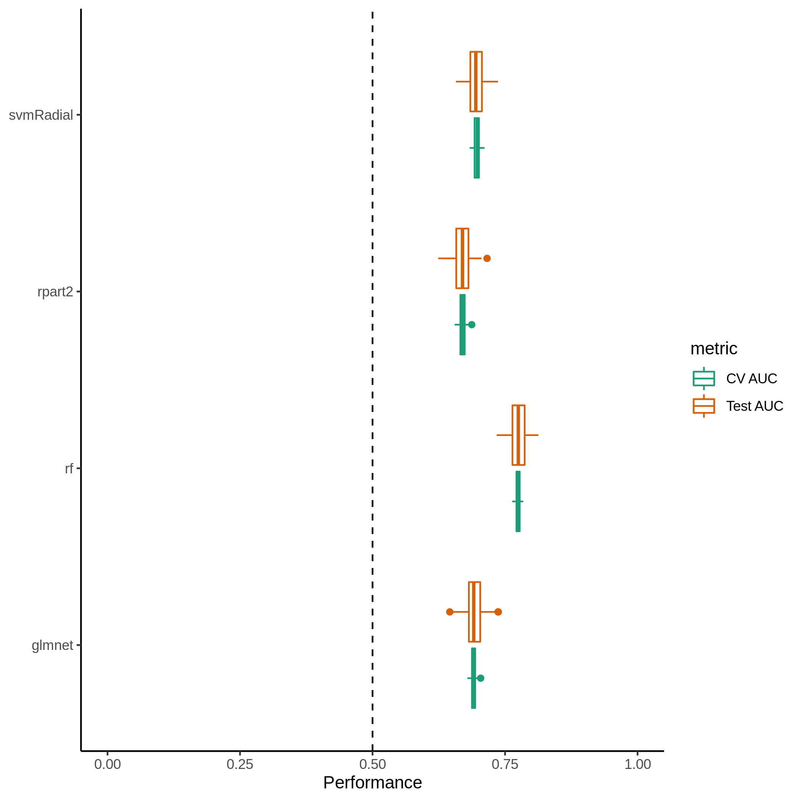
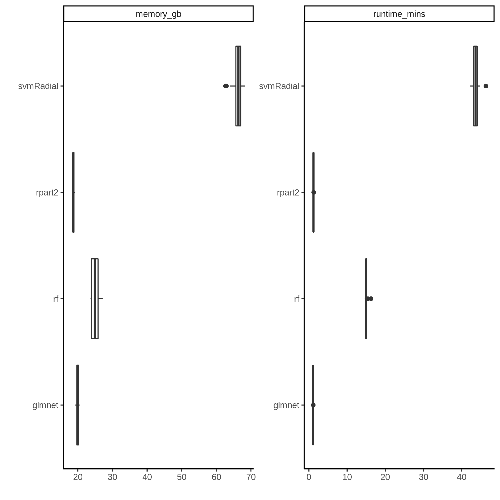

ML Results
================
2021-01-06

Machine learning algorithms used include: glmnet, rf, rpart2, svmRadial.
Models were trained with 100 different random partitions of the data
into training and testing sets using 5-fold cross validation.

## Model Performance

## Memory Usage & Runtime

Each model training run was given 36 cores for parallelization.
