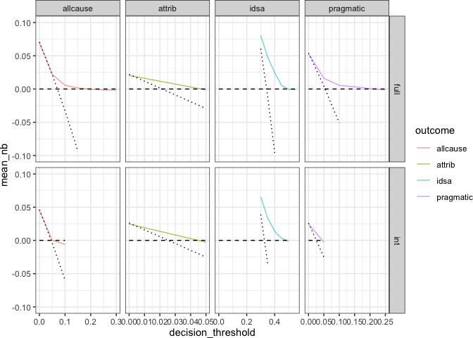

Cost-Benefit Analysis
================
2023-05-30

``` r
library(here)
library(schtools)
library(tidyverse)
thresh_dat <- read_csv(here('results','thresholds_results_aggregated.csv')) %>% 
  mutate(predicted_pos_frac = (tp + fp) / (tp + fp + tn + fn))
treat_all <- thresh_dat %>% 
  filter(strategy == 'all') %>% 
  select(strategy, decision_threshold, net_benefit, dataset, outcome) %>% 
  unique() %>% 
  pivot_wider(names_from = strategy, values_from = net_benefit, 
              names_prefix = "nb_treat_")
treat_none <- thresh_dat %>% filter(strategy == 'none') %>% 
  select(strategy, decision_threshold, net_benefit, dataset, outcome) %>% 
  unique() %>% 
  pivot_wider(names_from = strategy, values_from = net_benefit, 
              names_prefix = "nb_treat_")
thresh_dat <- thresh_dat %>% 
  filter(strategy == 'model') %>% 
  left_join(treat_all, by = join_by(decision_threshold, dataset, outcome)) %>% 
  left_join(treat_none, by = join_by(decision_threshold, dataset, outcome))
```

- use values from confusion matrix for one representative model on a
  test set. or get average precision? choose a particular sensitivity
  level and see the range in precision?
- assumptions
  - cost of a non-severe case
  - cost of a severe case
    - days in icu, colectomy
  - cost of possible treatments:
    - abx: metronizadole, vancomycin, fidaxomycin
    - fmt, bezlotoxumab (monoclonal antibodies)

## evaluating ml models

### [number needed to benefit](https://academic.oup.com/jamia/article-abstract/26/12/1655/5516459)

- Number needed to screen (NNS) - the number of alerted patients the
  models must flag to identify 1 true positive.
- Number needed to treat (NNT) - the number of true positive patients
  one must treat for 1 patient to benefit from the treatment.
- Number needed to benefit (NNB = NNS x NNT) - how many patients must be
  screened for 1 patient to benefit.

> In the simplest terms, prediction can be distilled into an NNS and
> action into a number needed to treat. When contextualized within this
> framework, the product of NNS and number needed to treat results in a
> number needed to benefit. The table outlines key variables in this
> framework that will alter the estimated number needed to benefit
> across different modeling and implementation scenarios.

## percentile of risk

95th percentile of risk: risk threshold where action is taken in 5% of
patients.

``` r
roc_risk_pct <- thresh_dat %>% 
  mutate(Specificity = round(Specificity, 2)) %>%
  group_by(Specificity, dataset, outcome) %>%
  summarise(
    mean_sensitivity = mean(Sensitivity),
    mean_pred_pos_frac = mean(predicted_pos_frac)
   ) %>% 
  ungroup() %>%
  group_by(dataset, outcome) %>%
  mutate(diff_95th_pct = abs(mean_pred_pos_frac - 0.05)) %>%
  slice_min(diff_95th_pct)
prc_risk_pct <- thresh_dat %>% 
  mutate(Recall = round(Recall, 2)) %>%
  group_by(Recall, dataset, outcome) %>%
  summarise(
    mean_precision = mean(Precision),
    mean_pred_pos_frac = mean(predicted_pos_frac)
   ) %>% 
  ungroup() %>%
  group_by(dataset, outcome) %>% 
  mutate(diff_95th_pct = abs(mean_pred_pos_frac - 0.05)) %>%
  slice_min(diff_95th_pct)

# confusion matrix values for 95th percentile of risk
confmat_95th_roc <- thresh_dat %>% 
  mutate(Specificity = round(Specificity, 2)) %>%
  inner_join(roc_risk_pct, by = join_by(Specificity, dataset, outcome)) %>% 
  mutate(diff_mean_sens = abs(mean_sensitivity - Sensitivity)) %>% 
  group_by(dataset, outcome) %>% 
  slice_min(diff_mean_sens) %>% 
  select(-seed) %>% 
  unique() %>% 
  slice_max(net_benefit) %>% 
  select(outcome, dataset, Precision, Recall, Specificity, tp,fp,tn,fn,
         net_benefit, nns, decision_threshold)

confmat_95th_prc <- thresh_dat %>% 
  mutate(Recall = round(Recall, 2)) %>% 
  inner_join(prc_risk_pct, by = join_by(Recall, dataset, outcome)) %>% 
  mutate(diff_mean_prec = abs(mean_precision - Precision)) %>% 
  group_by(dataset, outcome) %>% 
  slice_min(diff_mean_prec) %>% 
  select(-seed) %>% 
  unique() %>% 
  slice_max(net_benefit) %>% 
  select(outcome, dataset, Precision, Recall, Specificity, tp,fp,tn,fn,
         net_benefit, nns, decision_threshold)
confmat_95th_prc
```

    ## # A tibble: 8 × 12
    ## # Groups:   dataset, outcome [8]
    ##   outcome   dataset Precision Recall Specificity    tp    fp    tn    fn
    ##   <chr>     <chr>       <dbl>  <dbl>       <dbl> <dbl> <dbl> <dbl> <dbl>
    ## 1 allcause  full        0.286   0.12       0.978     2     5   221    15
    ## 2 attrib    full        0.2     0.2        0.983     1     4   226     4
    ## 3 idsa      full        0.556   0.07       0.972     5     4   137    68
    ## 4 pragmatic full        0.286   0.15       0.978     2     5   225    11
    ## 5 allcause  int         0.125   0.11       0.963     1     7   182     8
    ## 6 attrib    int         0.143   0.2        0.969     1     6   187     4
    ## 7 idsa      int         0.4     0.06       0.955     4     6   127    61
    ## 8 pragmatic int         0.143   0.2        0.969     1     6   187     4
    ## # ℹ 3 more variables: net_benefit <dbl>, nns <dbl>, decision_threshold <dbl>

## decision curve based on cost?

### [decision curve analysis](https://journals.sagepub.com/doi/10.1177/0272989X06295361)

QALYs are prone to systemic biases. We can sidestep using them by doing
decision curve analysis instead. Weight the relative harms of FP and FN
results.

- incidence of severe CDI
- net benefit = $\frac{TP}{n} - \frac{FP}{n} \times \frac{p_t}{1-p_t}$
  (Peirce 1884)
- plot net benefit vs probability threshold ($p_t$).
- harm of treating with fidaxomicin instead of vancomycin: more
  expensive. by how much?
- assume all patients severe vs no patients severe.

``` r
max_thresholds <- thresh_dat %>% 
  filter(strategy == 'model') %>% 
  group_by(dataset, outcome, strategy, decision_threshold)  %>% 
  summarize(mean_nb = mean(net_benefit)) %>% 
  filter(mean_nb <= 0) %>% 
  slice_min(mean_nb) %>% 
  ungroup() %>% 
  mutate(max_thresh = decision_threshold) %>% 
  select(dataset,outcome,max_thresh)

thresh_dat %>% 
  left_join(max_thresholds, by = join_by(dataset, outcome)) %>% 
  filter(decision_threshold <= max_thresh) %>% 
  group_by(dataset, outcome, decision_threshold) %>% 
  summarize(mean_nb = mean(net_benefit),
            nb_treat_all = mean(nb_treat_all),
            nb_treat_none = mean(nb_treat_none)) %>% 
  ggplot(aes(x = decision_threshold)) +
  geom_line(aes(y = mean_nb, color = outcome), alpha = 0.6) +
  geom_line(aes(y = nb_treat_all), linetype = 'dotted') +
  geom_line(aes(y = nb_treat_none), linetype = 'dashed') +
  scale_y_continuous(limits = c(-0.1,0.1)) +
  facet_grid(dataset ~ outcome, scales = 'free') +
  theme_sovacool()
```

<!-- -->

## treatment options & costs

- Vince: consider bezlotoxumab since it targets the toxin, mouse models
  show it reduces organ damage.
- Krishna: bezlotoxumab clinical trials didn’t find signal for limiting
  severity. however fidaxomicin is superior to vancomycin for cure and
  time to resolution of diarrhea ([IDSA 2021
  update](https://doi.org/10.1093/cid/ciab549)).
  - Fidaxomicin
    [NNT=10](https://thennt.com/nnt/oral-fidaxomicin-versus-vancomycin-clostridioides-difficile-infection/)
    for global cure (no recurrence occured).

NNT for Fidaxomicin, FMT, and/or Bezlotoxumab. Current standard is
Vancomycin because it’s cheaper than Fidaxomicin, even though IDSA
recommends Fidaxomicin.

rough estimate of costs. current: everyone gets vancomycin. potential:
patients flagged as severe get fidaxomicin. based on NNB, estimate how
much money saved in averting severe outcomes.

### [Gupta *et al.* 2021 - Economic Burden of CDI](https://journals.sagepub.com/doi/10.1177/17562848211018654)

- average cost of CDI case in the US:
  - \$8k to \$30k (Nanwa *et al*)
  - \$21k (Zhang *et al*)
  - likely underestimates of true attributable costs.
- treatment
  - IDSA recommends either vancomycin or fidaxomycin for 10 days
  - Metronizadole out of favor, not efficacious
  - Recommend FMT after multiple recurrences
  - monoclonal Ab now an fda-approved treatment

#### treatment costs

> More recently, Rajasingham et al. calculated the costs of the
> currently available therapies for CDI. The cost of oral metronidazole
> (10-day course) ranged from US\$4.38 to US\$13.14, intravenous
> metronidazole (14-day course) from US\$19.56 to \$58.68, vancomycin
> (10-day course) from US\$7.04 to US\$21.12, rifaximin (20-day course)
> from US\$44.16 to US\$132.48, and fidaxomicin (10day course), being
> the most expensive option, ranged from US\$883.60 to US\$2650.80. It
> is difficult to predict the exact cost of FMT due to the multiple
> variables involved, including source of stool and route of
> administration. In general, one course of FMT is estimated to cost
> between US\$500 and US\$2000.
