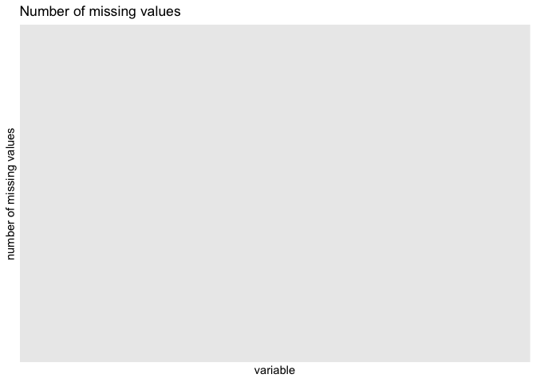

Data leakage - does imputation before or after splitting matter?
================
2022-09-19

``` r
library(data.table)
library(here)
library(mikropml)
library(tidyverse)
```

## load data

``` r
allcause_full_dat <- fread(here('data','process','allcause_full_OTU.csv'))
```

## is there any missing data?

``` r
temp <- colSums(is.na(allcause_full_dat)) 
head(temp)
```

    ## allcause Otu00001 Otu00002 Otu00003 Otu00004 Otu00005 
    ##        0        0        0        0        0        0

``` r
sum(temp)
```

    ## [1] 0

## what’s the distribution of missing data?

TODO histogram showing \# of NA’s in OTU columns.

``` r
missing.values <- allcause_full_dat %>%
    gather(key = "key", value = "val") %>%
    mutate(is.missing = is.na(val)) %>%
    group_by(key, is.missing) %>%
    summarise(num.missing = n()) %>%
    filter(is.missing==T) %>%
    select(-is.missing) %>%
    arrange(desc(num.missing)) 
missing.values %>%
  ggplot() +
    geom_bar(aes(x=key, y=num.missing), stat = 'identity') +
    labs(x='variable', y="number of missing values", title='Number of missing values') +
  theme(axis.text.x = element_text(angle = 45, hjust = 1))
```

<!-- -->

``` r
dat <- data.frame(x1 = c(NA, 5, 5, NA, 1, 2),
                   x2 = c(1, 2, 3, NA, 5, 6),
                   x3 = 1)
temp <- colSums(is.na(dat)) 
head(temp)
```

    ## x1 x2 x3 
    ##  2  1  0

``` r
sum(temp)
```

    ## [1] 3

``` r
missing.values <- dat %>%
    gather(key = "key", value = "val") %>%
    mutate(is.missing = is.na(val)) %>%
    group_by(key, is.missing) %>%
    summarise(num.missing = n()) %>%
    filter(is.missing==T) %>%
    select(-is.missing) %>%
    arrange(desc(num.missing)) 
missing.values %>%
  ggplot() +
    geom_bar(aes(x=key, y=num.missing), stat = 'identity') +
    labs(x='variable', y="number of missing values", title='Number of missing values') +
  theme(axis.text.x = element_text(angle = 45, hjust = 1))
```

<!-- -->

## does the median value change before/after splitting?

### compute medians on entire dataset

### compute medians on just training set

``` r
training_inds <- get_partition_indices(allcause_full_dat %>% pull('allcause'),
        training_frac = 0.8,
        groups = NULL,
        group_partitions = NULL
      )
allcause_train_dat <- allcause_full_dat[training_inds, ]
```

### compare median differences – histogram
