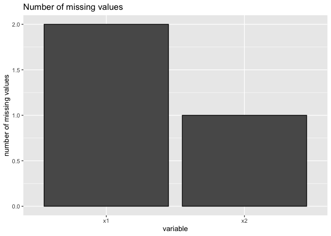

Data leakage - does imputation before or after splitting matter?
================
2022-10-12

``` r
library(data.table)
library(here)
library(mikropml)
library(tidyverse)
```

## load data

``` r
allcause_full_dat <- fread(here('data','process','allcause_full_OTU.csv'))
attrib_full_dat <- fread(here('data','process','attrib_full_OTU.csv'))
idsa_full_dat <- fread(here('data','process','idsa_full_OTU.csv'))
```

TODO: also check attrib & idsa data sets

``` r
count_num_nas <- function(dat) {
  temp <- colSums(is.na(dat)) 
  sum(temp)
}
```

``` r
count_num_nas(allcause_full_dat)
```

    ## [1] 0

``` r
count_num_nas(attrib_full_dat)
```

    ## [1] 0

``` r
count_num_nas(idsa_full_dat)
```

    ## [1] 0

## what’s the distribution of missing data?

TODO histogram showing \# of NA’s in OTU columns instead of barplot (too
many OTUs for barplot)

``` r
plot_histogram = function(dat) {
  missing.values <- dat %>%
    pivot_longer(everything(), names_to = "key", values_to = "val") %>%
    mutate(is.missing = is.na(val)) %>% 
    filter(is.missing)
  missing.values %>%
    ggplot() +
      geom_histogram(aes(key), stat="count", color="black", bins=2) +
      labs(x='variable', y="number of missing values", title='Number of missing values')
}
```

``` r
dat <- data.frame(x1 = c(NA, 5, 5, NA, 1, 2),
                   x2 = c(1, 2, 3, NA, 5, 6),
                   x3 = 1)
temp <- colSums(is.na(dat)) 
head(temp)
```

    ## x1 x2 x3 
    ##  2  1  0

``` r
sum(temp)
```

    ## [1] 3

``` r
missing.values <- dat %>%
    pivot_longer(everything(), names_to = "key", values_to = "val") %>%
    mutate(is.missing = is.na(val)) %>% 
    filter(is.missing)
missing.values %>%
  ggplot() +
    geom_histogram(aes(key), stat="count", color="black", bins=2) +
    labs(x='variable', y="number of missing values", title='Number of missing values')
```

<!-- -->

## does the median value change before/after splitting?

### compute medians on entire dataset

### compute medians on just training set

``` r
training_inds <- get_partition_indices(allcause_full_dat %>% pull('allcause'),
        training_frac = 0.8,
        groups = NULL,
        group_partitions = NULL
      )
allcause_train_dat <- allcause_full_dat[training_inds, ]
```

### compare median differences – histogram
