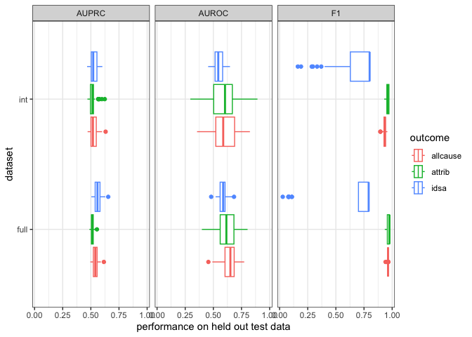
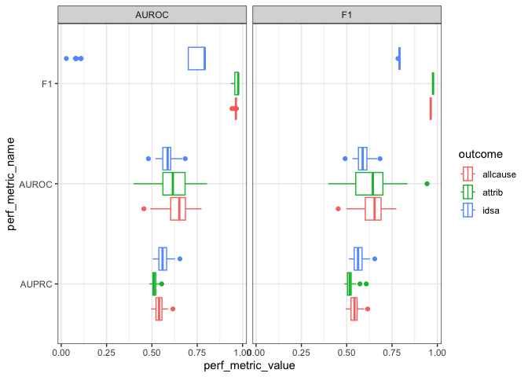
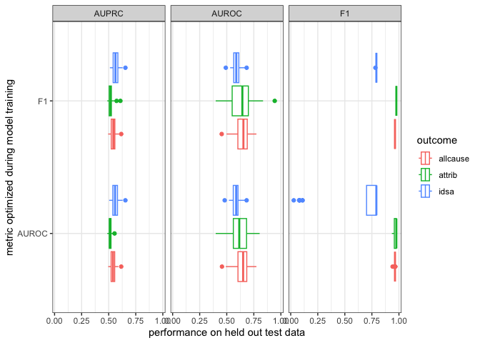
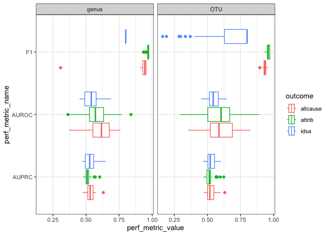
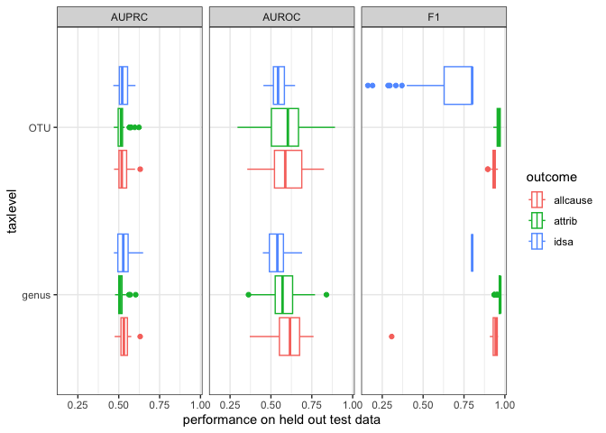

ML parameters
================
2023-01-31

``` r
library(data.table)
library(here)
library(mikropml)
library(tidyverse)
```

``` r
results_dat <- data.table::fread(here('results', 
                                      'performance_results_aggregated.csv')
                                 ) %>% 
  rename(cv_metric_AUROC = cv_metric_AUC,
         AUROC = AUC,
         AUPRC = prAUC) %>% 
  mutate(metric = case_when(metric == 'AUC' ~ 'AUROC',
                            TRUE ~ metric)) %>% 
  pivot_longer(starts_with('cv_metric_'), 
               names_to = 'cv_metric', 
               values_to = 'cv_value') %>% 
  pivot_longer(c(AUROC, AUPRC, F1), 
               names_to = 'perf_metric_name',
               values_to = 'perf_metric_value') %>% 
  filter(!is.na(cv_value))
```

parameter choices to investigate:

- `trainfrac`: training set size as a fraction(`0.65`, `0.8`)
- `dataset`: all samples for all outcomes (`full`) vs intersection of
  outcomes not missing (`int`)
- `method`: random forest (`rf`) vs L2 logistic regression (`glmnet`)
- `metric`: optimize model for `AUROC` vs `F1`
- taxonomic level: OTU vs genus. TODO: train models on genus level
  features

## training fraction

## dataset - full vs intersection

hold train frac, method, & metric constant

``` r
results_dat %>% 
  filter(trainfrac == 0.8, method == 'glmnet', metric == 'AUROC', taxlevel == "OTU") %>% 
  ggplot(aes(perf_metric_value, perf_metric_name, color = outcome)) +
  geom_boxplot() +
  theme_bw() +
  facet_wrap('dataset')
```

<!-- -->

``` r
results_dat %>% 
  filter(trainfrac == 0.8, method == 'glmnet', metric == 'AUROC', taxlevel == "OTU") %>% 
  ggplot(aes(perf_metric_value, dataset, color = outcome)) +
  geom_boxplot() +
  theme_bw() +
  facet_wrap('perf_metric_name') +
  labs(x="performance on held out test data")
```

<!-- -->

## ML method - rf vs l2 logit

``` r
results_dat %>% 
  filter(trainfrac == 0.8, metric == 'AUROC', dataset == 'full', taxlevel == "OTU") %>% 
  ggplot(aes(perf_metric_value, perf_metric_name, color = outcome)) +
  geom_boxplot() +
  theme_bw() +
  facet_wrap('method')
```

<!-- -->

``` r
results_dat %>% 
  filter(trainfrac == 0.8, metric == 'AUROC', dataset == 'full', taxlevel == "OTU") %>% 
  ggplot(aes(perf_metric_value, method, color = outcome)) +
  geom_boxplot() +
  theme_bw() +
  facet_wrap('perf_metric_name') +
  labs(x="performance on held out test data")
```

<!-- -->

## metric - AUROC vs F1 score

``` r
results_dat %>% 
  filter(trainfrac == 0.8, method == 'glmnet', dataset == 'full', taxlevel == "OTU") %>% 
  ggplot(aes(perf_metric_value, perf_metric_name, color = outcome)) +
  geom_boxplot() +
  theme_bw() +
  facet_wrap('metric')
```

<!-- -->

``` r
results_dat %>% 
  filter(trainfrac == 0.8, method == 'glmnet', dataset == 'full', taxlevel == "OTU") %>% 
  ggplot(aes(perf_metric_value, metric, color = outcome)) +
  geom_boxplot() +
  theme_bw() +
  facet_wrap('perf_metric_name') +
  labs(y="metric optimized during model training", x="performance on held out test data")
```

<!-- -->

## taxlevel - OTU vs genus

``` r
results_dat %>% 
  filter(trainfrac == 0.8, method == 'glmnet', dataset == 'int', metric == 'AUROC') %>% 
  ggplot(aes(perf_metric_value, perf_metric_name, color = outcome)) +
  geom_boxplot() +
  theme_bw() +
  facet_wrap('taxlevel')
```

<!-- -->

``` r
results_dat %>% 
  filter(trainfrac == 0.8, method == 'glmnet', dataset == 'int', metric == 'AUROC') %>% 
  ggplot(aes(perf_metric_value, taxlevel, color = outcome)) +
  geom_boxplot() +
  theme_bw() +
  facet_wrap('perf_metric_name') +
  labs(x="performance on held out test data")
```

<!-- -->
