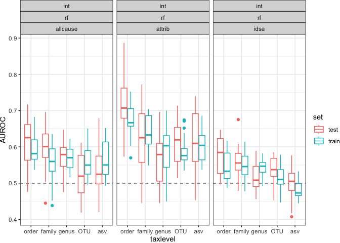

Taxonomic level search
================
2023-03-19

``` r
library(data.table)
library(here)
library(mikropml)
library(schtools)
library(tidyverse)
library(yaml)
```

``` r
results_dat <- data.table::fread(here('results', 
                                      'performance_results_aggregated.csv')
                                 ) %>% 
  rename(train = cv_metric_AUC,
         test = AUC,
         AUPRC = prAUC) %>% 
  pivot_longer(c(train, test), names_to = 'set', values_to = 'AUROC') %>% 
  mutate(taxlevel = factor(taxlevel, levels = c("order", "family", "genus", "OTU", 'asv')))
```

## config

``` r
read_yaml(here('config', 'tax-search.yml'))
```

    ## $ml_methods
    ## [1] "rf"
    ## 
    ## $kfold
    ## [1] 5
    ## 
    ## $ncores
    ## [1] 36
    ## 
    ## $nseeds
    ## [1] 20
    ## 
    ## $outcomes
    ## [1] "idsa"     "allcause" "attrib"  
    ## 
    ## $tax_levels
    ## [1] "asv"    "OTU"    "genus"  "family" "order" 
    ## 
    ## $metrics
    ## [1] "AUC"
    ## 
    ## $train_frac
    ## [1] 0.65
    ## 
    ## $dataset_subsets
    ## [1] "int"

## model performance

``` r
results_dat %>% 
  ggplot(aes(x = taxlevel, y = AUROC, color = set)) +
  geom_hline(yintercept = 0.5, linetype = 'dashed') +
  geom_boxplot() +
  facet_wrap(dataset+method~outcome)+#, nrow = 1) +
  theme_sovacool()
```

<!-- -->
