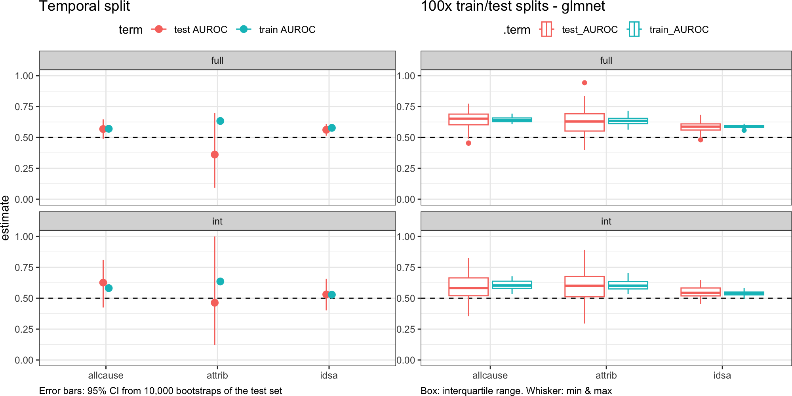

Temporal Split
================
2023-01-31

``` r
library(here)
library(knitr)
library(mikropml)
library(rlang)
library(schtools)
library(tidyverse)
```

Investigate feasibility of doing a temporal split to train/test models
on older data and then validate on newer data. Bootstrap the test data
to get empirical 95% CI.

Do the 20% most recent patients have the same proportion of severe cases
as the other 80% of the patients?

``` r
metadat_full <- read_csv(here("data", "process", "cases_full_metadata.csv"))
metadat_int <- read_csv(here("data", "process", "cases_int_metadata.csv"))
```

``` r
count_prop <- function(dat, colname, part) {
    dat %>%
        count({
            {
                colname
            }
        }) %>%
        mutate(p = round(n/sum(n), 3)) %>%
        mutate(partition = part) %>%
        select(partition, p, {
            {
                colname
            }
        }) %>%
        pivot_wider(names_from = partition, values_from = p)
}
compare_props <- function(test_dat, train_dat, colname) {
    test <- test_dat %>%
        count_prop({
            {
                colname
            }
        }, "test")
    train <- train_dat %>%
        count_prop({
            {
                colname
            }
        }, "train")
    full_join(test, train) %>%
        mutate(severity = paste(quo_name(enquo(colname)), {
            {
                colname
            }
        }, sep = "_")) %>%
        select(severity, train, test)
}
```

``` r
test_dat_int <- metadat_int %>%
    slice_max(order_by = collection_date, prop = 0.2)

train_dat_int <- metadat_int %>%
    anti_join(test_dat_int)

nrow(test_dat_int)
```

    ## [1] 91

``` r
nrow(train_dat_int)
```

    ## [1] 365

``` r
nrow(metadat_int)
```

    ## [1] 456

``` r
partitions_int <- bind_rows(compare_props(test_dat_int, train_dat_int, idsa), compare_props(test_dat_int,
    train_dat_int, attrib), compare_props(test_dat_int, train_dat_int, allcause))

kable(partitions_int)
```

| severity     | train |  test |
|:-------------|------:|------:|
| idsa_no      | 0.671 | 0.648 |
| idsa_yes     | 0.329 | 0.352 |
| attrib_no    | 0.940 | 0.956 |
| attrib_yes   | 0.060 | 0.044 |
| allcause_no  | 0.907 | 0.890 |
| allcause_yes | 0.093 | 0.110 |

## try bootstrapping with rsample

``` r
library(furrr)
library(mikropml)
library(rsample)

model <- readRDS(here("results/predict_idsa/taxlevel_OTU/metric_AUC/dataset_int/trainfrac_0.8/temporal-split/glmnet_100_model.Rds"))

test_dat <- read_csv(here("results/predict_idsa/taxlevel_OTU/metric_AUC/dataset_int/trainfrac_0.8/temporal-split/glmnet_100_test-data.csv"))

calc_perf <- function(split) {
    get_performance_tbl(model, analysis(split), outcome_colname = "idsa", perf_metric_function = caret::multiClassSummary,
        perf_metric_name = "AUC", class_probs = TRUE, method = "glmnet", seed = 100) %>%
        select(-c(method, seed)) %>%
        mutate(across(everything(), as.numeric)) %>%
        pivot_longer(everything(), names_to = "term", values_to = "estimate")
}

boots <- bootstraps(test_dat, times = 10) %>%
    mutate(perf = future_map(splits, ~calc_perf(.x)))

int_pctl(boots, perf) %>%
    kable()
```

| term              |    .lower | .estimate |    .upper | .alpha | .method    |
|:------------------|----------:|----------:|----------:|-------:|:-----------|
| Accuracy          | 0.6153846 | 0.6692308 | 0.7568681 |   0.05 | percentile |
| AUC               | 0.4736512 | 0.5220780 | 0.5816237 |   0.05 | percentile |
| Balanced_Accuracy | 0.5000000 | 0.5000000 | 0.5000000 |   0.05 | percentile |
| cv_metric_AUC     | 0.5290527 | 0.5290527 | 0.5290527 |   0.05 | percentile |
| Detection_Rate    | 0.0000000 | 0.3956044 | 0.7469780 |   0.05 | percentile |
| F1                | 0.7619048 | 0.7935327 | 0.8611985 |   0.05 | percentile |
| Kappa             | 0.0000000 | 0.0000000 | 0.0000000 |   0.05 | percentile |
| logLoss           | 0.5715850 | 0.6405144 | 0.6823033 |   0.05 | percentile |
| Neg_Pred_Value    | 0.6703297 | 0.6840659 | 0.7118132 |   0.05 | percentile |
| Pos_Pred_Value    | 0.6153846 | 0.6593407 | 0.7568681 |   0.05 | percentile |
| prAUC             | 0.4643378 | 0.4938545 | 0.5299658 |   0.05 | percentile |
| Precision         | 0.6153846 | 0.6593407 | 0.7568681 |   0.05 | percentile |
| Recall            | 0.0000000 | 0.6000000 | 1.0000000 |   0.05 | percentile |
| Sensitivity       | 0.0000000 | 0.6000000 | 1.0000000 |   0.05 | percentile |
| Specificity       | 0.0000000 | 0.4000000 | 1.0000000 |   0.05 | percentile |

## Plot performance

### temporal split

``` r
perf_dat <- read_csv(here("results", "temporal-split", "performance_results.csv"))
perf_temp_plot <- perf_dat %>%
    filter(term %in% c("cv_metric_AUC", "AUC")) %>%
    mutate(term = case_when(term == "cv_metric_AUC" ~ "train AUROC", term == "AUC" ~
        "test AUROC", TRUE ~ term)) %>%
    rename(estimate = .estimate, lower = .lower, upper = .upper) %>%
    ggplot(aes(x = estimate, xmin = lower, xmax = upper, y = outcome, color = term)) +
    geom_vline(xintercept = 0.5, linetype = "dashed") + geom_pointrange(position = position_dodge(width = 0.1)) +
    xlim(0, 1) + facet_wrap("dataset", ncol = 1) + coord_flip() + labs(title = "Temporal split",
    caption = "Error bars: 95% CI from 10,000 bootstraps of the test set") + theme_sovacool() +
    theme(legend.position = "top", axis.title.x = element_blank(), plot.caption = element_text(hjust = 0))
perf_temp_plot
```

<!-- -->

### 100x train/test splits

``` r
perf_dat_100 <- data.table::fread(here("results", "performance_results_aggregated.csv")) %>%
    pivot_longer(c("cv_metric_AUC", "AUC"), names_to = ".term", values_to = ".estimate") %>%
    mutate(.term = case_when(.term == "cv_metric_AUC" ~ "train_AUROC", .term == "AUC" ~
        "test_AUROC", TRUE ~ .term)) %>%
    select(method, seed, outcome, taxlevel, metric, dataset, trainfrac, .term, .estimate) %>%
    filter(!is.na(.estimate))
```

``` r
perf_dat_100 %>%
    filter(method == "rf", trainfrac == 0.8, taxlevel == "OTU") %>%
    group_by(dataset, outcome, .term) %>%
    summarize(median_est = round(median(.estimate), 3)) %>%
    pivot_wider(names_from = dataset, values_from = median_est, names_prefix = "median_perf_") %>%
    arrange(desc(outcome), desc(.term)) %>%
    kable()
```

| outcome  | .term       | median_perf_full | median_perf_int |
|:---------|:------------|-----------------:|----------------:|
| idsa     | train_AUROC |            0.584 |           0.520 |
| idsa     | test_AUROC  |            0.584 |           0.554 |
| attrib   | train_AUROC |            0.643 |           0.615 |
| attrib   | test_AUROC  |            0.643 |           0.641 |
| allcause | train_AUROC |            0.638 |           0.547 |
| allcause | test_AUROC  |            0.638 |           0.553 |

``` r
perf_dat_100 %>%
    filter(method == "glmnet", trainfrac == 0.8, taxlevel == "OTU") %>%
    group_by(dataset, outcome, .term) %>%
    summarize(median_est = round(median(.estimate), 3)) %>%
    pivot_wider(names_from = dataset, values_from = median_est, names_prefix = "median_perf_") %>%
    arrange(desc(outcome), desc(.term)) %>%
    kable()
```

| outcome  | .term       | median_perf_full | median_perf_int |
|:---------|:------------|-----------------:|----------------:|
| idsa     | train_AUROC |            0.590 |           0.539 |
| idsa     | test_AUROC  |            0.588 |           0.544 |
| attrib   | train_AUROC |            0.634 |           0.602 |
| attrib   | test_AUROC  |            0.629 |           0.601 |
| allcause | train_AUROC |            0.641 |           0.603 |
| allcause | test_AUROC  |            0.652 |           0.583 |

``` r
perf_100_glmnet_plot <- perf_dat_100 %>%
    filter(method == "glmnet", trainfrac == 0.8, taxlevel == "OTU") %>%
    ggplot(aes(x = .estimate, y = outcome, color = .term)) + geom_vline(xintercept = 0.5,
    linetype = "dashed") + geom_boxplot() + xlim(0, 1) + facet_wrap("dataset", ncol = 1) +
    coord_flip() + labs(title = "100x train/test splits - glmnet", caption = "Box: interquartile range. Whisker: min & max") +
    theme_sovacool() + theme(legend.position = "top", axis.title.x = element_blank(),
    axis.title.y = element_blank(), plot.caption = element_text(hjust = 0))
perf_100_glmnet_plot
```

<!-- -->

``` r
perf_100_rf_plot <- perf_dat_100 %>%
    filter(method == "rf", trainfrac == 0.8, taxlevel == "OTU") %>%
    ggplot(aes(x = .estimate, y = outcome, color = .term)) + geom_vline(xintercept = 0.5,
    linetype = "dashed") + geom_boxplot() + xlim(0, 1) + facet_wrap("dataset", ncol = 2) +
    labs(title = "100x train/test splits - rf", caption = "Box: interquartile range. Whisker: min & max") +
    theme_sovacool() + theme(legend.position = "top", axis.title.x = element_blank(),
    axis.title.y = element_blank(), plot.caption = element_text(hjust = 0))
perf_100_rf_plot
```

<!-- -->

#### 100 splits - OTU vs genus

``` r
perf_dat_100 %>%
    filter(method == "glmnet", trainfrac == 0.8) %>%
    ggplot(aes(x = .estimate, y = outcome, color = .term)) + geom_vline(xintercept = 0.5,
    linetype = "dashed") + geom_boxplot() + xlim(0, 1) + facet_wrap(c("dataset",
    "taxlevel")) + coord_flip() + labs(title = "100x train/test splits - glmnet",
    caption = "Box: interquartile range. Whisker: min & max") + theme_sovacool() +
    theme(legend.position = "top", axis.title.x = element_blank(), axis.title.y = element_blank(),
        plot.caption = element_text(hjust = 0))
```

<!-- -->

### temporal split vs 100x train/test splits

``` r
cowplot::plot_grid(perf_temp_plot, perf_100_glmnet_plot, nrow = 1)
```

<!-- -->

## Computational resources

``` r
bench_dat <- read_csv(here("results", "temporal-split", "benchmarks_results.csv"))
bench_dat %>%
    ggplot(aes(x = s, y = outcome, color = dataset)) + geom_point() + scale_x_time() +
    theme_sovacool()
```

<!-- -->

## Feature importance

``` r
feat_dat <- read_csv(here("results", "temporal-split", "feature-importance_results.csv"))
tax_dat <- read_tax(here("data", "mothur", "cdi.taxonomy"))
important_feats <- feat_dat %>%
    rename(otu = names) %>%
    left_join(tax_dat, by = "otu") %>%
    filter(pvalue < 0.05, perf_metric_diff > 0) %>%
    arrange(perf_metric_diff)
important_feats %>%
    mutate(otu = factor(otu, levels = important_feats %>%
        pull(otu) %>%
        unique())) %>%
    ggplot(aes(x = perf_metric_diff, y = label_html, color = outcome, shape = dataset)) +
    geom_point() + theme_sovacool() + theme(axis.text.y = ggtext::element_markdown())
```

<!-- -->
